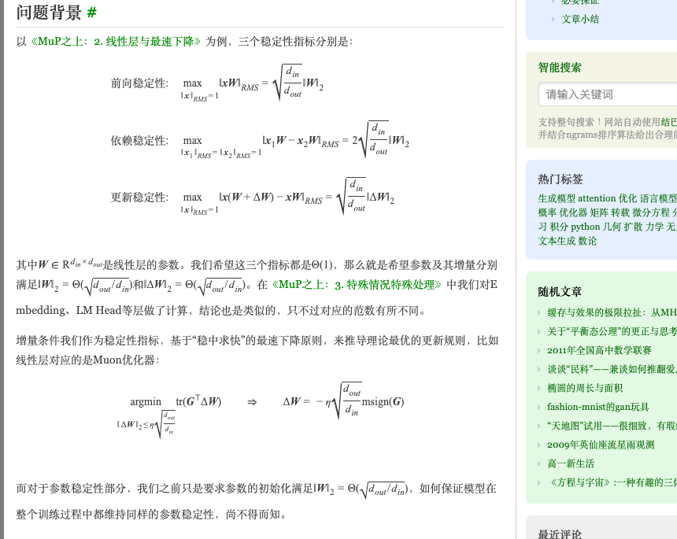
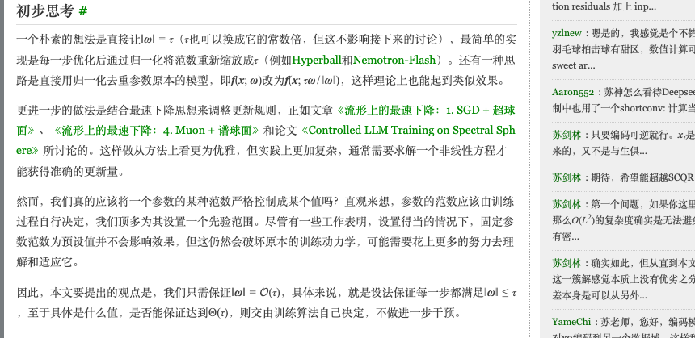
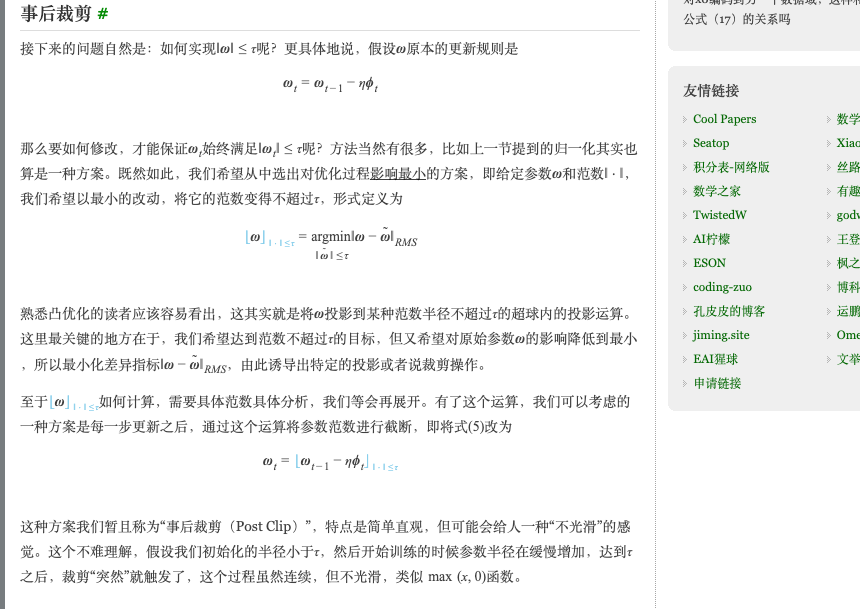
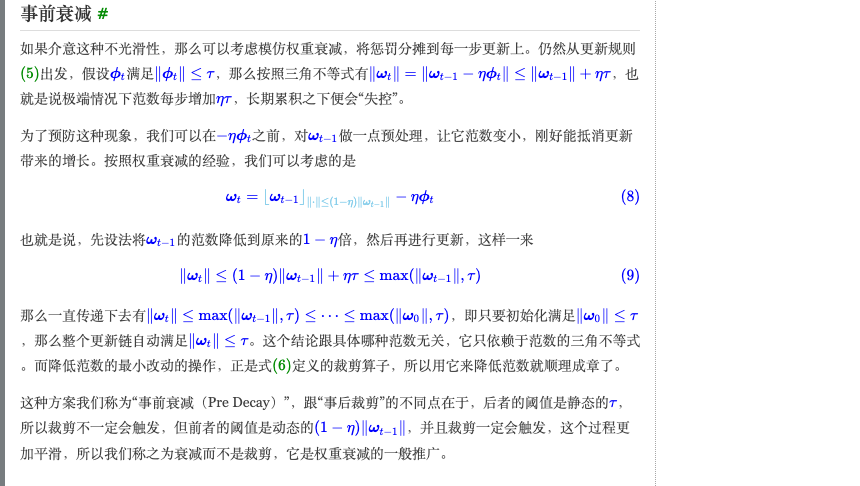
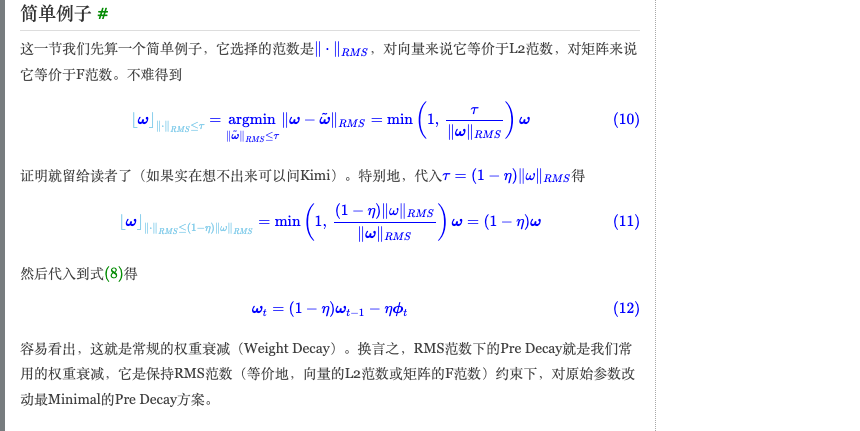
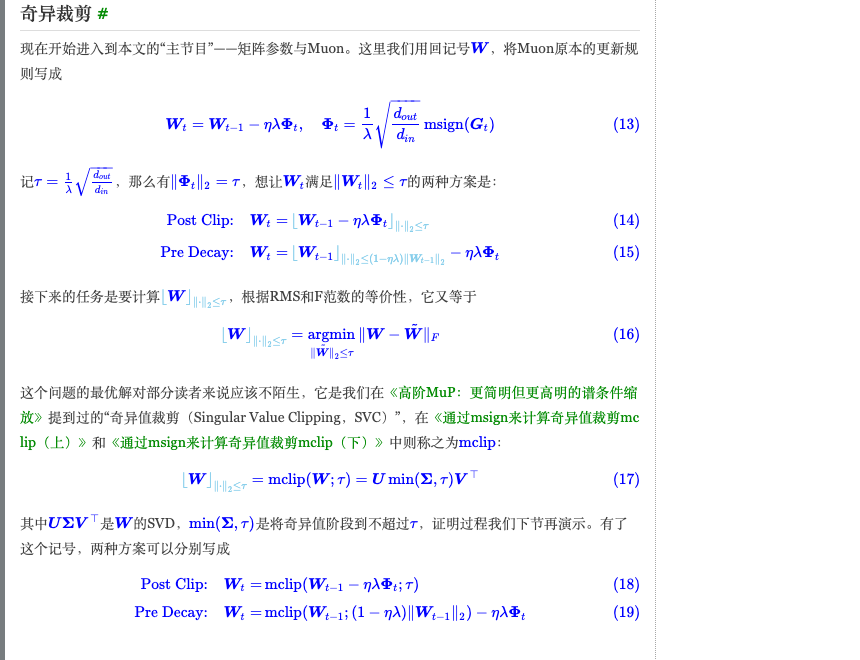
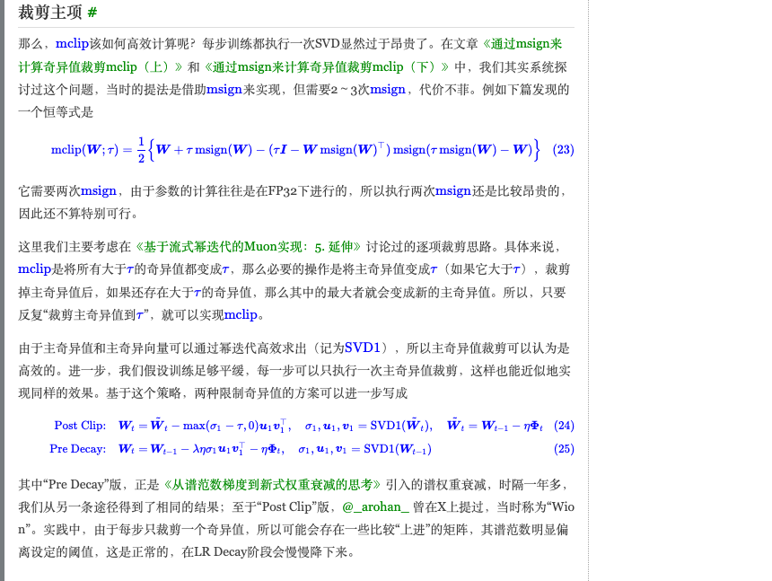
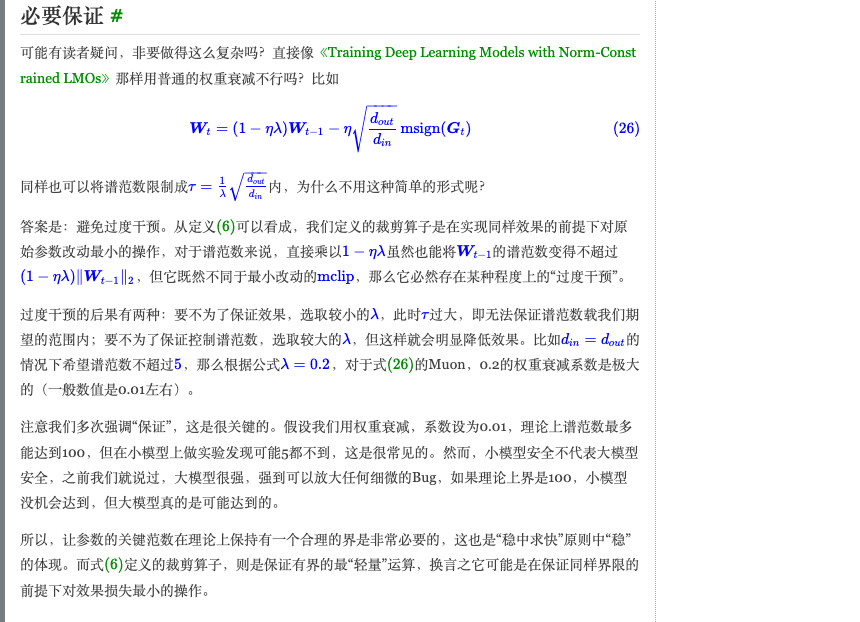

# MuP之上 Part 4: Maintaining Parameter Stability (坚守参数的稳定性)

**Author:** 苏剑林 (Jianlin Su) — creator of RoPE
**Date:** April 24, 2026
**Source:** [kexue.fm/archives/11729](https://kexue.fm/archives/11729)
**Series:** Part 4 of the "Beyond MuP" (MuP之上) series
**Language:** Chinese (technical blog post)
**Local archive:** `source_text_zh.txt` (extracted text), `source_page.html` (rendered HTML), `figures/full_page_screenshot.png` (full-page screenshot)

> **Sourcing note.** kexue.fm has Cloudflare protection that blocks programmatic curl/WebFetch (403). The full content for this report was obtained by rendering the page in a headless Chromium via Playwright, which produced complete extracted text (21KB Chinese), full-page screenshot (1280×8242), and section-level equation screenshots (the figures below). Everything in this report is from the actual rendered article.

---

## TL;DR

This is Part 4 of Su's "Beyond MuP" series. Parts 1-3 used **steepest descent under the increment-stability constraint** to derive optimizers (Muon for linear layers, layer-specific variants for embeddings/RMSNorm). Part 4 fills the remaining gap: how to keep parameter norms bounded throughout training, not just at initialization. He proposes a unified framework based on the **principle of minimal modification** (最小改动) — a clipping operator `⌊ω⌋_{‖·‖≤τ}` that projects ω to the norm-τ ball with the smallest possible change. Two schemes apply this operator: **Post Clip** (clip after each update; non-smooth) and **Pre Decay** (shrink before each update; smooth, generalizes weight decay to any norm). Under spectral norm, Post Clip = singular value clipping (SVC), Pre Decay = spectral weight decay — recovering a result Su derived a year earlier via a different route. The framework prescribes different norms for different layer types and uses single-step top-1 SVD via power iteration for efficient implementation.

---

## Series Context

| Part | Title | URL | Date |
|---|---|---|---|
| 1 | Three Characteristics of Good Models (好模型的三个特征) | [kexue.fm/archives/11340](https://kexue.fm/archives/11340) | Oct 21, 2025 |
| 2 | Linear Layers and Steepest Descent (线性层与最速下降) | [kexue.fm/archives/11605](https://kexue.fm/archives/11605) | Feb 15, 2026 |
| 3 | Special Cases, Special Treatment (特殊情况特殊处理) | [spaces.ac.cn/archives/11647](https://spaces.ac.cn/archives/11647) | — |
| **4** | **Maintaining Parameter Stability (坚守参数的稳定性)** | **[kexue.fm/archives/11729](https://kexue.fm/archives/11729)** | **Apr 24, 2026** |

**The arc:** Part 1 names three stability indicators. Part 2 combines the *increment* indicator with steepest descent → derives Muon for linear layers. Part 3 does the same for special cases (Embeddings, LM Head, RMSNorm) with their natural norms. Part 4 is the missing piece — the *parameter* stability indicator, which previous parts only enforced at initialization, now extended to maintain throughout training.

---

## Key Figures (Rendered Equations from the Article)

### Fig. 1: The Three Stability Indicators (问题背景)


The setup: for a linear-layer parameter `W ∈ ℝ^(d_in × d_out)` with input `x` measured in RMS norm, three indicators must be Θ(1) for a well-conditioned model:
- **Forward stability:** `max_{‖x‖_RMS=1} ‖xW‖_RMS = √(d_out/d_in) · ‖W‖₂`
- **Dependency stability:** `max_{‖x₁‖_RMS=‖x₂‖_RMS=1} ‖x₁W − x₂W‖_RMS = 2√(d_out/d_in) · ‖W‖₂`
- **Update stability:** `max_{‖x‖_RMS=1} ‖x(W+ΔW) − xW‖_RMS = √(d_out/d_in) · ‖ΔW‖₂`

For all three to be Θ(1): `‖W‖₂ = Θ(√(d_out/d_in))` (parameter stability) and `‖ΔW‖₂ = Θ(√(d_out/d_in))` (increment stability). Part 2 used the latter to derive Muon: `argmin_{‖ΔW‖₂ ≤ η√(d_out/d_in)} tr(G^T ΔW) ⇒ ΔW = -η√(d_out/d_in) · msign(G)`.

### Fig. 2: The General Framework (初步思考)


The article surveys naive approaches (Hyperball, Nemotron-Flash) that just renormalize parameters to exactly τ each step, and "manifold steepest descent" approaches (Su's earlier "Steepest Descent on Manifolds" series + the *Controlled LLM Training on Spectral Sphere* paper) that solve nonlinear equations to keep parameters on a sphere. He argues both are **too aggressive** — they fix the norm to a specific value, which interferes with training dynamics. His proposed alternative is to require only `‖ω‖ ≤ τ` (an upper bound, not equality), letting training itself decide the actual value.

### Fig. 3: Post Clip — Project after Each Step (事后裁剪)


The clipping operator (Equation 6 of the article):
```
⌊ω⌋_{‖·‖≤τ} = argmin_{‖ω̃‖≤τ} ‖ω − ω̃‖_RMS
```
This is the projection of ω onto the τ-ball under the chosen norm, with **the smallest RMS-norm change** to ω. Post Clip applies this after each gradient update:
```
ω_t = ⌊ ω_{t-1} − η·φ_t ⌋_{‖·‖≤τ}
```
The note: "this is simple and direct, but feels non-smooth — when initialization has radius below τ and training drifts up to τ, clipping suddenly triggers, like `max(x, 0)`."

### Fig. 4: Pre Decay — Shrink Before Each Step (事前衰减)


If `‖φ_t‖ ≤ τ`, then by triangle inequality `‖ω_t‖ ≤ ‖ω_{t-1}‖ + ητ` — extreme case grows by ητ per step, eventually unbounded. Pre Decay prevents this by shrinking ω first:
```
ω_t = ⌊ω_{t-1}⌋_{‖·‖ ≤ (1-η)·‖ω_{t-1}‖} − η·φ_t
```
By triangle inequality: `‖ω_t‖ ≤ (1-η)‖ω_{t-1}‖ + ητ ≤ max(‖ω_{t-1}‖, τ)`. By induction: `‖ω_t‖ ≤ max(‖ω_0‖, τ)`. So if `‖ω_0‖ ≤ τ`, then `‖ω_t‖ ≤ τ` for all t. **The proof depends only on the triangle inequality — works for any norm.** Unlike Post Clip's static threshold τ, Pre Decay uses a dynamic threshold `(1-η)‖ω_{t-1}‖` that always triggers, making the dynamics smooth — hence "decay" instead of "clip". **Pre Decay is the general-norm extension of weight decay.**

### Fig. 5: Pre Decay under L2/RMS Norm = Standard Weight Decay (简单例子)


Under the RMS norm (= L2 for vectors, Frobenius for matrices), the clipping operator has a closed form: `⌊ω⌋_{‖·‖_RMS ≤ τ} = min(1, τ/‖ω‖_RMS) · ω`. Plug in `τ = (1-η)‖ω‖_RMS` and you get exactly `(1-η)·ω`. So Pre Decay under L2/RMS norm becomes:
```
ω_t = (1-η) · ω_{t-1} − η · φ_t
```
which is **exactly standard weight decay**. This is the cleanest illustration of the equivalence: weight decay is the L2-norm instance of Pre Decay. Pick a different norm and you get a different decay scheme that respects that norm.

### Fig. 6: Singular Value Clipping for Matrix Parameters (奇异裁剪)


For Muon-trained linear layers, `Φ_t = (1/λ)√(d_out/d_in) · msign(G_t)` and `‖Φ_t‖₂ = τ` where `τ = (1/λ)√(d_out/d_in)`. The two schemes become (Eqs 14-15):
- **Post Clip:** `W_t = ⌊W_{t-1} − ηλΦ_t⌋_{‖·‖₂ ≤ τ}`
- **Pre Decay:** `W_t = ⌊W_{t-1}⌋_{‖·‖₂ ≤ (1-ηλ)‖W_{t-1}‖₂} − ηλΦ_t`

The clipping operator under spectral norm (Eq 17): `⌊W⌋_{‖·‖₂ ≤ τ} = mclip(W; τ) = U·min(Σ, τ)·V^T` — clip each singular value above τ, leave smaller ones alone. This is **Singular Value Clipping (SVC)**, also called `mclip`. The two final schemes (Eqs 18-19):
- **Post Clip:** `W_t = mclip(W_{t-1} − ηλΦ_t; τ)`
- **Pre Decay:** `W_t = mclip(W_{t-1}; (1-ηλ)‖W_{t-1}‖₂) − ηλΦ_t`

### Fig. 7: Single Top-1 SVD per Step via Power Iteration (裁剪主项)


Full SVD per step is too expensive. The article references two earlier posts ([archives/11006](https://kexue.fm/archives/11006), [archives/11059](https://kexue.fm/archives/11059)) that compute mclip via msign — but that requires 2 msign operations in FP32, which is still expensive.

The practical approach (from Part 5 of the streaming-power-iteration Muon series): **clip only the top singular value per step**, computed by power iteration (`SVD₁`). If multiple singular values exceed τ, repeated single clips will eventually flatten them all. So:
- **Post Clip (per-step):** `W_t = W̃_t − max(σ₁ − τ, 0) · u₁v₁^T`, where `W̃_t = W_{t-1} − ηΦ_t` and `(σ₁, u₁, v₁) = SVD₁(W̃_t)`
- **Pre Decay (per-step):** `W_t = W_{t-1} − λη·σ₁·u₁v₁^T − η·Φ_t`, where `(σ₁, u₁, v₁) = SVD₁(W_{t-1})`

The Pre Decay version is **exactly the spectral weight decay** Su introduced more than a year ago in [archives/10648](https://kexue.fm/archives/10648) ("殊途同归" — different paths, same destination). The Post Clip version was previously called "**Wion**" by [@_arohan_](https://x.com/_arohan_) on X.

### Fig. 8: Necessary Guarantee — Why Not Just Use Standard Weight Decay (必要保证)


A natural objection: why not just use standard weight decay `W_t = (1-ηλ)·W_{t-1} − η√(d_out/d_in)·msign(G_t)` from "Training Deep Learning Models with Norm-Constrained LMOs"? The answer: **avoid over-intervention**. Multiplying by (1-ηλ) shrinks every singular value uniformly — but the goal was only to bound the *largest* one. So uniform shrinkage hurts the smaller singular values (which were already fine) more than necessary.

Concrete dilemma for Muon: if `d_in = d_out` and you want spectral norm ≤ 5, the formula gives `λ = 0.2`. But typical Muon weight decay is `λ ≈ 0.01`. So:
- **Small λ (0.01):** spectral norm is uncontrolled in theory (could reach 100); small models are fine empirically, but **large models can amplify any subtle bug** to reach the theoretical bound.
- **Large λ (0.2):** weight decay is too aggressive; training quality drops noticeably.

The point of the minimal-modification operator: get the same theoretical guarantee with the smallest possible loss in training quality. "**Stability first, speed second** (稳中求快)" — the bound must hold *in theory*, not just empirically on small models.

---

## Key Novel Ideas

### 1. The Minimal Modification Principle (最小改动原则)

The conceptual core of the paper. Given a parameter ω and a norm `‖·‖`, define:

```
⌊ω⌋_{‖·‖≤τ} = argmin_{‖ω̃‖≤τ} ‖ω − ω̃‖_RMS
```

This is the **closest point to ω inside the τ-ball under the chosen norm, measured by RMS distance**. It's a constrained optimization: "make the smallest possible change to ω while ensuring its norm stays bounded."

Why this matters: many ad-hoc tricks in the optimizer literature (renormalize-to-fixed-radius, divide-by-current-norm, multiply-by-(1-ε)) all enforce some norm bound, but they over-modify the parameter, distorting training dynamics. The minimal-modification operator is by definition the *least invasive* projection — for any given norm, it's the unique operator that achieves the bound with the smallest collateral damage.

### 2. Two Schemes: Post Clip vs Pre Decay

**Post Clip** (Eq 7 in article):
```
ω_t = ⌊ω_{t-1} − η·φ_t⌋_{‖·‖≤τ}
```
- Static threshold τ. Clipping only triggers when the parameter wants to escape.
- Simple, direct, but non-smooth (kinks when triggered).

**Pre Decay** (Eq 8 in article):
```
ω_t = ⌊ω_{t-1}⌋_{‖·‖ ≤ (1-η)·‖ω_{t-1}‖} − η·φ_t
```
- Dynamic threshold `(1-η)·‖ω_{t-1}‖`. Always triggers.
- Smooth, hence "decay" rather than "clip."
- Generalizes weight decay to any norm.
- The bounded-norm property (`‖ω_t‖ ≤ τ` if `‖ω_0‖ ≤ τ`) follows from triangle inequality alone — independent of which norm you pick.

### 3. The Equivalence Catalog by Norm

Choosing different norms in Pre Decay recovers different known methods:

| Norm | Pre Decay becomes | Post Clip becomes |
|---|---|---|
| **L2 / RMS / Frobenius** | Standard weight decay `(1-η)ω − ηφ` | L2 norm clamp (rare) |
| **Spectral `‖W‖₂`** | Spectral weight decay (Su 2024, [archives/10648](https://kexue.fm/archives/10648)) | Singular value clipping / mclip / "Wion" |
| **Max row RMS** (Embeddings) | Per-row RMS-decay | Per-row RMS-clip |
| **Max column RMS** (LM Head) | Per-column RMS-decay | Per-column RMS-clip |
| **Infinity norm `‖γ‖_∞`** (RMSNorm γ) | Element-wise decay | Element-wise clip: `clip(γ, -τ, τ)` |

The pattern: the right norm for each layer matches the role that layer plays in the forward pass. Linear layers act multiplicatively → spectral norm. Embeddings produce one row per token → max-row RMS. LM Head produces one column per output dimension → max-column RMS. RMSNorm γ is element-wise multiplicative → max-absolute-value (infinity norm).

### 4. The Per-Step Top-1 SVD Trick

Computing full SVD or even a 2-msign mclip every step is too slow for production training. The trick: **clip only the top singular value per step** via streaming power iteration (SVD₁).

If multiple singular values exceed τ, this only flattens one per step — so during high-LR training, the spectral norm can drift well above τ in the short term. Su accepts this: "this is normal; during the LR-decay phase it will gradually settle."

For tighter precision, you can use power iteration to compute the **top-k** singular values + vectors simultaneously, clipping up to k per step. The cost: ordinary L2-normalize (in standard power iteration) must be replaced by **QR decomposition** to keep the multiple singular vectors orthogonal.

### 5. The Theoretical-vs-Empirical Bound Argument

A subtle point in the "necessary guarantee" section: standard weight decay with `λ=0.01` allows spectral norm up to ~100 in theory but rarely ~5 in small-model experiments. Su's argument: **"large models can amplify any subtle bug"** (大模型很强，强到可以放大任何细微的Bug). What the small model never reached, the large model might. So having a *theoretical* bound — not just an empirical one — matters for production scale.

This is essentially a robustness-engineering argument applied to optimizers: the bound must hold in the worst case, not just the average case. The clipping operator gives you the bound with minimum quality loss.

---

## Architecture / Algorithm Details

### The general framework

Given parameter ω, norm `‖·‖`, threshold τ:

```python
# Define the clipping operator (norm-specific implementation)
def clip(omega, norm, tau):
    # Returns the closest point to omega with norm ≤ tau
    # closed form depends on the norm
    ...

# Post Clip
omega_t = clip(omega_{t-1} - eta * phi_t, norm, tau)

# Pre Decay
omega_t = clip(omega_{t-1}, norm, (1 - eta) * norm(omega_{t-1})) - eta * phi_t
```

### Per-norm closed forms

| Norm | Clipping formula |
|---|---|
| L2/RMS/F | `min(1, τ/‖ω‖_RMS) · ω` |
| Spectral `‖W‖₂` | `mclip(W; τ) = U · min(Σ, τ) · V^T` |
| Max-row RMS | per row: `min(1, τ/‖row‖_RMS) · row` |
| Max-col RMS | per column: `min(1, τ/‖col‖_RMS) · col` |
| `‖γ‖_∞` | `clip(γ, -τ, τ) = max(min(γ, τ), -τ)` |

### Production-ready single-step variants (using SVD₁ via power iteration)

```python
# Post Clip per-step (Wion)
W_tilde = W_{t-1} - eta * Phi_t
sigma_1, u_1, v_1 = SVD1(W_tilde)  # top-1 SVD via power iteration
W_t = W_tilde - max(sigma_1 - tau, 0) * outer(u_1, v_1)

# Pre Decay per-step (= spectral weight decay)
sigma_1, u_1, v_1 = SVD1(W_{t-1})
W_t = W_{t-1} - lambda * eta * sigma_1 * outer(u_1, v_1) - eta * Phi_t
```

### Threshold τ for Muon-trained linear layers

`τ = (1/λ) · √(d_out / d_in)` — derived from `‖Φ_t‖₂ = τ` where `Φ_t` is the Muon update direction.

---

## Key Takeaways

1. **The Beyond-MuP framework decomposes stability into parameter-side and increment-side.** Most existing work (MuP, Muon) constrains the *increment* (`‖ΔW‖₂`). Part 4 is the missing piece: constraining the *parameter* (`‖W‖₂`) throughout training.

2. **Pre Decay generalizes weight decay to any norm.** Standard weight decay is the L2 instance. Choosing the spectral norm gives spectral weight decay; choosing the max-row RMS gives row-RMS weight decay; etc. This unifies a scattered literature of "tricks" into one operator under different norms.

3. **The bounded-norm proof needs only the triangle inequality.** This is what makes the framework norm-agnostic. Any norm with a triangle inequality (i.e., any norm) gives you `‖ω_0‖ ≤ τ ⇒ ‖ω_t‖ ≤ τ ∀t` automatically under Pre Decay.

4. **Post Clip is non-smooth but simple; Pre Decay is smooth but always triggered.** Different practical regimes prefer different choices. Post Clip's threshold is static τ; Pre Decay's is dynamic `(1-η)·‖ω_{t-1}‖`.

5. **Singular Value Clipping (mclip) = Post Clip under spectral norm.** Computable via two msign operations in closed form, or via repeated top-1 SVD steps (per-step version) for efficiency.

6. **Spectral weight decay = Pre Decay under spectral norm.** Su independently derived this a year earlier from a totally different angle ("从谱范数梯度到新式权重衰减的思考"). Different paths to the same algorithm — a form of theoretical validation.

7. **Layer-specific norms matter.** A single optimizer-wide weight decay (which is L2-only) is too blunt. Linear layers want spectral; embeddings want max-row RMS; LM Heads want max-column RMS; RMSNorm γ wants infinity norm. Mismatching the norm to the layer's role over-constrains some parameters and under-constrains others.

8. **The Muon weight-decay dilemma motivates this whole post.** To control spectral norm to ≤5 with `d_in=d_out`, you'd need `λ ≈ 0.2` — twenty times typical Muon weight decay. Either λ is too small to control the bound (large models can blow it up), or λ is too large and hurts training. Direct singular value clipping side-steps the dilemma: bound the spectral norm directly, not via the L2-flavored proxy of weight decay.

9. **"Wion" was the X-discovered name for the same idea.** The Post-Clip-under-spectral-norm scheme was independently named "Wion" by [@_arohan_](https://x.com/_arohan_); Su's framework subsumes it as one corner of the (norm, scheme) cross-product.

10. **Single-singular-value clipping is OK because LR decay finishes the job.** A practical concession: per-step SVC only flattens one singular value per step. Some "ambitious" matrices may have spectral norms drifting above τ in the high-LR regime. As LR decays toward zero, the constraint binds tighter and the norm settles. For tighter precision, top-k SVC via power iteration with QR decomposition is available.

11. **Theoretical bounds matter at production scale.** The "small model rarely hits the bound, but large models can" argument: weight decay with `λ=0.01` allows spectral norms up to ~100 in theory, and large enough models *will* reach that. Stability arguments must be theoretical, not just empirical.

---

## Connections to Existing Work (Su's Own and Others)

- **Su's own earlier work** ("从谱范数梯度到新式权重衰减的思考", [archives/10648](https://kexue.fm/archives/10648)) — derived spectral weight decay from a different starting point. Part 4 shows it's the spectral-norm instance of Pre Decay.
- **Su's mclip-via-msign series** ([archives/11006](https://kexue.fm/archives/11006), [archives/11059](https://kexue.fm/archives/11059)) — efficient computation of mclip in closed form using two msign operations. Part 4 references but largely supersedes this with the simpler per-step top-1 SVD approach.
- **Su's streaming power iteration Muon series** ([archives/11340 onward](https://kexue.fm/archives/11340)) — Part 5 of that series introduced the per-step top-1 clipping idea that Part 4 here generalizes.
- **"Steepest Descent on Manifolds" series** + **"Controlled LLM Training on Spectral Sphere"** — alternative approaches that fix the parameter to a sphere (force `‖W‖ = τ` exactly). Part 4 argues this is over-aggressive and just enforcing `‖W‖ ≤ τ` is sufficient.
- **"高阶MuP: 更简明但更高明的谱条件缩放"** — earlier post that introduced SVC.
- **MuonClip / Kimi K2 (mid-2025)** — production system that uses Muon + QK-Clip for stability across 15.5T pretraining tokens. The Part 4 framework is the theoretical justification for that family of techniques.
- **"Wion"** ([@_arohan_](https://x.com/_arohan_) on X) — independent naming for Post Clip under spectral norm.
- **"Training Deep Learning Models with Norm-Constrained LMOs"** — the standard weight-decay-as-norm-constraint baseline that Part 4 critiques as over-aggressive.

---

## Connection to Other Papers in This Repo

- **MoE Architecture Evolution survey, §6 (Routing & Load Balancing)** — the survey discusses Kimi K2's MuonClip and zero-loss-spike training over 15.5T tokens. Part 4 is the theoretical lens behind that family of techniques.
- **Megatron Core MoE, GLM-4.5, Kimi K2** — production systems using Muon at trillion-parameter scale; they all need parameter-norm control. Part 4's framework prescribes which norm to use per layer.
- **DeepSeek-V3's auxiliary-loss-free routing** — same philosophy at the routing level: instead of penalty-based stability (loss term), use direct projection (bias adjustment) outside the gradient. Part 4 applies the same philosophy at the optimizer level.

---

## What's Open-Sourced

This is a blog post — no code or model release attached. But the components are widely implemented:

- **Muon optimizer** — open-source implementations in Megatron-LM, MoonshotAI's K2 codebase, NVIDIA frameworks
- **msign / Newton-Schulz iteration** — community implementations available; for an autodiff-friendly numerically-stable version see [leloykun.github.io](https://leloykun.github.io/ponder/spectral-clipping/)
- **mclip / SVC** — adopted in Kimi K2's MuonClip; the Wion variant has open-source implementations
- **Spectral weight decay** — Su's earlier post with implementation details

The post itself is the open contribution: the unified framework + the per-layer norm prescriptions.

---

## Reading List

| Reference | Why |
|---|---|
| [MuP之上 Part 1 (archives/11340)](https://kexue.fm/archives/11340) | The three stability indicators |
| [MuP之上 Part 2 (archives/11605)](https://kexue.fm/archives/11605) | Steepest descent → Muon for linear layers |
| [MuP之上 Part 3 (spaces.ac.cn/archives/11647)](https://spaces.ac.cn/archives/11647) | Per-layer special cases (Embedding, LM Head, RMSNorm) |
| [Spectral norm gradients → spectral weight decay (archives/10648)](https://kexue.fm/archives/10648) | The earlier route to the same Pre-Decay-under-spectral-norm result |
| [mclip-via-msign Part 1 (archives/11006)](https://kexue.fm/archives/11006) | Two-msign formula for spectral clipping |
| [mclip-via-msign Part 2 (archives/11059)](https://kexue.fm/archives/11059) | Continuation with stability analysis |
| [Streaming Power Iteration Muon Part 5 (referenced in Part 4)](https://kexue.fm/) | The per-step top-1 SVD idea Part 4 builds on |
| [Spectral Clipping via Newton-Schulz (leloykun)](https://leloykun.github.io/ponder/spectral-clipping/) | English-language autodiff-friendly implementation |

---

## Source Files in This Folder

- `REPORT.md` — this report
- `source_text_zh.txt` — full extracted Chinese text from the rendered page (21KB)
- `source_page.html` — full rendered HTML (316KB) for archival
- `figures/full_page_screenshot.png` — full-page screenshot (1280×8242)
- `figures/fig{1..8}_*.png` — section-level screenshots of each main equation block
