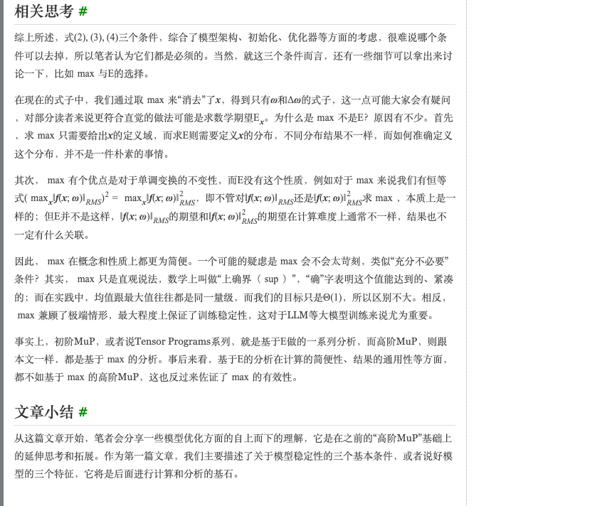
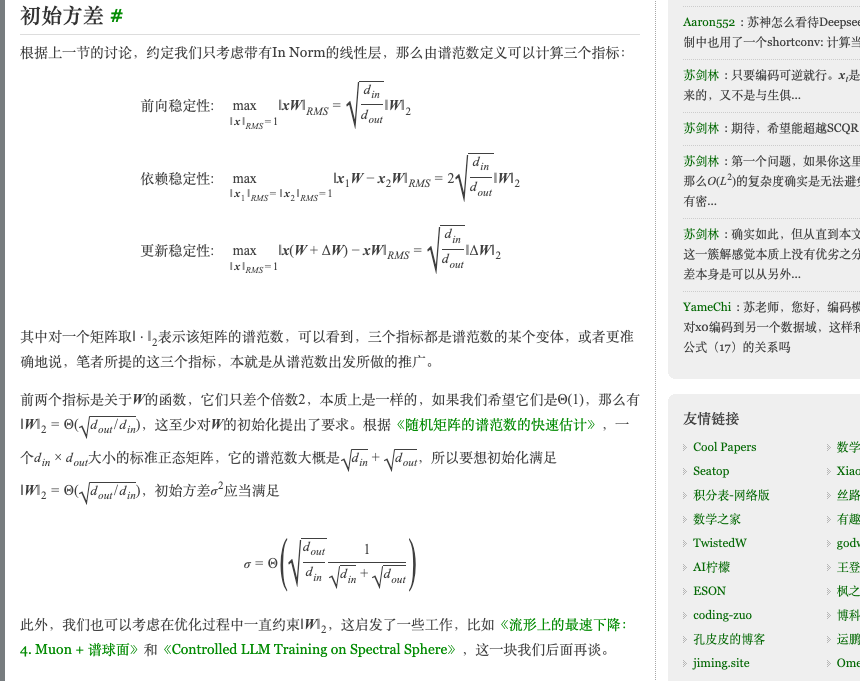
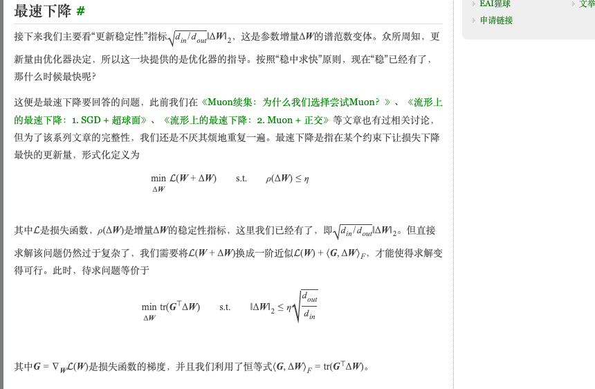
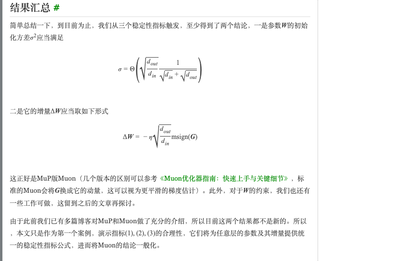
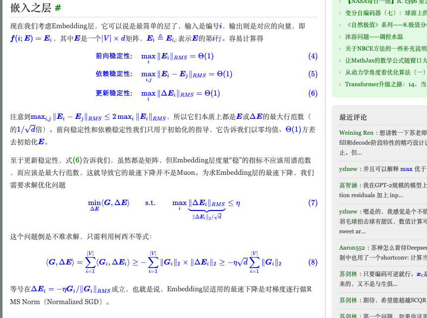
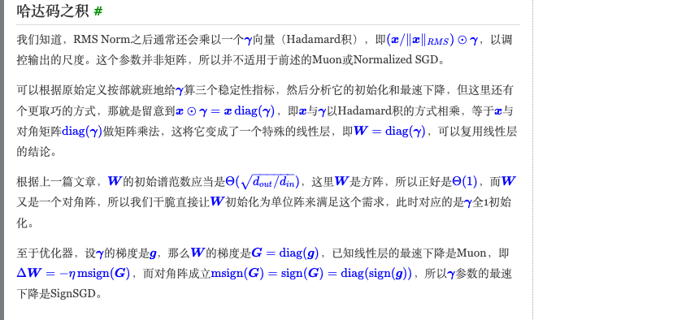
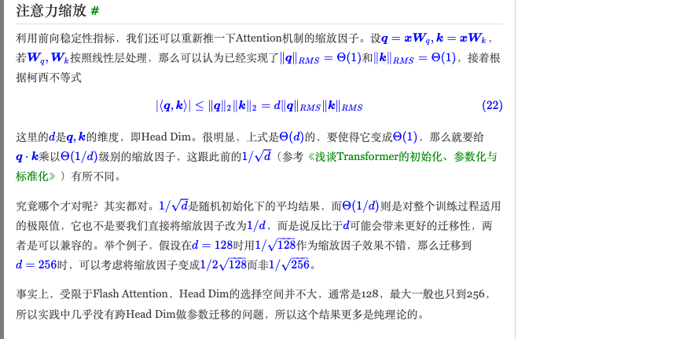

# The "Beyond MuP" Series — A Walkthrough in Plain Language

**Author:** 苏剑林 (Jianlin Su) — creator of RoPE
**Series:** "MuP之上" (Beyond MuP) — four blog posts on kexue.fm
**Goal of this document:** Walk through all four posts in plain English, assuming linear-algebra background but no prior knowledge of MuP or Muon.

| Part | Title | URL | Date |
|---|---|---|---|
| 1 | Three Characteristics of Good Models | [archives/11340](https://kexue.fm/archives/11340) | Oct 21, 2025 |
| 2 | Linear Layers and Steepest Descent | [archives/11605](https://kexue.fm/archives/11605) | Feb 15, 2026 |
| 3 | Special Cases, Special Treatment | [archives/11647](https://kexue.fm/archives/11647) | Mar 2, 2026 |
| 4 | Maintaining Parameter Stability | [archives/11729](https://kexue.fm/archives/11729) | Apr 24, 2026 |

---

## 0. Why This Series Exists — One Sentence Per Idea

Two threads ran through 2024–2026 LLM optimization:

- **MuP (Maximal Update Parametrization)** — a recipe by Greg Yang's group that prescribes per-layer initialization variances and learning rates so that hyperparameters tuned on a small model transfer cleanly to a large one. Two flavors exist: "initial-MuP" from the Tensor Programs series (uses expectations), and "high-order MuP" from Yang's spectral-condition-scaling work (uses worst-case norms). This series builds on the high-order version.
- **Muon (MomentUm Orthogonalized by Newton-Schulz)** — an optimizer by Keller Jordan that applies the matrix sign function (`msign`, computed via Newton-Schulz iteration) to the momentum before using it as the update direction. Adopted by Kimi K2, GLM-4.5, and other production models.

Su's observation: **Muon and MuP look like different ideas, but they fall out of one principle.** That principle is what the series develops. The chain is:

1. Define what makes a model "good" — three numerical conditions (Part 1)
2. Plug a linear layer into those conditions — Muon falls out (Part 2)
3. Plug other layer types in — different optimizers fall out, depending on the layer (Part 3)
4. Notice the conditions only constrained things at initialization — fix this with a clipping framework (Part 4)

The unifying mantra: **稳中求快** — "stability first, then speed." Make sure nothing blows up; *then* go as fast as possible.

---

## Part 1 — Three Conditions for a Good Model

Su's central question: what's the smallest set of numerical conditions that guarantees a model is "stable" enough to train well?

His answer is three conditions, all having the same form: **for some quantity that depends on the input `x`, take its largest possible value, and require that value to be Θ(1)** — meaning, of order 1, not blowing up to infinity and not collapsing to zero.

### The setup

Let `f(x; ω)` be a layer, a block, or even the whole model. Input `x ∈ ℝ^(d_in)`, parameters `ω` (could be vector, matrix, whatever), output `f(x; ω) ∈ ℝ^(d_out)`. To measure the *per-element* size of a vector, Su uses **RMS norm**:

```
‖x‖_RMS = √( (1/d) · Σᵢ xᵢ² ) = ‖x‖₂ / √d
```

This is just the L2 norm scaled by `√d` so it captures the "average size of one coordinate." Why per-element? Because activation functions (ReLU, SiLU, etc.) act element-wise, so what matters for them is the typical scale of one component, not the total length.

### The three conditions


In English:

1. **Forward stability:** for the worst-case input `x`, the output should not blow up.
   ```
   max_x ‖f(x; ω)‖_RMS = Θ(1)
   ```
2. **Dependency stability:** if you change the input slightly, the output should change a measurable but bounded amount. (This rules out degenerate models like `f(x) = 0 · x + 1` — perfectly stable but useless.)
   ```
   max_{x₁, x₂} ‖f(x₁; ω) − f(x₂; ω)‖_RMS = Θ(1)
   ```
3. **Update stability:** if you take a parameter update step `ω → ω + Δω`, the output should change by an amount that's bounded *and not too small* — order 1.
   ```
   max_x ‖f(x; ω + Δω) − f(x; ω)‖_RMS = Θ(1)
   ```

### Why these three (and only these)?

- **(1)** forces the output to not blow up — purely a constraint on `ω` once you take the max over `x`.
- **(2)** forces the model to actually depend on its input — also purely on `ω`.
- **(3)** is about the *update*, so it's a constraint on `Δω`. This is the one that drives optimizer choice.

So **(1) and (2) constrain initialization and architecture; (3) constrains the optimizer.** Everything in the series is downstream of these three.

### The `max` versus `𝔼` choice (a subtle but important detail)



Why does Su take `max` over `x` rather than expectation `𝔼`? Three reasons:

1. **`max` only needs a domain.** `𝔼` needs you to define a *distribution* on inputs, which is an extra (and usually arbitrary) modeling choice.
2. **`max` is invariant under monotonic transforms.** `(max ‖f‖)² = max ‖f‖²`. The expectation of `‖f‖` and the expectation of `‖f‖²` are different in general — so calculations get fragile.
3. **`max` is the worst case.** For LLMs at scale, the worst case is what bites you. Empirically, max and mean are usually the same order of magnitude, so requiring `max = Θ(1)` is rarely too strict.

This is the philosophical wedge between the original "initial-MuP" (Tensor Programs, uses `𝔼`) and Su's "high-order MuP" / "Beyond MuP" (uses `max`). The `max` version turns out to be both simpler to compute and more general — that's the takeaway from Part 1.

### What "稳中求快" means as a design principle

"Stability first, then speed" is structural: enforce conditions (1)–(3) first, *then* among the choices that satisfy them, pick the fastest. This separates *correctness* (the bound holds) from *speed* (which optimizer hits the bound tightest). Subsequent parts apply this two-step algorithm to specific layer types.

---

## Part 2 — Plug In a Linear Layer, Out Pops Muon

This is the proof-of-concept post: take the three conditions, apply them to the simplest interesting case (a linear layer), and watch them produce both an **initialization recipe** and an **optimizer**.

### The setup

A linear layer is `f(x; W) = xW` with `W ∈ ℝ^(d_in × d_out)`. As written, `max_x ‖xW‖_RMS = ∞` — the input can be arbitrarily large. So the model needs an explicit normalization step. Su works with **In Norm**:

```
In Norm:  Norm(x) · W       where Norm(x) = x / ‖x‖_RMS
```

(He notes Pre-Norm and Post-Norm are both forms of In Norm for the per-block analysis. Out Norm is also possible but In Norm parallelizes better — `(x/‖x‖_RMS)·W = (x·W)/‖x‖_RMS`.)

### Computing the three indicators

Now `‖x‖_RMS = 1` (after normalization), so the three indicators become:

```
Forward:    max ‖xW‖_RMS    = √(d_in/d_out) · ‖W‖₂   ← (note: RMS norm, so divide by √d_out)
Dependency: max ‖x₁W − x₂W‖_RMS = 2 · √(d_in/d_out) · ‖W‖₂
Update:     max ‖x(W+ΔW) − xW‖_RMS = √(d_in/d_out) · ‖ΔW‖₂
```

where `‖·‖₂` for a matrix is the **spectral norm** (largest singular value).

All three are spectral norms of `W` (or `ΔW`) up to constants. So all three conditions reduce to:

- `‖W‖₂ = Θ(√(d_out/d_in))`  (parameter stability)
- `‖ΔW‖₂ = Θ(√(d_out/d_in))`  (increment stability)

### Initialization recipe (out of the parameter stability condition)



A standard Gaussian matrix of size `d_in × d_out` with element-wise variance `σ²` has spectral norm approximately `σ · (√d_in + √d_out)` (Marchenko-Pastur). Set this equal to `√(d_out/d_in)`:

```
σ · (√d_in + √d_out) = √(d_out/d_in)

⇒ σ = Θ( √(d_out/d_in) / (√d_in + √d_out) )
```

That's the **MuP-style initialization variance**. It pops out of condition (1).

### Optimizer (out of the increment stability condition)



This is the elegant part. Steepest descent says: among all updates `ΔW` with `‖ΔW‖₂ ≤ η · √(d_out/d_in)`, pick the one that decreases the loss the most.

Linearizing the loss: `L(W + ΔW) ≈ L(W) + ⟨G, ΔW⟩`, where `G = ∇_W L`. So we want:

```
min ⟨G, ΔW⟩  s.t.  ‖ΔW‖₂ ≤ η · √(d_out/d_in)

equivalent to:

min  tr(Gᵀ ΔW)  s.t.  ‖ΔW‖₂ ≤ η · √(d_out/d_in)
```

Now substitute `ΔW = -κΦ` with `‖Φ‖₂ = 1, κ ≥ 0`. The optimization splits: pick `κ` as large as the constraint allows (`κ = η · √(d_out/d_in)`), and pick `Φ` to maximize `tr(Gᵀ Φ)` subject to `‖Φ‖₂ = 1`.

To solve `max_Φ tr(Gᵀ Φ) s.t. ‖Φ‖₂ = 1`: SVD `G = U Σ Vᵀ = Σᵢ σᵢ uᵢ vᵢᵀ`. Then:

```
tr(Gᵀ Φ) = Σᵢ σᵢ · uᵢᵀ Φ vᵢ ≤ Σᵢ σᵢ = ‖G‖_*  (nuclear norm)
```

Equality holds when `uᵢᵀ Φ vᵢ = 1` for all i, i.e., `Φ = Σᵢ uᵢ vᵢᵀ = U[:,:r] V[:,:r]ᵀ`, where `r = rank(G)`. This is exactly the **matrix sign function** — `msign(G)` — the orthogonal matrix that aligns with `G`.

### Final formulas



```
Initialization:  σ = Θ( √(d_out/d_in) / (√d_in + √d_out) )

Optimizer:       ΔW = -η · √(d_out/d_in) · msign(G)
```

That's MuP-Muon — the second formula is exactly Muon, and the first is the MuP scaling rule. **Both fall out of the same three conditions.**

### What if you don't have In Norm everywhere?

Su addresses the natural objection: do you need an RMS Norm before *every* linear layer? Answer: no — you need it where you can guarantee `‖x‖_RMS ≈ constant`. For example, in `y = φ(xW_up) W_down` (an FFN with activation φ that's 1-Lipschitz), the bound `‖y‖_RMS ≤ const · ‖W_up‖₂ · ‖W_down‖₂` still holds approximately even without explicit normalization, so Muon still works for `W_down`.

The principle is forgiving: the conditions just need to hold *approximately*. Stability first; the optimizer can be applied anywhere stability is approximately maintained.

---

## Part 3 — Different Layer Types Need Different Optimizers

Now the framework gets tested on layers that aren't plain linear: Embeddings, LM Head, RMSNorm γ, biases, attention scaling.

### Embedding layer → Row-wise Normalized SGD



The embedding `E ∈ ℝ^(|V| × d)` is a lookup: `f(i; E) = Eᵢ` (the i-th row). The three indicators all reduce to **the largest row's RMS norm**:

```
Forward:     max_i ‖Eᵢ‖_RMS = Θ(1)
Dependency:  max_{i,j} ‖Eᵢ − Eⱼ‖_RMS = Θ(1)
Update:      max_i ‖ΔEᵢ‖_RMS = Θ(1)
```

So the relevant norm here is "max row RMS," not the spectral norm. This means the optimizer for E is *not* Muon. Steepest descent under this constraint:

```
min ⟨G, ΔE⟩  s.t.  max_i ‖ΔEᵢ‖_RMS ≤ η
```

By Cauchy-Schwarz applied row by row:

```
⟨G, ΔE⟩ = Σᵢ ⟨Gᵢ, ΔEᵢ⟩ ≥ -Σᵢ ‖Gᵢ‖₂ · ‖ΔEᵢ‖₂ ≥ -η · √d · Σᵢ ‖Gᵢ‖₂
```

Equality when `ΔEᵢ = -η · Gᵢ / ‖Gᵢ‖_RMS`. This is **per-row Normalized SGD**: each row of E gets renormalized independently using its own gradient row.

### LM Head → Column-wise Normalized SGD with extra `1/d` scaling

The LM Head is a linear layer in the *forward* direction (`xW` with `W ∈ ℝ^(d × |V|)`), but its role in *training* is special: it directly produces the loss. So Su treats the model `f` as taking input `(x, t)` (where `t` is the next token id) and outputting the cross-entropy loss:

```
ℓ(x, t; W) = log Σᵢ exp(⟨x, wᵢ - w_t⟩)
```

where `wᵢ` is the i-th column of W. Now compute the three indicators, using two key tricks:

1. **The log-sum-exp inequality:** `|log Σᵢ exp(aᵢ) − log Σᵢ exp(bᵢ)| ≤ max_i |aᵢ - bᵢ|`. (This is just because log-sum-exp is 1-Lipschitz under the L∞ norm.)
2. **Cauchy-Schwarz** for the inner products.

After bounding:

```
Forward:     ℓ(x, t; W) ≤ log|V| + 2·d · max_i ‖wᵢ‖_RMS
Dependency:  |ℓ(x₁,t₁;W) − ℓ(x₂,t₂;W)| ≤ 4·d · max_i ‖wᵢ‖_RMS
Update:      |ℓ(x,t; W+ΔW) − ℓ(x,t; W)| ≤ 2·d · max_i ‖Δwᵢ‖_RMS
```

So for LM Head, the indicator is the **largest column's RMS norm** — and there's an extra **factor of d**. To make these Θ(1):

- Init std: Θ(1/d) — different from regular linear layers!
- Update: `Δw_{:,i} = -η/d · G_{:,i} / ‖G_{:,i}‖_RMS` — column-wise Normalized SGD with an extra `1/d`.

The extra `d` factor is why MuP-Muon doesn't apply to LM Head: the loss-contribution structure introduces an extra `d` dependency that linear layers don't have.

### RMSNorm γ → SignSGD (the elegant trick)



After RMS Norm, we multiply by a learned `γ ∈ ℝ^d`: output is `(x / ‖x‖_RMS) ⊙ γ` (Hadamard / element-wise product). γ is a vector, not a matrix — so neither Muon nor matrix Normalized SGD directly applies.

Su's trick: `x ⊙ γ = x · diag(γ)` — the Hadamard product is matrix multiplication with a diagonal matrix. So treat γ as a special linear layer with `W = diag(γ)`. The Part 2 result for linear layers gives:

- Init: `‖W‖₂ = Θ(1)` (since `d_in = d_out = d`). For a diagonal matrix that's just `‖γ‖_∞ = Θ(1)`. The simplest choice: `W = I`, i.e., **γ = 1 (all-ones initialization)** — which is exactly what people use in practice.
- Update: `ΔW = -η · msign(G)`. For a diagonal G = diag(g), `msign(G) = sign(G) = diag(sign(g))`. So:
  ```
  Δγ = -η · sign(g)
  ```
  This is **SignSGD** for γ.

That's a nice instance of the framework: a totally different optimizer (SignSGD) emerges for γ from the same underlying principle, simply because γ has diagonal structure.

### Linear bias → Normalized SGD

For `f(x; W, b) = xW + b`, the three indicators add a `‖b‖_RMS` (or `‖Δb‖_RMS`) term. Setting these to Θ(1):

- Init: `b = 0` (zero init)
- Update: `Δb = -η · g / ‖g‖_RMS` — Normalized SGD on the bias

### Attention scaling → 1/d, not 1/√d



A delightful corollary. With `q = xW_q`, `k = xW_k` and W_q, W_k treated as MuP-Muon linear layers, we have `‖q‖_RMS ≈ ‖k‖_RMS ≈ Θ(1)`. Then by Cauchy-Schwarz:

```
|⟨q, k⟩| ≤ ‖q‖₂ · ‖k‖₂ = d · ‖q‖_RMS · ‖k‖_RMS = Θ(d)
```

To make `q · k = Θ(1)` we need to divide by Θ(d), **not Θ(√d)**.

Su clarifies: `1/√d` is the *random-init average-case* scaling (variance-based), while `1/d` is the *worst-case-during-training* scaling. Both are correct in different regimes — but if you want clean transfer across head dimensions, use `1/d` (or the implied scale: if `1/√128` works at d=128, transition to `1/(2·√128)` at d=256, not `1/√256`). In practice Flash Attention pins head-dim to 128 most of the time, so this is more theoretical than operational, but it's an honest principle.

### The summary table (Part 3's payoff)


The whole story for one Transformer block:

| Layer | Input | Params | Output | Init Std | Steepest Descent |
|---|---|---|---|---|---|
| **Linear** | `x` | `W ∈ ℝ^(d_in×d_out), b ∈ ℝ^(d_out)` | `xW + b` | `W: √(d_out/d_in) · 1/(√d_in + √d_out)`<br>`b: 0` | `ΔW = -η√(d_out/d_in)·msign(G)`<br>`Δb = -η · g/‖g‖_RMS` |
| **Embedding** | `i` (token id) | `E ∈ ℝ^(|V|×d)` | `E_{i,:}` | `1` (per element) | `ΔEᵢ = -η · Gᵢ/‖Gᵢ‖_RMS` |
| **LM Head** | `x, t` | `W ∈ ℝ^(d×|V|)` | cross-entropy | `1/d` | `Δw_{:,i} = -η/d · G_{:,i}/‖G_{:,i}‖_RMS` |
| **RMSNorm** | `x` | `γ ∈ ℝ^d` | `(x/‖x‖_RMS) ⊙ γ` | `1` (i.e., γ = 1) | `Δγ = -η · sign(g)` |

**Four different optimizers, one principle.** This table is the most immediately useful artifact of the entire series — anyone training a Transformer from scratch with the Beyond-MuP recipe can read it off directly.

---

## Part 4 — Maintaining Parameter Stability During Training

Parts 1–3 set up the right *initialization* (parameter stability at step 0) and the right *update direction* (increment stability at every step). But what happens to the parameter norm `‖W‖₂` after thousands of update steps? It can drift — and Parts 1–3 don't prevent that.

### The problem in one line

After many updates, `W_t = W_0 + Σ ΔW_s`, and triangle inequality says `‖W_t‖₂` can grow without bound. So even if you initialized perfectly and pick the right Δ direction every step, your parameter norm can still leave its "good" regime over time.

### The minimal-modification clipping operator

The framework's heart is one operator: given parameter `ω`, norm `‖·‖`, threshold τ:

```
⌊ω⌋_{‖·‖ ≤ τ}  =  argmin_{‖ω̃‖ ≤ τ} ‖ω − ω̃‖_RMS
```

In English: **the closest point to `ω` (in RMS distance) inside the τ-ball under the chosen norm.** This is the projection that makes the smallest possible change to `ω` while bringing its norm down.

### Two schemes

**Post Clip** — clip *after* each update:
```
ω_t = ⌊ω_{t-1} − η·φ_t⌋_{‖·‖ ≤ τ}
```
- Static threshold τ. Only triggers when ω wants to escape.
- Simple but non-smooth (kinks when triggered).

**Pre Decay** — shrink ω *before* the update, by a factor `(1−η)`:
```
ω_t = ⌊ω_{t-1}⌋_{‖·‖ ≤ (1−η)·‖ω_{t-1}‖}  −  η·φ_t
```
- Dynamic threshold. Triggers every step.
- Smooth — hence "decay" not "clip."
- By triangle inequality: `‖ω_t‖ ≤ max(‖ω_0‖, τ)` always (induction on t). So if you start inside the ball, you stay inside it. Forever. Independent of which norm you chose — only requires the triangle inequality.

### Why this is profound: weight decay generalized

Plug the **L2 / RMS norm** into Pre Decay. The clipping operator becomes `⌊ω⌋_{‖·‖_RMS ≤ τ} = min(1, τ/‖ω‖_RMS) · ω`. Set `τ = (1-η)·‖ω_{t-1}‖_RMS` and it becomes exactly `(1-η)·ω`. So Pre Decay under L2 norm gives:

```
ω_t = (1-η) · ω_{t-1} − η·φ_t
```

That's **standard weight decay**. So weight decay is the L2-norm instance of a much broader operation. **Different norm → different "weight decay."**

### Per-norm catalog

| Norm | Pre Decay becomes | Post Clip becomes |
|---|---|---|
| L2 / RMS | Standard weight decay | L2 norm clamp |
| Spectral `‖W‖₂` | Spectral weight decay | Singular value clipping (a.k.a. Wion / mclip) |
| Max-row RMS (Embeddings) | Per-row RMS decay | Per-row RMS clip |
| Max-col RMS (LM Head) | Per-column RMS decay | Per-column RMS clip |
| Infinity `‖γ‖_∞` (RMSNorm γ) | Element-wise decay | Element-wise clip: `clip(γ, −τ, τ)` |

Each layer's "natural" norm matches its forward-pass role. Linear layers act multiplicatively → spectral. Embeddings hand out one row per token → row RMS. LM Head produces one column per output dim → column RMS. RMSNorm γ is element-wise → infinity norm.

### Why not just use big weight decay?

A natural objection: "to control spectral norm, just crank up the weight-decay coefficient λ." Su's answer:

For Muon at `d_in = d_out` to keep `‖W‖₂ ≤ 5`, you'd need `λ ≈ 0.2`. But typical Muon weight decay is `λ ≈ 0.01` — twenty times smaller. Two bad outcomes:

- **Small λ (0.01):** Spectral norm uncontrolled in theory (could reach 100); small models stay safe empirically, but **large models can amplify any bug** to actually hit the theoretical bound. So you need a *theoretical* guarantee, not just empirical.
- **Large λ (0.2):** Aggressive weight decay hurts training.

The minimal-modification operator side-steps this: it bounds the spectral norm directly, with the smallest possible side effect on training quality. **This is the "稳中求快" principle applied at the optimizer level: enforce stability *minimally*, then let speed take care of itself.**

### Practical implementation

Computing the spectral-norm clip exactly requires SVD per step — too expensive. The practical move: clip only the **top singular value** per step using power iteration (`SVD₁`):

```
Post Clip (per step):    W_t = W_{t-1} − ηΦ_t − max(σ₁ − τ, 0) · u₁v₁ᵀ
Pre Decay (per step):    W_t = W_{t-1} − λη · σ₁ · u₁v₁ᵀ − ηΦ_t
```

where `(σ₁, u₁, v₁) = SVD₁` of the matrix being clipped. If multiple singular values exceed τ, repeated single-clips (one per training step) eventually flatten them all. As LR decays, this naturally tightens.

The Pre Decay version turns out to equal **spectral weight decay**, which Su independently derived a year earlier from a completely different angle. The Post Clip version was independently discovered by `@_arohan_` on X, who called it "Wion." Su's framework subsumes both as natural choices in one space.

---

## The Big Picture — One Principle, Many Algorithms

Stepping back, the entire series is a derivation tree from one root:

```
"A good model satisfies three numerical conditions" (Part 1)
            │
            ├── Apply to linear layer → MuP init + Muon optimizer (Part 2)
            ├── Apply to Embedding → row-wise Normalized SGD (Part 3)
            ├── Apply to LM Head → column-wise Normalized SGD with 1/d (Part 3)
            ├── Apply to RMSNorm γ → SignSGD (Part 3)
            └── Maintain across training → Post Clip / Pre Decay (Part 4)
                       │
                       ├── L2 norm: standard weight decay
                       ├── Spectral norm: SVC / spectral weight decay
                       ├── Row RMS: per-row decay
                       └── Infinity norm: element-wise clip
```

Six different optimizers. One unifying derivation. **Every leaf is a special case of "stability first, then steepest descent," with the choice of layer-specific norm giving you the layer-specific algorithm.**

### What this means for an engineer training a model

If you're training a Transformer from scratch and want clean hyperparameter transfer + production-grade stability:

1. **Initialize per Part 3's table.** Each layer type gets its own variance.
2. **Use the layer-specific optimizer per Part 3's table.** Muon for linears, Normalized SGD (per row) for Embeddings, Normalized SGD (per column) with extra 1/d for LM Head, SignSGD for RMSNorm γ, Normalized SGD for biases.
3. **Apply Part 4's clipping during training.** Spectral SVC for linears, per-row RMS clip for Embeddings, per-column RMS clip for LM Head, element-wise clip for RMSNorm γ.

That's the complete Beyond-MuP recipe. You'll get the MuP property (small-model hyperparameters transfer to large) and the Muon property (fast convergence) as automatic consequences, plus production-grade norm control throughout training.

### What this means for a researcher

The series exposes a *design principle* you can apply to new layer types or training settings:

- **For a new layer type:** identify its natural norm (whatever makes the three indicators bounded), apply steepest descent under that norm constraint, derive the layer's optimizer.
- **For a new constraint:** plug it into the minimal-modification operator and you get the corresponding "decay" or "clip" rule.

The framework is generative, not just descriptive. It explains *why* MuP and Muon work, but it also tells you what to do when you're building something new.

### Connections to current production systems

- **Kimi K2 (mid-2025):** Uses MuonClip = Muon + QK-Clip across 15.5T tokens with zero loss spikes. The QK-Clip part is essentially Post Clip applied at the attention-logit level.
- **GLM-4.5 (Jul 2025):** Uses Muon optimizer for stability.
- **Megatron Core MoE:** Open-sourced Muon implementation.
- **DeepSeek-V3 auxiliary-loss-free routing:** Same philosophy as Pre Decay — instead of fighting collapse with a penalty term in the gradient, fight it with a non-gradient projection. Different domain (routing vs optimizer), same idea.

### Concrete reading recommendation

If you have one hour:
1. Read Part 1 — get the three-conditions framework. **15 minutes.**
2. Skim Part 2 — confirm Muon falls out for linear layers. **10 minutes.**
3. Read Part 3's summary table — note the four different optimizers. **5 minutes.**
4. Read Part 4 — get the Post Clip / Pre Decay framework. **30 minutes.**

If you only have 15 minutes: read Part 1 and Part 3's summary table.

---

## Source Materials in This Folder

- `SERIES.md` — this walkthrough
- `sources/part{1..4}_text_zh.txt` — full Chinese text of all four parts (extracted via Playwright)
- `figures/part1_full.png`, `figures/part2_full.png`, `figures/part3_full.png` — full-page screenshots of Parts 1, 2, 3 (Part 4 lives in the sibling folder `su-beyond-mup-4-parameter-stability/`)
- `figures/part1_three_conditions.png` — the three stability indicators
- `figures/part1_max_vs_expectation.png` — why max not expectation
- `figures/part2_init_variance.png` — derivation of init variance
- `figures/part2_steepest_descent.png` — steepest descent derivation → Muon
- `figures/part2_muon_summary.png` — final MuP-Muon formulas
- `figures/part3_embedding.png` — embedding layer derivation
- `figures/part3_lm_head.png` — LM Head section header
- `figures/part3_rmsnorm_gamma.png` — RMSNorm γ → SignSGD via diagonal-matrix trick
- `figures/part3_attention_scaling.png` — attention 1/d derivation
- `figures/part3_summary_table.png` — the master summary table
