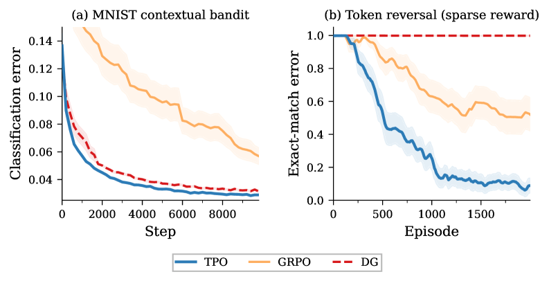
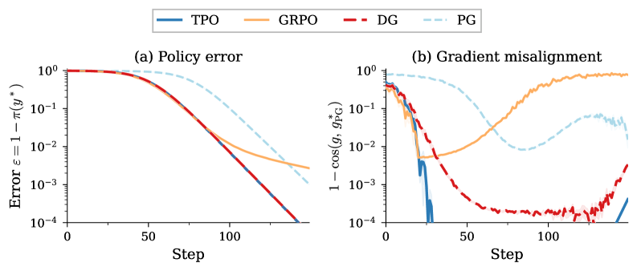
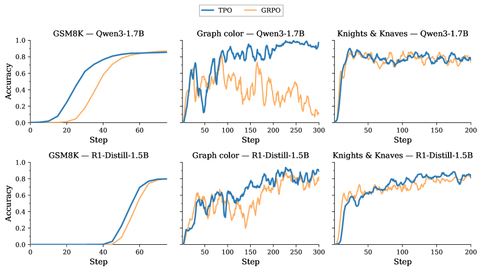
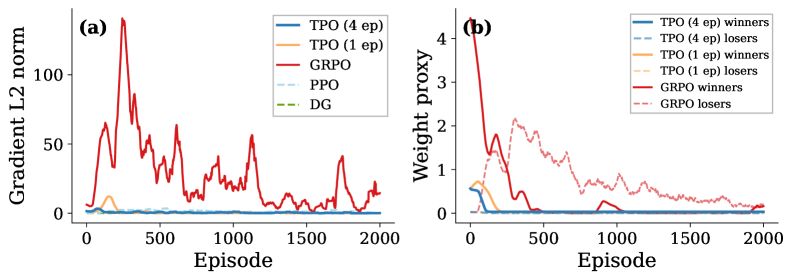
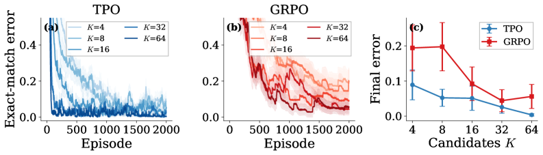
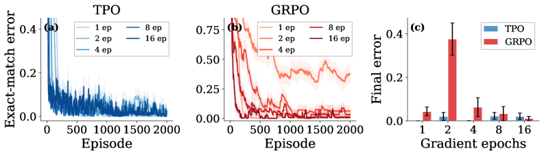
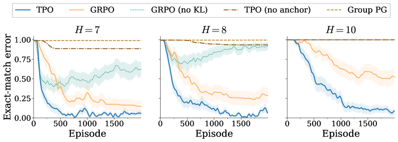

# Target Policy Optimization

- **Authors:** Jean Kaddour
- **Date:** April 7, 2026
- **Link:** [arxiv.org/abs/2604.06159](https://arxiv.org/abs/2604.06159)
- **Code:** [github.com/JeanKaddour/tpo](https://github.com/JeanKaddour/tpo)

## TL;DR

Target Policy Optimization (TPO) decouples two entangled questions in group-based RL: "which completions should gain probability?" and "how should parameters move?" Instead of scalar-weighted policy gradients, TPO constructs a closed-form target distribution over sampled candidates and fits the policy to it via cross-entropy. The gradient is simply `p - q` and vanishes exactly when the policy matches the target. TPO matches baselines on easy tasks and substantially outperforms PPO, GRPO, and DG under sparse reward, including on billion-parameter LLM RLVR.

---

## Key Figures

### Figure 1 -- Hero Result: Dense vs. Sparse Reward


The core claim in one image. **Left (dense):** On MNIST contextual bandit, TPO converges slightly faster than GRPO and DG. **Right (sparse):** On token reversal with terminal reward only, GRPO and DG stall near random (100% error) while TPO solves the task. This gap under sparse reward is TPO's main selling point.

### Figure 3 -- Single-Context Bandit: Gradient Quality


K=100 armed bandit, exact gradients. **(a)** TPO and DG converge fastest; GRPO and PG plateau at higher error. **(b)** Gradient misalignment: TPO stays closest to the oracle policy-gradient direction throughout training. GRPO's gradient becomes increasingly misaligned as the policy concentrates.

### Figure 10 -- LLM RLVR at Billion Scale


TPO vs. GRPO on Qwen3-1.7B and DeepSeek-R1-Distill-Qwen-1.5B across GSM8K, graph coloring, and Knights & Knaves. On GSM8K, both converge to ~85-87%. On the harder Reasoning Gym tasks, the gap is stark: GRPO fails entirely on graph coloring for Qwen3-1.7B (near-zero for 300 steps) while TPO reaches ~0.96. On R1-Distill-1.5B, TPO converges higher (~0.96 vs. ~0.81).

### Figure 11 -- TPO's Gradient Self-Extinguishes; GRPO's Does Not


**(a)** TPO's L2 gradient norm spikes during learning then decays to near zero once the policy converges (~episode 300). GRPO maintains persistent gradient norms throughout training, even after its error curve plateaus at 12.7%. **(b)** Weight proxy on successful vs. failed candidates: TPO rapidly removes weight from failures, while GRPO keeps assigning nonzero advantage to failures indefinitely.

### Figure 13 -- Group-Size Sensitivity Sweep


Varying K from 4 to 64. **(a)** TPO shows steady, monotonic improvement: 8.9% error at K=4 down to 0.36% at K=64. **(b)** GRPO is weaker and non-monotonic: 19.4% at K=4, improves to 4.4% at K=32, then worsens to 5.6% at K=64. **(c)** Final error comparison shows TPO scales smoothly with group size while GRPO does not.

### Figure 16 -- Epoch-Count Ablation


**(a)** TPO is stable across all epoch counts (1 to 16): final error stays below 2.3% everywhere. **(b)** GRPO is strongly non-monotonic: 2 epochs is worst (37.6%), 16 epochs is best (1.1%). **(c)** TPO is robust to this hyperparameter choice; GRPO requires careful tuning.

### Figure 9 -- Ablation: Anchor and Target Matching Both Matter


Terminal reward, reverse-copy task. Full TPO outperforms every ablation at each sequence length H. At H=10, TPO reaches 7.4% error while every ablation (no anchor, Group PG, GRPO no KL) exceeds 99%. The old-policy anchor (p^old) is critical. Target matching (fitting to q via CE) is also critical -- replacing it with scalar-weighted PG (Group PG) is the worst variant.

---

## Key Novel Ideas

### 1. The Core Decoupling: Reweight Then Fit

Standard policy-gradient methods entangle two questions:
1. **What redistribution is desired?** (Which completions should gain probability?)
2. **How should parameters move?** (The optimizer mechanics)

TPO separates them. First, construct a target distribution. Then, fit the policy to it.

### 2. Target Distribution Construction

Given K candidates sampled from the behavior policy with probabilities p_i^old and standardized scores u_i, TPO constructs:

$$q_i = \frac{p_i^{\text{old}} \exp(u_i / \eta)}{\sum_{j=1}^{K} p_j^{\text{old}} \exp(u_j / \eta)}$$

This "tilts" the old policy toward higher-scoring candidates. The temperature eta controls tilt strength (eta=1 used throughout; shown to be robust).

**Why standardize?** Without standardization, groups with the same ranking but different numerical spreads produce wildly different targets. For example, (100, 0, -100) makes the target nearly deterministic while (1, 0, -1) yields a gentle tilt. Standardization makes the update depend only on relative within-group performance.

### 3. Cross-Entropy Fitting with Self-Extinguishing Gradient

TPO fits the policy to the target by minimizing cross-entropy:

$$\mathcal{L}_{\text{TPO}}(\theta) = -\sum_{i=1}^{K} q_i \log p_i^{\theta}$$

The gradient on the group logits is:

$$\frac{\partial \mathcal{L}}{\partial \ell_i^{\theta}} = p_i^{\theta} - q_i$$

This gradient **vanishes exactly** when the policy matches the target (p = q). This is the key property that standard policy-gradient methods lack. PG/GRPO/PPO gradients persist even after convergence, causing the policy to keep drifting.

### 4. KL-Regularized Interpretation

The target q is equivalently the unique solution to:

$$q = \arg\max_{r \in \Delta^{K-1}} \left\{ \sum_{i=1}^{K} r_i u_i - \eta \, \text{KL}(r \| p^{\text{old}}) \right\}$$

This means TPO's target maximizes expected standardized reward while staying close to the old policy (measured by KL divergence). The finite scored candidate set makes this available in closed form -- no critic, no dual optimization, no inner loop.

### 5. Cross-Context Allocation Coefficients

In the multi-context bandit (Section 3.2), all methods share the same within-context direction but differ in the scalar weight beta(p_n) that controls how much of the normalized step each context receives:

| Method | beta(p_n) | Behavior at p_n=0.1 |
|--------|-----------|---------------------|
| CE (oracle) | 1 | 1.0 |
| DG | p_n / (1 + p_n) | 0.09 |
| GRPO | sqrt(p_n / (1 - p_n)) | 0.33 |
| TPO | p_n(lambda - 1) / (1 - p_n + lambda*p_n) | 0.73 |

DG and GRPO both vanish as p_n -> 0, meaning they barely update hard contexts. TPO's coefficient stays large even when p_n is small, allocating more update budget to hard contexts where it is most needed. This is why TPO tracks the CE oracle more closely.

---

## Architecture Details

TPO is **not a model architecture** -- it is a policy optimization algorithm. It is a drop-in replacement for the loss function in any group-based RL setup.

### Algorithm (pseudocode)

```
repeat:
  1. Freeze behavior policy: pi_old <- pi_theta
  2. Sample K candidates per context: y_1,...,y_K ~ pi_old(.|x)
  3. Score: s_i = S(x, y_i)
  4. Standardize: u_i = z-score(s_i)
  5. Compute target: q_i = p_i^old * exp(u_i/eta) / Z
  6. Take gradient steps on L_TPO = -sum(q_i * log(p_i^theta))
     treating q as fixed
until converged
```

### Implementation (4 lines of PyTorch)

```python
def tpo_target(log_scores, u, eta=1.0):
    return F.softmax(F.log_softmax(log_scores, -1) + u / eta, -1)

q = tpo_target(log_scores, u).detach()
log_p = F.log_softmax(log_scores, -1)
loss = -(q * log_p).sum(-1).mean()
```

The key insight: `log_scores` contains the policy log-probabilities of sampled candidates. `log_softmax` normalizes them into the group policy. Adding `u/eta` tilts toward higher scores. The outer `softmax` renormalizes. Then standard cross-entropy fitting.

### Two Operating Modes

1. **Token-level (TPO_token):** At each prefix state during autoregressive generation, sample K=8 next-token candidates and form the group over those. Used for dense per-token rewards.
2. **Sequence-level (TPO):** Sample K=8 (or K=16 for LLMs) full rollouts per prompt. Score each complete sequence. Used for terminal/sparse reward.

---

## Training Pipeline

### Small-Scale Experiments (Sections 3.1-3.7)

- **Optimizer:** Optax (JAX), Muon for 2D parameter tensors + AdamW for non-2D tensors
- **Learning rate:** 10^-3
- **Batch size:** B=100 prompts
- **Group size:** K=8 token candidates (dense), K=8 rollouts (terminal), K=16 (LLM RLVR)
- **Gradient epochs:** Multiple epochs per rollout batch for PPO/GRPO/TPO; single epoch for DG
- **Seeds:** 10-30 seeds per experiment

### LLM RLVR (Section 3.8)

- **Framework:** verl (HybridFlow)
- **Models:** Qwen3-1.7B, DeepSeek-R1-Distill-Qwen-1.5B
- **Tasks:** GSM8K, Reasoning Gym graph coloring, Reasoning Gym Knights & Knaves
- **Group size:** K=16 rollouts per prompt
- **Only difference between TPO and GRPO runs:** The policy loss (TPO cross-entropy vs. GRPO clipped surrogate with z-scored advantages)

---

## Key Results

### Tabular Bandits (Sections 3.1-3.2)

| Metric | TPO | DG | GRPO | PG |
|--------|-----|-----|------|-----|
| Single-context convergence | Fastest (with DG) | Fast | Plateaus | Plateaus |
| Misalignment to oracle | Lowest throughout | Moderate | Worsens | Worsens |
| Multi-context (vs CE oracle) | Closest to CE | Initially fast, overtaken | Moderate | Moderate |

### MNIST Contextual Bandit (Section 3.3)

| Method | Step to 5% error | Final error |
|--------|-----------------|-------------|
| TPO | 1,600 | **2.9%** |
| DG | 2,200 | 3.3% |
| PG | >10,000 | 5.3% |
| GRPO | >10,000 | 5.9% |

### Token Reversal -- Steps to 1% Error (Section 3.4)

| Method | V=2 | V=4 | V=8 | V=16 |
|--------|-----|-----|-----|------|
| TPO_token | **58** | **74** | **103** | **102** |
| GRPO_token | 904 | 141 | 124 | 148 |
| DG | 199 | 273 | 314 | 393 |
| PPO | 872 | 181 | 191 | 259 |

TPO is 1.4-15x faster than the runner-up.

### Task Variations -- Steps to 1% Error (Section 3.5)

Under **bag-of-tokens** reward, TPO_token reaches 1% first on all 8 variants (4 tasks x 2 rewards), 2-6x faster than runner-up.

Under **sequential** reward (sparser), only TPO_token and DG converge. GRPO_token and PPO fail on all 4 tasks.

### Terminal Reward -- Exact-Match Error % (Section 3.6)

| Method | H=7 | H=8 | H=9 | H=10 |
|--------|-----|-----|-----|------|
| **TPO** | **6.9** | **8.6** | **6.1** | **7.4** |
| GRPO | 14.5 | 27.6 | 30.0 | 50.4 |
| PPO | 12.0 | 26.3 | 90.6 | -- |
| DG | 33.8 | 58.8 | -- | -- |
| GRPO (no KL) | 66.6 | 92.5 | -- | -- |

("--" means >95% error, i.e., no meaningful learning.)

TPO is the only method that learns at every sequence length. The gap widens dramatically with H.

### LLM RLVR (Section 3.8)

| Task | Model | TPO | GRPO |
|------|-------|-----|------|
| GSM8K | Qwen3-1.7B | ~87% (faster early) | ~85% |
| GSM8K | R1-Distill-1.5B | ~80% | ~78% |
| Graph coloring | Qwen3-1.7B | **~0.96** | **fails (~0)** |
| Graph coloring | R1-Distill-1.5B | **~0.96** | ~0.81 |
| Knights & Knaves | Qwen3-1.7B | ~0.76 | ~0.70 |
| Knights & Knaves | R1-Distill-1.5B | ~0.75 | ~0.68 |

On easy tasks (GSM8K), both converge to similar accuracy. On harder tasks with sparser reward, TPO's advantage is stark -- GRPO outright fails on graph coloring with Qwen3-1.7B.

### Ablation Results (Section 3.7)

At H=10 (hardest terminal-reward setting):

| Variant | Error |
|---------|-------|
| **Full TPO** | **7.4%** |
| TPO (no anchor) | >99% |
| Group PG | >99% |
| GRPO | 50.4% |
| GRPO (no KL) | >99% |

Both the old-policy anchor (p^old) and the target-matching mechanism are essential. Removing either is catastrophic.

### Group-Size Ablation (Section 4.2)

| K | TPO | GRPO |
|---|-----|------|
| 4 | 8.9% | 19.4% |
| 8 | 5.2% | 19.8% |
| 16 | 5.1% | 9.2% |
| 32 | 2.6% | 4.4% |
| 64 | **0.36%** | 5.6% |

TPO improves monotonically with K. GRPO is non-monotonic (worsens from K=32 to K=64).

### Epoch-Count Ablation (Section 4.3)

| Epochs | TPO | GRPO |
|--------|-----|------|
| 1 | 0.02% | 4.3% |
| 2 | 2.3% | **37.6%** |
| 4 | 0.05% | 6.3% |
| 8 | <2.3% | 3.3% |
| 16 | <2.3% | 1.1% |

TPO is stable across all epoch counts. GRPO is extremely sensitive -- 2 epochs is catastrophic (37.6%).

---

## Key Takeaways

1. **Decoupling "what" from "how" is the core insight.** Standard PG methods entangle the desired probability redistribution with the optimizer mechanics that realize it. TPO separates them: build a target distribution, then fit to it. This makes the update more interpretable and robust.

2. **The self-extinguishing gradient is a genuine advantage.** TPO's gradient vanishes exactly at p=q. PG methods lack this fixed point, causing persistent gradients that keep moving the policy even after convergence. This is especially harmful under sparse reward where the policy can overshoot.

3. **TPO allocates more update budget to hard contexts.** In the multi-context setting, DG and GRPO have vanishing beta as p_n -> 0, meaning they barely update hard problems. TPO's coefficient stays large for hard contexts, matching the CE oracle's behavior.

4. **Sparse reward is where TPO shines most.** On dense-reward tasks, all methods converge similarly (TPO is slightly faster). The real gap emerges under sparse/terminal reward where informative groups are rare and each must be fully exploited.

5. **Zero-variance groups are not junk.** Counter-intuitively, masking all-fail groups (where all K candidates get the same score) is harmful for GRPO (error jumps from 6.3% to 29.7%). In multi-epoch training, these groups provide a useful anchor pulling the policy back toward the rollout snapshot. TPO handles this naturally -- zero-variance means u=0, so q=p^old, contributing no signal on the first epoch but anchoring on later epochs.

6. **TPO is robust to hyperparameters that GRPO is sensitive to.** TPO's final error is stable across group sizes (monotonically improving) and epoch counts (always <2.3%). GRPO is non-monotonic for both: wrong K or wrong epoch count can be catastrophic.

7. **The old-policy anchor is essential.** Removing p^old from the target (using q proportional to exp(u_i) instead of p^old exp(u_i)) destroys performance. The anchor ensures the target stays close to the behavior policy, preventing catastrophic overstepping.

8. **Multi-epoch extraction is stable.** TPO's fixed target q provides a stable attractor across gradient epochs. With 4 epochs, TPO reaches 0.2% error at episode 400 vs. 1.1% for 1 epoch -- roughly 5x faster early convergence. DG cannot use multiple epochs safely because it lacks a stable target.

9. **TPO transfers to billion-parameter LLM RLVR.** On Qwen3-1.7B and R1-Distill-1.5B, TPO is a drop-in replacement for GRPO's loss. It matches on easy tasks (GSM8K) and dominates on harder reasoning tasks (graph coloring, Knights & Knaves).

10. **Implementation is trivial.** The entire TPO update is 4 lines of PyTorch. No critic, no dual optimization, no inner loop. The only new piece beyond standard GRPO is replacing the clipped surrogate loss with cross-entropy to a softmax-and-tilt target.

---

## What's Open-Sourced

- **Code:** [github.com/JeanKaddour/tpo](https://github.com/JeanKaddour/tpo) -- full implementation
- **Models:** Not released (experiments use existing open-source models: Qwen3-1.7B, DeepSeek-R1-Distill-Qwen-1.5B)
- **Data:** Standard benchmarks (GSM8K, Reasoning Gym)

### Limitations Noted by Authors

1. **Scale:** Only tested on 1.5-1.7B models. Whether gains persist at 7B+ or on harder benchmarks (MATH, AIME) is unknown.
2. **Candidate quality:** TPO can only redistribute over sampled candidates. If the candidate set is uniformly poor, the target is correspondingly uninformative.
3. **Score standardization:** Can amplify small differences when within-group variance is tiny (same difficulty-bias issue as GRPO).
4. **Rollout cost:** TPO requires K rollouts per context, same as GRPO. It uses them better but does not reduce the cost.
