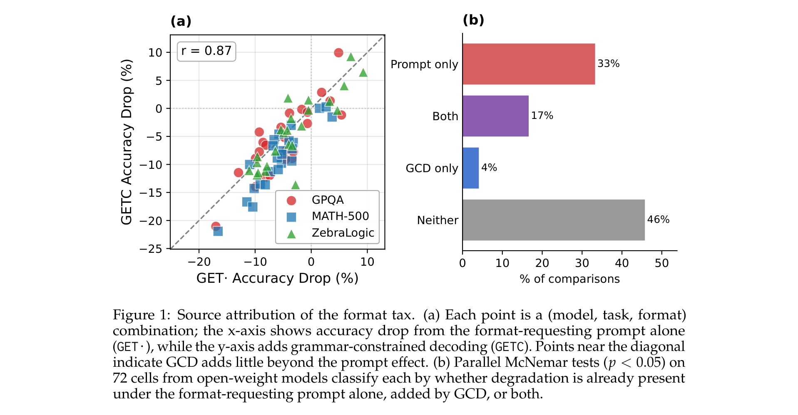
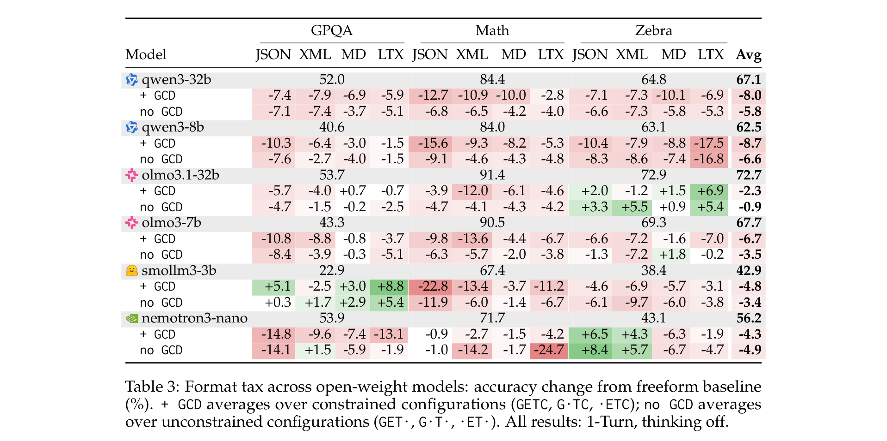
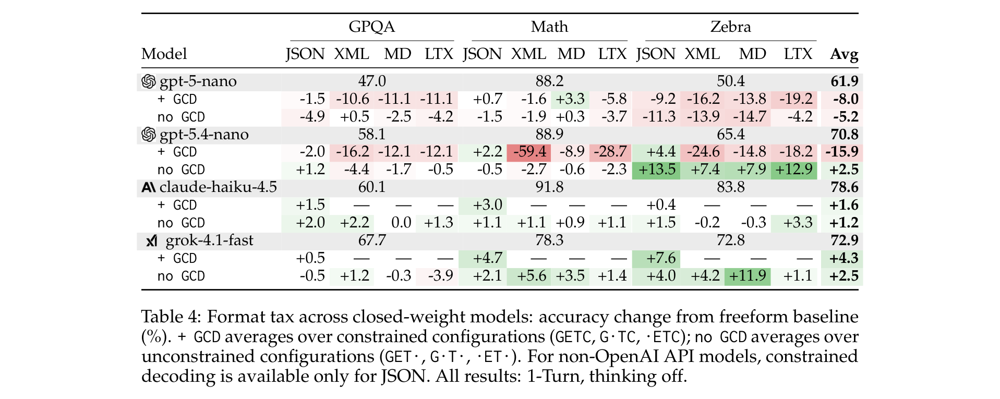
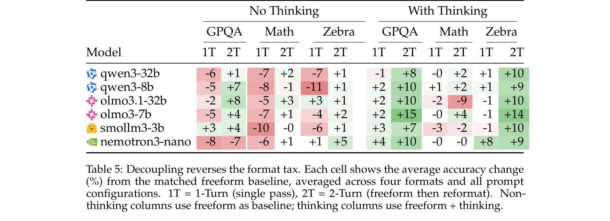
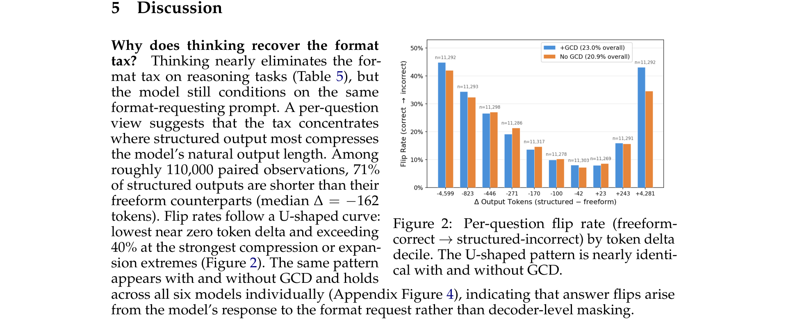

# The Format Tax

**Authors:** Ivan Yee Lee, Loris D'Antoni, Taylor Berg-Kirkpatrick — UC San Diego
**Date:** April 4, 2026
**Paper:** [PDF](https://arxiv.org/abs/2604.03616)
**Code:** [github.com/ivnle/the-format-tax](https://github.com/ivnle/the-format-tax)

---

## TL;DR

Requiring structured output (JSON, XML, Markdown, LaTeX) degrades reasoning and writing performance across all open-weight models tested. The key finding: the degradation is mostly caused by the **format-requesting prompt** — not by grammar-constrained decoding (GCD). Simply asking for structured output, before any decoder constraint is applied, accounts for ~92% of the problem. The fix: decouple reasoning from formatting, either by generating freeform first and reformatting in a second pass ("2-Turn"), or by using extended thinking. Both approaches recover most lost accuracy. Recent closed-weight models (claude-haiku-4.5, grok-4.1-fast, gpt-5.4-nano) show near-zero format tax, suggesting the problem is solvable.

---

## Key Figures

### Figure 1: Source Attribution — The Prompt Is the Problem, Not the Decoder

**(a)** Each point is a (model, task, format) combination. The x-axis shows accuracy drop from the format-requesting prompt alone (GET·, no GCD); the y-axis adds GCD (GETC). Points hugging the diagonal (r = 0.87) show that GCD adds almost nothing beyond the prompt effect. **(b)** Of 72 cells with statistically significant effects (p < 0.05), 33% are caused by the prompt alone, 17% by both prompt + GCD, and only 4% by GCD alone. 46% show no significant degradation at all. **The prompt accounts for 92% of the explainable degradation; GCD adds only 4% on its own.**

### Table 3: Format Tax Across Open-Weight Models

Red cells show degradation vs. freeform baseline; green shows improvement. The dominant color is red — every open-weight model degrades under structured output. The tax varies by model and task: qwen3-8b averages -9.9 pp, while nemotron3-nano averages -4.3 pp. No format is consistently better or worse than others.

### Table 4: Closed-Weight Models Show Near-Zero Tax

gpt-5-nano (older) still shows format tax (-5.2 pp without GCD). But claude-haiku-4.5, grok-4.1-fast, and gpt-5.4-nano show near-zero or positive deltas without GCD. This proves the format tax is not inherent to structured generation — it's a gap that training can close.

### Table 5: Decoupling Reverses the Format Tax

1T = single-pass generation (the default, shows degradation). 2T = freeform first, then reformat. **2-Turn recovers +6.8 pp on average** across 72 comparisons, significantly improving 42 of 72 and worsening only 2. Thinking also recovers the tax but is more variable (15% worsening rate).

### Figure 2: Why Formatting Hurts — The U-Shaped Flip Rate

The x-axis shows how much shorter or longer structured output is compared to freeform (Δ tokens). The y-axis shows the flip rate (fraction of questions where freeform was correct but structured was wrong). Flips are lowest near zero delta and spike at the extremes — both when structured output is much shorter (compression loses information) and much longer (expansion wastes reasoning capacity on formatting). The pattern is identical with and without GCD, confirming the prompt is the cause.

---

## Key Novel Ideas

### 1. Decomposing the Format Tax into Prompt-Level vs. Decoder-Level

The paper's central contribution is a clean causal decomposition. Prior work assumed grammar-constrained decoding (masking tokens to enforce valid output) was the main source of quality loss. This paper tests that assumption directly by comparing:

- **GET·** (format-requesting prompt, no GCD) vs.
- **GETC** (same prompt + GCD active)

If GCD were the culprit, GETC would be much worse than GET·. Instead, degradation is nearly identical (r = 0.87 between the two). The average delta from the prompt alone is −3.9 pp; adding GCD adds only −1.6 pp more. Parallel McNemar tests on 72 cells confirm: of 39 cells with any significant effect, 36 (92%) already have the effect under the prompt alone, and only 3 cells show GCD-only degradation.

This finding has major implications for the research community: the entire line of work on "grammar-aligned decoding" (GAD) methods — which tries to correct the sampling bias of GCD — is working on a problem that accounts for at most ~8% of the loss. The real problem is that the format-requesting prompt distorts the model's reasoning process.

### 2. The Mechanism: Token Compression and Expansion

The paper provides a mechanistic explanation for *why* the prompt hurts. Across ~110,000 paired observations, 71% of structured outputs are shorter than their freeform counterparts (median Δ = −162 tokens). This compression is not benign — it correlates with answer flips.

The relationship follows a **U-shaped curve** (Figure 2): accuracy loss is worst when the token delta is extreme in either direction.

- **When structured output is much shorter than freeform** (left tail): the model compresses its reasoning to fit the format, losing intermediate steps needed for correct answers.
- **When structured output is much longer than freeform** (right tail): the model spends tokens on format overhead (opening/closing tags, key names, escaping), reducing the token budget available for actual reasoning.
- **Near zero delta** (center): little compression or expansion, and accuracy loss is minimal.

### 3. Two Mitigations: 2-Turn and Thinking

**2-Turn (Decoupled Generation):** The model first generates a freeform answer (no format mention), then a second call reformats that answer into the target structure. The second call uses GCD but the reasoning is already complete.

- Average improvement: **+6.8 pp** vs. 1-Turn structured output
- Safe: only 3% worsening rate (2 of 72 comparisons)
- Works consistently across tasks: MATH-500 (19 of 24 improved), GPQA (10 of 24), ZebraLogic (13 of 24)
- Cost: two inference calls, roughly double token consumption

**Thinking (Extended Reasoning):** Models with thinking enabled (hidden scratchpad before visible output) can reason freely in the thinking block, then commit to structured format only for the visible answer.

- Average improvement: **+9.2 pp** on reasoning tasks
- Stronger but riskier: 15% worsening rate (11 of 72 comparisons)
- Thinking token counts are strongly correlated between freeform and structured (r = 0.72), confirming thinking effort tracks question difficulty, not format complexity
- Does NOT help writing (WritingBench): thinking actually widens the gap on some models

### 4. The Closed-Weight Gap

Three recent API models — claude-haiku-4.5, grok-4.1-fast, gpt-5.4-nano — show near-zero or positive format tax *without GCD*. This is the paper's most practical finding: the format tax is not a fundamental limitation of structured generation. Some models have already solved it, likely through deliberate structured-output fine-tuning or broader post-training. The paper raises this as an open question for the open-weight community: should robustness to format constraints become an explicit training objective?

One exception: gpt-5.4-nano shows *severe* degradation under GCD for non-JSON formats (XML: -59 pp, LaTeX: -28 pp), because its structured output training was apparently optimized only for JSON. This shows that GCD *can* cause extreme harm when the model's training doesn't cover the grammar being enforced.

---

## Key Results

### Format Tax Definition

$$\text{Format Tax} = \text{Perf}_{\text{freeform}} - \text{Perf}_{\text{format-constrained}}$$

A positive value means structured output hurts performance.

### Open-Weight Models (Table 3, averaged across formats)

| Model | GPQA | MATH-500 | ZebraLogic | Avg Tax |
|-------|------|----------|------------|---------|
| qwen3-32b | -6.4 | -8.0 | -6.1 | -6.8 |
| qwen3-8b | -6.3 | -7.0 | -6.7 | -6.7 |
| olmo3.1-32b | -3.2 | -5.7 | -0.7 | -3.2 |
| olmo3-7b | -6.9 | -5.0 | -3.8 | -5.2 |
| smollm3-3b | +0.6 | -8.1 | +3.8 | -1.2 |
| nemotron3-nano | -9.6 | -6.3 | -4.3 | -6.7 |

All models show net degradation. Values are percentage-point changes from freeform baseline.

### Closed-Weight Models (Table 4, without GCD)

| Model | Avg Tax (no GCD) |
|-------|-----------------|
| gpt-5-nano | -5.2 |
| gpt-5.4-nano | +2.5 |
| claude-haiku-4.5 | +1.2 |
| grok-4.1-fast | +1.6 |

Recent models resist the tax; older gpt-5-nano does not.

### Decoupling Recovery (Table 5, averaged)

| Strategy | Avg Change vs. Freeform |
|----------|------------------------|
| 1-Turn (baseline) | Negative (format tax) |
| 2-Turn | +6.8 pp recovery |
| 1-Turn + Thinking | +9.2 pp on reasoning |

### Writing Quality (Table 2, WritingBench, LaTeX format)

| Model | 1-Turn Tax | 2-Turn Recovery |
|-------|-----------|-----------------|
| nemotron3-nano | -15.7 pp | -6.9 pp (partial) |
| qwen3-32b | -6.8 pp | -0.5 pp (near full) |
| smollm3-3b | -5.6 pp | -4.2 pp (partial) |

LaTeX formatting hurts writing quality (not just a judge artifact — stripping markup and judging prose gives similar scores). 2-Turn partially recovers but the effect is weaker for writing than reasoning.

### Format Compliance vs. Accuracy (Table 7)

| | No GCD Valid | No GCD Acc | +GCD Valid | +GCD Acc |
|---|---|---|---|---|
| All | 55.7% | 57.3% | 92.2% | 55.7% |

GCD dramatically improves format compliance (55.7% → 92.2%) but **does not improve reasoning accuracy** (stays ~55-57%). Models that produce valid structured output lose just as much accuracy as those that fail to comply.

---

## Key Takeaways

1. **The format tax is real and widespread.** Every open-weight model tested (3B-32B parameters, 2024-2025 releases) shows degradation under structured output. The average loss is 3-10 percentage points on reasoning benchmarks.

2. **The culprit is the prompt, not the decoder.** Simply asking for structured output in the prompt causes 92% of the degradation. Grammar-constrained decoding adds only marginal additional harm (~4% of cases). This upends the prevailing research focus on improving constrained decoding methods.

3. **GCD improves compliance without improving accuracy.** Format validity jumps from 55.7% to 92.2% with GCD, but reasoning accuracy stays flat. Models that successfully comply with format constraints lose just as much accuracy as those that don't.

4. **The mechanism is token reallocation.** Structured output compresses or expands the model's natural response length. Both extremes cause accuracy loss (U-shaped curve). Format prompts compress visible reasoning into format fields (losing intermediate steps) or expand it with formatting overhead (leaving less budget for actual reasoning).

5. **Decoupling reasoning from formatting recovers the tax.** Both 2-Turn (freeform → reformat) and thinking (hidden scratchpad → structured visible output) work. 2-Turn is safer (3% worsening rate); thinking is stronger but riskier (15% worsening rate).

6. **Recent closed-weight models have already closed the gap.** claude-haiku-4.5, grok-4.1-fast, and gpt-5.4-nano show near-zero format tax. This proves the tax is a training gap, not a fundamental limitation. The open-weight community should consider format robustness as a training objective.

7. **Richer prompts don't help.** The paper tests schema descriptions, few-shot examples, and other prompt-level mitigations (the GETC notation system). None of them close the gap. The degradation is not caused by ambiguous format instructions — it's caused by the model trying to reason and format simultaneously.

8. **The writing tax is distinct from the reasoning tax.** On WritingBench, thinking does not help (and sometimes hurts). The writing degradation appears to stem from the model's prose quality declining under format constraints, not from reasoning failures. 2-Turn partially recovers writing quality but less effectively than for reasoning.

9. **Training for one format doesn't generalize.** gpt-5.4-nano shows near-zero tax for JSON but catastrophic collapse under non-JSON GCD (XML: -59 pp), with token counts dropping to 50-90 as the model generates placeholder text. Structured output training must cover the full range of target formats.

10. **The paper likely underestimates the real-world format tax.** All experiments use clean schemas, unambiguous instructions, and standard benchmarks. Real deployments contend with schema errors, ambiguous specifications, and malformed examples — conditions that would compound the observed degradation.

---

## What's Open-Sourced

- **Code:** [github.com/ivnle/the-format-tax](https://github.com/ivnle/the-format-tax) — full experimental pipeline and reproduction instructions
- **Full results:** Table 10 in the appendix provides per-configuration results across all models, formats, tasks, and generation strategies
- No model checkpoints (the paper evaluates existing models, doesn't train new ones)
