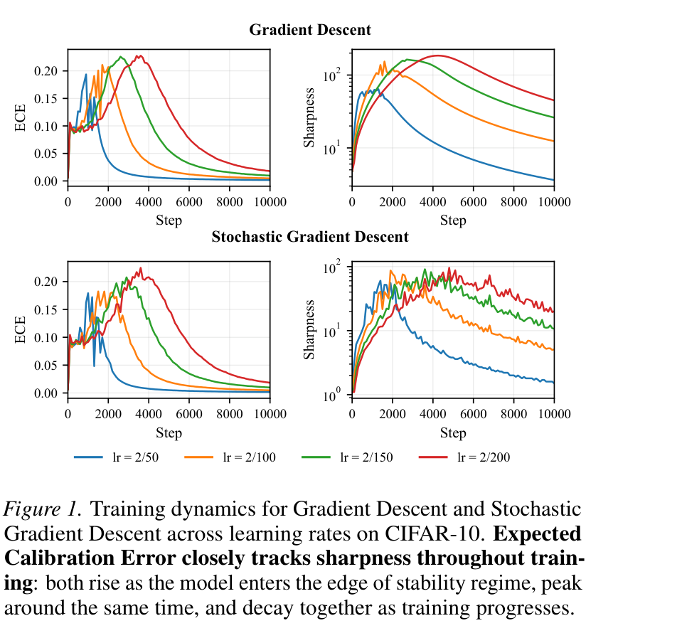
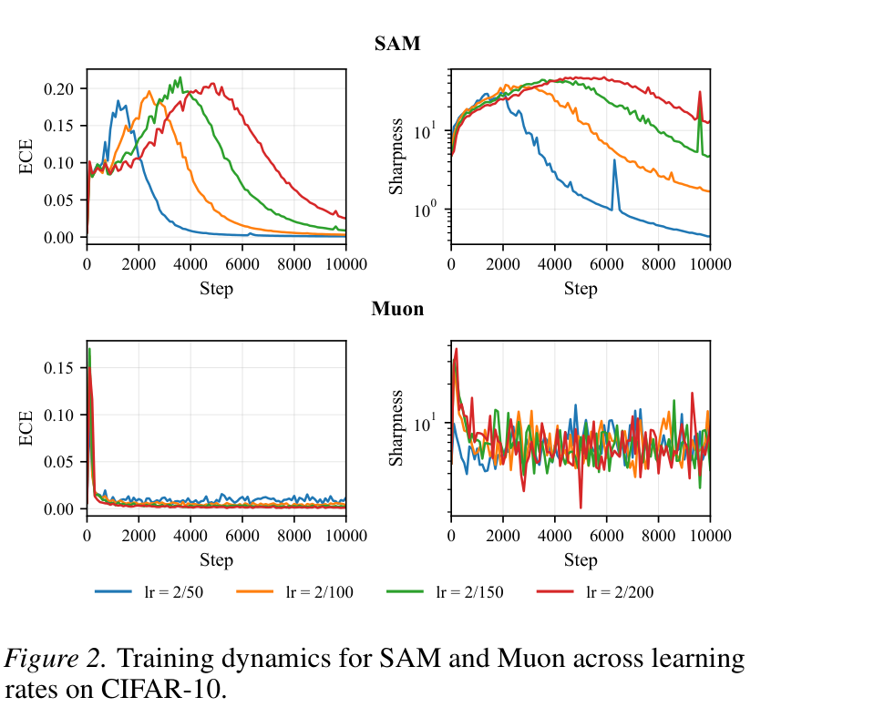
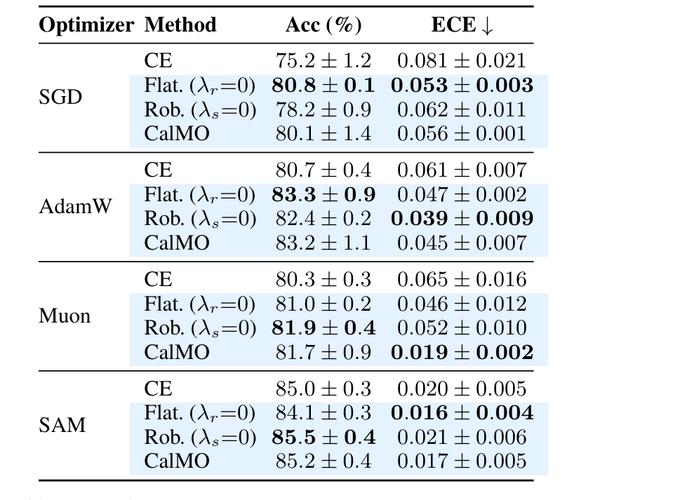
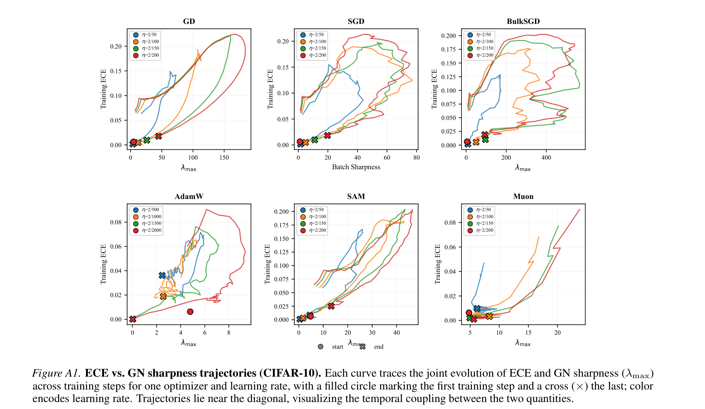

# Too Sharp, Too Sure: When Calibration Follows Curvature

**Authors:** Alessandro Morosini, Matea Gjika, Tomaso Poggio, Pierfrancesco Beneventano — MIT
**Date:** April 22, 2026
**Paper:** [PDF](https://arxiv.org/abs/2604.20614)
**Code:** [github.com/AlessandroMorosini/2sharp2sure](https://github.com/AlessandroMorosini/2sharp2sure)

---

## TL;DR

This paper shows that neural network calibration (whether a model's confidence matches its accuracy) is tightly coupled with the **curvature** of the loss landscape throughout training — not just at convergence. ECE (Expected Calibration Error) and Gauss-Newton sharpness rise and fall together during training, both governed by the same underlying quantity: the **exponential margin tail** Q(θ) = E[e^(-m(x,y))]. This unifying perspective motivates CalMO (CAlibration with Margin Objective), a training loss that directly regularizes robust margins and local smoothness, reducing test ECE by up to 71% (Muon: 0.065 → 0.019) without sacrificing accuracy.

---

## Key Figures

### Figure 1: ECE Closely Tracks Sharpness Throughout Training

Training dynamics for Gradient Descent (top) and SGD (bottom) across four learning rates. Left columns: ECE over training steps. Right columns: Gauss-Newton sharpness (λ_max). Both quantities follow the same trajectory — they rise together as the model enters the edge-of-stability regime, peak at the same time, and decay together. This co-evolution holds across all optimizers and learning rates tested.

### Figure 2: SAM vs. Muon — Flat Minima vs. Directional Flatness

SAM (top) converges to globally flat minima but shows calibration trajectories similar to standard training. Muon (bottom) suppresses high-curvature directions without making the solution globally flat, yet achieves much lower in-sample calibration error. This supports Hypothesis 2: it's *directional* flatness (suppressing steep descent directions) that matters for calibration, not global flatness.

### Table 2: CalMO Results — ECE Reduction Across Optimizers

CalMO (last row per optimizer) consistently reduces test ECE compared to standard cross-entropy across all four optimizers. The most dramatic improvement is on Muon: ECE drops from 0.065 to **0.019** (71% reduction) while accuracy is preserved (80.3 → 81.7%). For SAM, CalMO achieves 0.017 ECE with 85.2% accuracy. The ablation rows (Flat. and Rob.) show that the optimal combination of robustness and flatness terms is optimizer-dependent.

### Figure A1: ECE vs. Sharpness Trajectories Across All Optimizers

Each curve traces the joint evolution of ECE and λ_max over training for one optimizer and learning rate (filled circle = start, cross = end). Trajectories cluster near the diagonal, visualizing the temporal coupling between calibration and curvature. The pattern holds across GD, SGD, BulkSGD, AdamW, SAM, and Muon.

---

## Key Novel Ideas

### 1. Calibration as a Training-Time Phenomenon

Prior work treats calibration as a property of the final model — something you fix post-hoc with temperature scaling. This paper reframes calibration as a **dynamical** quantity that evolves throughout training, tightly coupled to loss-landscape geometry.

The key empirical observation (Contribution 1): ECE and Gauss-Newton sharpness (the top eigenvalue λ_max of the GN matrix) follow the same temporal trajectory during training. Both rise as the model approaches the edge-of-stability regime, peak together, and decay together. This holds across GD, SGD, AdamW, Muon, and SAM, and across CIFAR-10 and CIFAR-100. Pearson correlations between training ECE and sharpness range from 0.61 to 0.98 (Table 1).

### 2. Directional Flatness Beats Global Flatness for Calibration

The paper distinguishes two competing hypotheses about why curvature affects calibration:

**Hypothesis 1 (Flat Minima):** Converging to globally flat regions of the loss landscape produces better-calibrated models. SAM explicitly encourages this.

**Hypothesis 2 (Directional Flatness):** Suppressing updates along high-curvature directions during training improves calibration, even if the final solution isn't globally flat. Muon and BulkSGD do this.

The experiments clearly favor Hypothesis 2. Muon maintains low in-sample calibration error while operating in regions that are **not** globally flat. BulkSGD improves calibration even amid pronounced instability. SAM, despite finding flat minima, shows calibration trajectories similar to standard GD/SGD. The distinction matters: it's *how* the optimizer traverses curvature directions during training, not *where* it converges, that determines calibration.

### 3. The Margin Tail as a Unifying Mediator

The paper's central theoretical contribution is identifying the **robust exponential margin moment** as the quantity that simultaneously controls both ECE and GN sharpness:

$$Q(\theta) := \mathbb{E}_{(X,Y) \sim \pi}\left[e^{-m_{\varepsilon,\theta}(X,Y)}\right]$$

where the robust true margin is:

$$m_{\varepsilon,\theta}(x, y) := \inf_{\|\delta\| \leq \varepsilon} m_\theta(x + \delta, y)$$

and the true margin is:

$$m_\theta(x, y) := z_\theta(x)_y - \max_{j \neq y} z_\theta(x)_j$$

In words: the margin is how much larger the correct-class logit is compared to the largest wrong-class logit. The robust margin is the worst-case margin under small input perturbations.

**Theorem 4.1 (Overlap regime):** For any θ and any distribution π:

$$\text{ECE}_M \leq (K-1) \, Q(\theta)$$

and if the Jacobian norm is bounded by C_J:

$$\lambda_{\max}(H_{\text{GN}}) \leq 2C_J^2 (K-1) \, Q(\theta)$$

Both ECE and GN sharpness are upper-bounded by the same exponential margin moment Q(θ), up to problem-specific constants. This is why they co-evolve: as training pushes margins up, Q(θ) shrinks, pulling both ECE and sharpness down together.

**Theorem 4.2 (Interpolating regime):** When all training points are correctly classified (γ > 0), the bounds become two-sided:

$$\frac{1}{K} Q_\mathcal{D}(\theta) \leq \text{ECE}_M(\theta; \mathcal{D}) \leq (K-1) \, Q_\mathcal{D}(\theta)$$

and similarly for λ_max. This means in-sample ECE and GN sharpness are **equivalent** up to constants — they're forced to co-vary.

### 4. CalMO: CAlibration with Margin Objective

Guided by the theory, the paper introduces a training loss that directly targets robust margins:

$$L_{\text{CalMO}}(\theta) = \mathbb{E}_{(x,y)}\left[\ell_{\text{CE}}(\theta; x, y) + \lambda_r R_{\text{rob}}(\theta; x, y) + \lambda_s R_{\text{smooth}}(\theta; x, y)\right]$$

Two regularization terms:

**Robustness regularizer R_rob:** Encourages consistent predictions between clean and adversarial inputs:

$$R_{\text{rob}}(\theta; x, y) = D_{\text{KL}}\big(p_\theta(x) \,\|\, p_\theta(x_{\text{adv}})\big)$$

where x_adv is a 3-step PGD adversarial example. Combined with cross-entropy at x, this raises the margin at the worst point in the ε-neighborhood, directly targeting the robust margin m_{ε,θ}.

**Smoothness regularizer R_smooth:** Prevents the margin Lipschitz constant from growing too large, which would make the ECE bound vacuous:

$$R_{\text{smooth}}(\theta; x, y) = \|\nabla_x m_\theta(x, y)\|_2^2$$

This keeps robust margins close to clean margins, ensuring the bound e^(-m_{ε,θ}) ≤ e^(-m_θ) · e^(εL_m) doesn't blow up.

### 5. Muon's Calibration Failure Mode

The paper discovers a specific failure mode of the Muon optimizer: Muon induces **unusually large training margins**, driving training ECE to near-zero, but these margins are *fragile* — they collapse under small input perturbations. This causes severe test-time overconfidence (test ECE remains high even as training ECE vanishes).

This is exactly the failure that CalMO's robust-margin term fixes. For Muon specifically, neither robustness nor flatness alone suffices — their combination in CalMO yields the largest ECE reduction (0.065 → 0.019) of any optimizer tested.

---

## Key Results

### CalMO vs. Cross-Entropy (ResNet-20, CIFAR-10, Table 2)

| Optimizer | Method | Acc (%) | Test ECE ↓ |
|-----------|--------|---------|-----------|
| SGD | CE | 75.2 ± 1.2 | 0.081 ± 0.021 |
| SGD | CalMO | **80.1 ± 1.4** | **0.056 ± 0.001** |
| AdamW | CE | 80.7 ± 0.4 | 0.061 ± 0.007 |
| AdamW | CalMO | **83.2 ± 1.1** | **0.045 ± 0.007** |
| Muon | CE | 80.3 ± 0.3 | 0.065 ± 0.016 |
| Muon | CalMO | **81.7 ± 0.9** | **0.019 ± 0.002** |
| SAM | CE | 85.0 ± 0.3 | 0.020 ± 0.004 |
| SAM | CalMO | **85.2 ± 0.4** | **0.017 ± 0.005** |

CalMO improves or preserves accuracy in every case while reducing ECE.

### CalMO vs. Other Intrinsic Calibration Methods (Table A2, 90/10 split)

| Optimizer | Method | Acc (%) | ECE ↓ |
|-----------|--------|---------|-------|
| Muon | CE | 80.3 | 0.065 |
| Muon | Label Smooth. | **82.4** | 0.045 |
| Muon | Focal Loss | 78.7 | 0.025 |
| Muon | CalMO | 81.7 | **0.019** |
| SAM | CE | 85.0 | 0.020 |
| SAM | Label Smooth. | **86.2** | 0.067 |
| SAM | Focal Loss | 84.0 | 0.089 |
| SAM | CalMO | 85.8 | **0.017** |

CalMO achieves the lowest ECE for Muon and SAM, while label smoothing and focal loss can actually increase ECE (SAM: 0.020 → 0.067/0.089).

### Sharpness–Calibration Correlation (Table 1)

| Optimizer | Train ECE-Sharpness (Pearson r) | Test ECE-Sharpness |
|-----------|---|----|
| GD | 0.83 ± 0.08 | 0.96 ± 0.02 |
| SGD | 0.84 ± 0.07 | 0.97 ± 0.01 |
| AdamW | 0.72 ± 0.07 | 0.15 ± 0.15 |
| Muon | 0.63 ± 0.26 | −0.10 ± 0.28 |
| SAM | 0.92 ± 0.04 | 0.98 ± 0.01 |

Strong in-sample coupling across all optimizers. Out-of-sample coupling breaks for AdamW and Muon, reflecting the calibration generalization gap.

---

## Key Takeaways

1. **Calibration is a training-time phenomenon, not just a post-hoc concern.** ECE tracks curvature throughout the entire training trajectory, not just at convergence. This opens the door to training-time interventions that are more principled than post-hoc temperature scaling.

2. **Directional flatness matters more than global flatness.** Optimizers that suppress updates along high-curvature directions (Muon, BulkSGD) produce better in-sample calibration than those that seek globally flat minima (SAM). This is because calibration depends on *how* the optimizer traverses the loss landscape, not *where* it ends up.

3. **A single quantity — the exponential margin tail — controls both ECE and sharpness.** The robust exponential margin moment Q(θ) = E[e^(-m_{ε,θ})] upper-bounds both metrics, explaining their temporal co-evolution. In the interpolating regime, the bounds are two-sided: they're not just correlated, they're mathematically forced to co-vary.

4. **Muon has a specific calibration failure mode: fragile margins.** Muon drives training margins to extreme values (near-zero training ECE) but these margins are not robust — they collapse under small perturbations, causing test-time overconfidence. CalMO's robustness term directly fixes this.

5. **Training and test calibration can diverge even as accuracy improves.** Once models enter the interpolating regime, a small set of near-boundary or negative-margin test points can dominate the margin functional, making test ECE highly sensitive to how optimization shapes the tail. This explains why calibration-accuracy gaps are common.

6. **CalMO is optimizer-dependent in its mechanism.** For SGD, the flatness term does most of the work. For AdamW, robustness and flatness split the gain. For Muon, neither alone suffices — only their combination produces the dramatic ECE reduction. CalMO should not be viewed as universally superior but as a targeted intervention whose components interact with the optimizer's dynamics.

7. **Label smoothing and focal loss are unreliable for calibration.** On SAM, both methods *increase* ECE substantially (0.020 → 0.067 for label smoothing). Their effectiveness is optimizer-dependent in unpredictable ways. CalMO, by targeting the root cause (margin tails), is more consistent.

8. **The paper is limited to small-scale vision.** All experiments use MLPs and ResNet-20 on CIFAR-10/100. The authors explicitly flag that extending to language models, where calibration is equally critical, is an open direction. The theoretical framework (margin bounds) generalizes, but the empirical validation at scale is missing.

---

## What's Open-Sourced

- **Code:** [github.com/AlessandroMorosini/2sharp2sure](https://github.com/AlessandroMorosini/2sharp2sure) — full experimental pipeline
- No pretrained checkpoints (experiments are small-scale and quick to reproduce)
