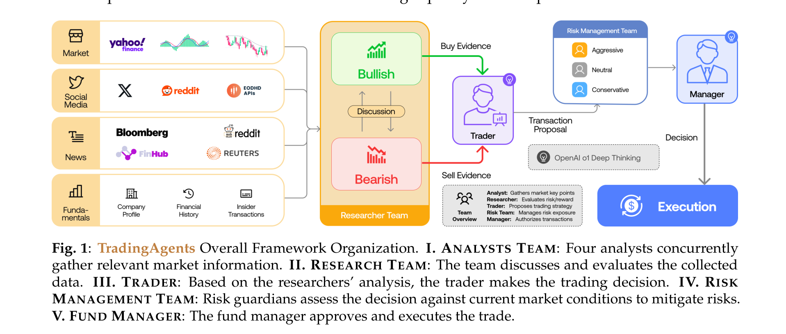
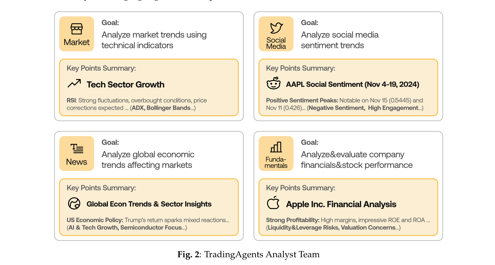
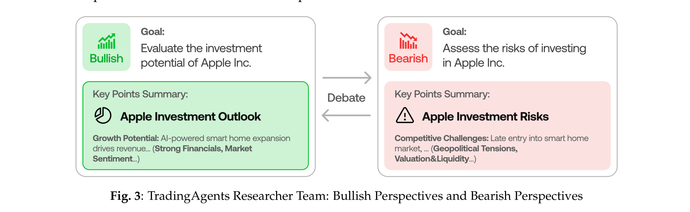
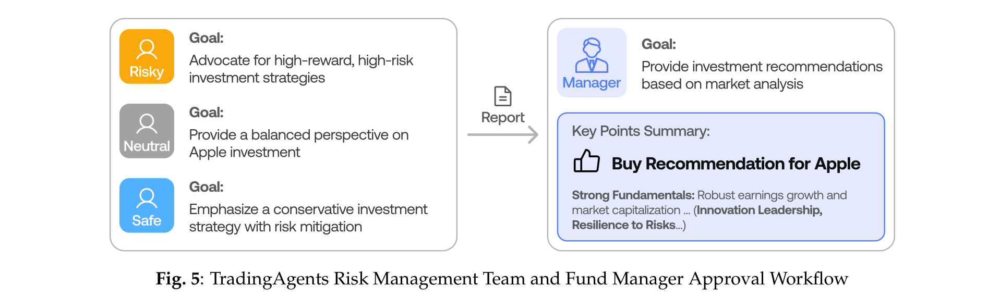
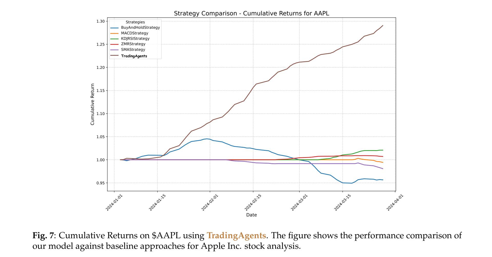
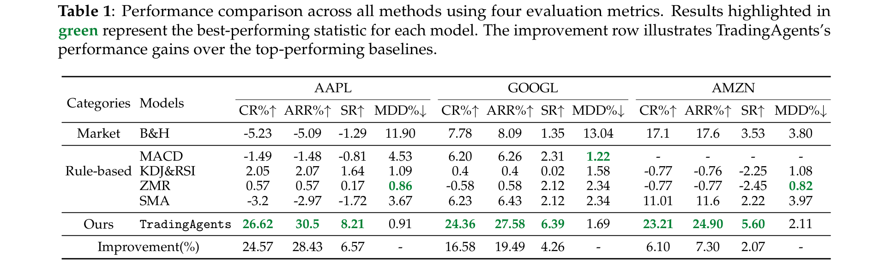

# TradingAgents: Multi-Agents LLM Financial Trading Framework

**Authors:** Yijia Xiao, Edward Sun, Di Luo, Wei Wang
**Affiliations:** UCLA, MIT, Tauric Research
**Date:** December 28, 2024
**Paper:** [PDF](https://arxiv.org/pdf/2412.20138)
**Code:** [GitHub](https://github.com/TauricResearch/TradingAgents) (38,600+ stars)

---

## TL;DR

TradingAgents is a multi-agent LLM framework that simulates a real-world trading firm, with specialized agents acting as fundamental analysts, sentiment analysts, technical analysts, bullish/bearish researchers, traders, risk managers, and a fund manager. By combining structured communication protocols with adversarial bull-bear debates, it achieves 23-27% cumulative returns over 3 months on tech stocks, outperforming traditional baselines (Buy & Hold, MACD, KDJ+RSI, ZMR, SMA) by large margins across all metrics.

---

## Key Figures

### Figure 1: Overall Framework Organization

The end-to-end pipeline: four analyst agents concurrently gather market data (from Yahoo Finance, Reddit, Bloomberg, etc.), which feeds into a Researcher Team with Bull/Bear debaters. The Trader synthesizes debate insights, the Risk Management Team (aggressive/neutral/conservative) evaluates exposure, and the Fund Manager approves and executes the trade. This mirrors a real trading firm's organizational structure.

### Figure 2: Analyst Team

Four specialized analysts operate in parallel: Market (technical indicators like RSI, ADX, Bollinger Bands), Social Media (sentiment scores from X/Reddit), News (macro trends from Bloomberg/Reuters), and Fundamentals (financial statements, ROE, ROA). Each produces a structured report with key findings.

### Figure 3: Researcher Team (Bull vs. Bear Debate)

The Bullish researcher highlights growth potential (e.g., AI-powered expansion, strong financials), while the Bearish researcher flags risks (e.g., competitive challenges, geopolitical tensions). They engage in *n* rounds of natural language debate, moderated by a facilitator who selects the prevailing perspective. This adversarial process produces more balanced investment assessments.

### Figure 5: Risk Management & Fund Manager

Three risk-profile agents (Risky, Neutral, Safe) deliberate on the trader's proposal, adjusting it within risk constraints. The Fund Manager reviews the discussion, determines appropriate risk adjustments, and authorizes the final trade execution.

### Figure 7: Cumulative Returns on AAPL

TradingAgents (red line) dramatically outperforms all baselines on AAPL, reaching ~1.27x cumulative return while all other strategies remain near or below 1.0x. This is especially notable because AAPL experienced significant volatility during the test period (Jan-Mar 2024), causing traditional strategies to struggle.

### Table 1: Performance Comparison

TradingAgents achieves the best cumulative return, annualized return, and Sharpe ratio across all three stocks (AAPL, GOOGL, AMZN), while maintaining competitive maximum drawdown (never exceeding 2.11%).

---

## Key Novel Ideas

### 1. Trading Firm-Inspired Multi-Agent Organization
Instead of using a generic multi-agent chat or a single LLM agent, TradingAgents mirrors the organizational structure of professional trading firms. Seven distinct agent roles (Fundamental Analyst, Sentiment Analyst, News Analyst, Technical Analyst, Researcher, Trader, Risk Manager) collaborate through well-defined workflows. This works because real trading firms have evolved these structures over decades to manage the complexity of financial decision-making — the framework leverages this domain-proven organizational design.

### 2. Adversarial Bull-Bear Debate Mechanism
The Researcher Team uses a dialectical process where a Bullish and a Bearish agent debate for *n* rounds, producing opposing assessments of the same data. A facilitator agent reviews the debate history and selects the prevailing perspective. This prevents single-perspective bias that plagues most LLM trading agents and produces more robust investment theses.

### 3. Structured Communication Protocol
Rather than relying solely on natural language message passing (which degrades over multi-turn interactions — the "telephone effect"), agents communicate through structured documents and reports. Each role queries the global agent state, processes data, and produces a structured report. Natural language dialogue is reserved exclusively for debates (researcher and risk management discussions), where it adds genuine value.

### 4. Multi-LLM Backbone Strategy
The framework strategically assigns different LLMs to different roles based on task complexity:
- **Quick-thinking models** (gpt-4o-mini, gpt-4o): Data retrieval, summarization, tabular-to-text conversion
- **Deep-thinking models** (o1-preview): Decision-making, evidence-based reasoning, report writing

This balances cost/speed with reasoning depth, and the entire framework runs on API credits without requiring GPUs.

### 5. Multi-Risk-Profile Risk Management
Three risk management agents (aggressive, neutral, conservative) independently evaluate the trader's proposal, then engage in *n* rounds of facilitated debate. This prevents the framework from taking on excessive risk while still capturing upside — a mechanism absent from other LLM trading frameworks.

---

## Architecture Details

| Component | Agent Roles | Backbone LLM | Communication |
|-----------|------------|--------------|---------------|
| Analyst Team | Fundamental, Sentiment, News, Technical | Deep-thinking (analysis), Quick-thinking (data retrieval/tools) | Structured reports |
| Researcher Team | Bullish, Bearish, Facilitator | Deep-thinking | Natural language debate (*n* rounds) + structured summary |
| Trader | Single trader agent | Deep-thinking | Structured decision signal + rationale report |
| Risk Management | Risky, Neutral, Safe, Facilitator | Deep-thinking | Natural language debate (*n* rounds) |
| Fund Manager | Single manager agent | Deep-thinking | Reviews risk report, authorizes execution |

All agents follow the **ReAct prompting framework** (Yao et al., 2023), enabling them to interleave reasoning and action steps with tool use.

---

## Training Pipeline

TradingAgents is not trained in the traditional sense — it is a **prompt-based agentic framework** that relies on:

1. **Pre-built tool integrations**: Yahoo Finance APIs, Reddit/X search APIs, Bloomberg/Reuters feeds, sentiment scoring models, technical indicator calculators (60 indicators: MACD, RSI, Bollinger Bands, etc.)
2. **Structured prompts per role**: Each agent has a predefined name, role, goal, constraints, skills, and tool access
3. **ReAct-style execution**: Agents alternate between reasoning (Thought), acting (Action), and observing (Observation)
4. **No fine-tuning or RL**: The framework uses off-the-shelf LLMs via API calls, making it deployable without GPUs

---

## Key Results

### Performance Across Three Stocks (Jan 1 - Mar 29, 2024)

| Model | AAPL CR% | AAPL SR | GOOGL CR% | GOOGL SR | AMZN CR% | AMZN SR |
|-------|----------|---------|-----------|----------|----------|---------|
| Buy & Hold | -5.23 | -1.29 | 7.78 | 1.35 | 17.1 | 3.53 |
| MACD | -1.49 | -0.81 | 6.20 | 2.31 | - | - |
| KDJ+RSI | 2.05 | 1.64 | 0.40 | 0.02 | -0.77 | -2.25 |
| ZMR | 0.57 | 0.17 | -0.58 | 2.12 | -0.77 | -2.45 |
| SMA | -3.20 | -1.72 | 6.23 | 2.12 | 11.01 | 2.22 |
| **TradingAgents** | **26.62** | **8.21** | **24.36** | **6.39** | **23.21** | **5.60** |

### Improvement Over Best Baseline

| Metric | AAPL | GOOGL | AMZN |
|--------|------|-------|------|
| Cumulative Return | +24.57% | +16.58% | +6.10% |
| Annualized Return | +28.43% | +19.49% | +7.30% |
| Sharpe Ratio | +6.57 | +4.26 | +2.07 |

### Key Observations
- **AAPL was the hardest case**: Traditional methods all struggled due to market volatility, yet TradingAgents achieved 26.62% cumulative return
- **Maximum drawdown never exceeded 2.11%** across all stocks, indicating strong risk control
- **Sharpe ratios of 5.6-8.2** are exceptionally high (above 2 is "very good", above 3 is "excellent")
- The authors note the high Sharpe ratios likely stem from few pullbacks during TradingAgents' decision sequences in this specific 3-month window

---

## Key Takeaways

1. **Organizational design matters for multi-agent systems**: Mimicking real trading firm structure (analysts -> researchers -> traders -> risk management -> fund manager) produces better results than flat agent architectures or single-agent systems.

2. **Adversarial debate improves decision quality**: The bull-bear debate mechanism prevents single-perspective bias, forcing the system to consider both upside potential and downside risks before making decisions.

3. **Structured communication > pure chat**: Using structured reports between agents (rather than free-form natural language) prevents the "telephone effect" where information degrades across multi-agent conversations.

4. **Risk management is a first-class citizen**: Dedicated risk management agents with diverse risk profiles (aggressive/neutral/conservative) enable the framework to capture returns while maintaining drawdowns below 2.11%.

5. **No GPU required**: The entire framework runs on LLM API credits, making it accessible to researchers without specialized hardware. Any backbone model can be swapped in.

6. **Explainability as a feature**: Every decision includes detailed natural language reasoning, tool usage logs, and thought processes — a significant advantage over black-box deep learning trading systems.

7. **Short evaluation window is a limitation**: The 3-month backtesting period (Jan-Mar 2024) on only 3-5 tech stocks is narrow. The exceptionally high Sharpe ratios may not generalize to longer periods or different market conditions.

8. **High API costs are a barrier**: The authors note benchmarking took 3+ months due to "intensive LLM and tool use (11 LLM calls & 20+ tool calls/prediction)" per trading day, indicating significant cost per decision.

9. **No comparison to other LLM-based trading systems**: The baselines are all rule-based strategies (MACD, KDJ+RSI, etc.). No comparison against other LLM agent frameworks (FinMem, TradingGPT, FinAgent) was included.

10. **The framework is modular and extensible**: New agent roles, data sources, or backbone LLMs can be added without restructuring the system — the structured communication protocol makes this straightforward.

---

## What's Open-Sourced

- **Full framework code**: [github.com/TauricResearch/TradingAgents](https://github.com/TauricResearch/TradingAgents) (38,600+ stars)
- The repository includes the complete multi-agent framework, tool integrations, and configuration
- No pre-trained models are released (the framework uses commercial LLM APIs)
- No proprietary datasets are released, though the paper describes the multi-modal dataset composition in detail
