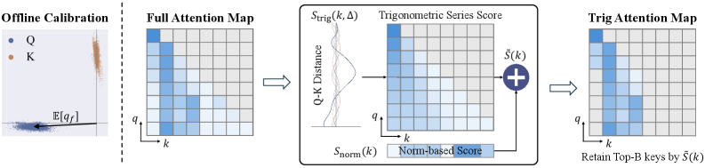
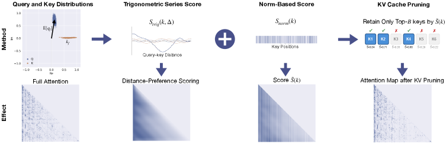
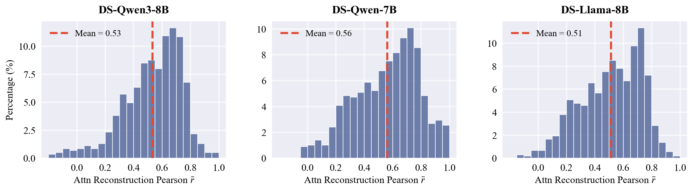

# TriAttention: Efficient Long Reasoning with Trigonometric KV Compression

**Authors:** Weian Mao, Xi Lin, Wei Huang, Yuxin Xie, Tianfu Fu, Bohan Zhuang, Song Han, Yukang Chen
**Affiliations:** MIT, NVIDIA, Zhejiang University
**Date:** April 6, 2026
**Paper:** [PDF](https://arxiv.org/abs/2604.04921)
**Code:** [GitHub](https://github.com/WeianMao/triattention) (194 stars)
**Project Page:** [weianmao.github.io/tri-attention-project-page](https://weianmao.github.io/tri-attention-project-page/)

---

## TL;DR

When LLMs do long chain-of-thought reasoning, the KV cache eats up GPU memory. Existing compression methods guess which tokens matter by looking at recent attention scores, but these scores rotate with position (because of RoPE), so the guesses are unreliable. TriAttention discovers that Q and K vectors *before* RoPE is applied cluster tightly around fixed centers, and these centers determine which distances a head prefers to attend to via a trigonometric series. By scoring keys using these stable centers instead of noisy post-RoPE attention, TriAttention matches full-attention accuracy while achieving 2.5x higher throughput or 10.7x KV memory reduction on AIME25.

---

## Key Figures

### Figure 1: Performance Trade-offs

At the same accuracy as Full Attention (40.8% on AIME25), TriAttention generates tokens 2.5x faster. Alternatively, at the same throughput, it dramatically outperforms the best baseline (R-KV). Panel (B) shows TriAttention uses only ~3% of KV cache memory vs. Full Attention's ~32% to achieve the same accuracy -- a 10.7x reduction.

### Figure 2: Q/K Concentration -- The Core Observation

The key discovery of the paper. (A) In pre-RoPE space, Q and K vectors cluster tightly around fixed non-zero centers -- they barely move regardless of input content. (B) After RoPE rotation, these clean clusters spread into arcs, making post-RoPE analysis unreliable. (C) This concentration (measured by Mean Resultant Length R) is near 1.0 for the vast majority of heads. (D) Because of this concentration, a trigonometric series computed from the centers can reconstruct actual attention logits with Pearson r=0.72.

### Figure 3: Method Overview

The TriAttention pipeline: (1) offline calibration computes Q distribution centers; (2) during inference, keys are scored by combining S_trig (distance preference from the trigonometric series) and a norm-based score; (3) low-scoring keys are pruned. The two scoring components complement each other: S_trig captures which distances a head prefers, while the norm score catches low-importance tokens that happen to be at "preferred" distances.

### Figure 4: Accuracy vs. KV Budget Across Benchmarks

TriAttention consistently outperforms R-KV at every KV budget level across MATH 500, AIME24, and AIME25. The advantage is most pronounced at low-to-mid budgets. On MATH 500, TriAttention matches Full Attention with just 1024 tokens cached (out of 32K). Panel (D) shows the memory retention benchmark: TriAttention tracks Full Attention up to depth 16, while R-KV collapses catastrophically at depth 16.

### Figure 5: Method Visualization with Real Attention Maps

Real attention maps showing how TriAttention works in practice. The trigonometric score S_trig captures the diagonal (distance-preference) structure of the attention map. The combined score adds norm information to identify tokens that are unimportant despite being at favorable distances. After pruning, the essential attention pattern is preserved.

### Figure 6: Cross-Model Reconstruction Quality

The trigonometric series reconstruction works across three different architectures (Qwen3-8B, DeepSeek-R1-Distill-Qwen-7B, DeepSeek-R1-Distill-Llama-8B). All show right-skewed distributions with mean Pearson correlation above 0.5, confirming Q/K concentration is a general phenomenon, not specific to one model.

---

## Key Novel Ideas

### 1. Q/K Concentration: A Model-Intrinsic Property in Pre-RoPE Space

The central discovery. Before RoPE rotations are applied, query and key vectors in each attention head cluster very tightly around fixed, non-zero centers. This is measured by the Mean Resultant Length:

$$R_f = \frac{\|\mathbb{E}[q_f]\|}{\mathbb{E}[\|q_f\|]}$$

where $q_f$ is the query vector in frequency band $f$. When $R \to 1$, all vectors point in nearly the same direction. The paper finds ~90% of heads in Qwen3-8B have $R > 0.95$, and this holds across math, coding, and chat domains (R values 0.977-0.980). It also generalizes to MLA architectures (96.6% of heads with $R > 0.95$).

**Why this matters:** Post-RoPE methods fail because RoPE rotates vectors with position, so a query's direction changes continuously -- you can only use the most recent ~25 queries as a representative sample. Pre-RoPE vectors don't rotate, so the center is stable and can represent *all* future queries.

### 2. Trigonometric Series: Predicting Attention from Distance

The RoPE attention formula for a query at position $p_q$ and key at position $p_k$ across frequency bands $f$ is:

$$\text{logit}(q, k) = \sum_f \|q_f\| \|k_f\| \cos(\omega_f \Delta + \phi_f)$$

where $\Delta = p_q - p_k$ is the distance and $\phi_f = \arg(q_f) - \arg(k_f)$ is the phase difference. When Q/K are concentrated, you can replace them with their centers, making the logit a function of distance alone:

$$\text{logit}(\Delta) \approx \sum_f [a_f \cos(\omega_f \Delta) + b_f \sin(\omega_f \Delta)]$$

This is a trigonometric series (like Fourier synthesis, but with RoPE's geometric frequency progression instead of harmonic). Different learned Q/K centers produce different attention-vs-distance curves -- some heads prefer nearby keys (local attention), others prefer distant keys (attention sinks). The key insight: **these preferences are encoded in the Q/K centers and can be predicted without observing actual attention.**

### 3. Two-Component Scoring with Adaptive Weighting

TriAttention scores keys using two complementary signals:

**Trigonometric score** -- captures distance preferences using the Q center as a proxy for future queries:

$$S_{\text{trig}}(k, \Delta) = \sum_f \|\mathbb{E}[q_f]\| \cdot \|k_f\| \cdot \cos(\omega_f \Delta + \phi_f)$$

**Norm-based score** -- catches importance differences that the trigonometric series misses (e.g., a low-norm key at a "preferred" distance should still be evicted):

$$S_{\text{norm}}(k) = \sum_f (1 - R_f) \cdot \mathbb{E}[\|q_f\|] \cdot \|k_f\|$$

The $(1 - R_f)$ weighting is elegant: when concentration is high ($R_f \to 1$), the trigonometric series is accurate so the norm term vanishes. When concentration is low, the norm term takes over. This is automatically calibrated per-head per-frequency-band -- no hyperparameter tuning needed.

### 4. Geometric Future Offset Averaging

A key in the cache will be queried from many future positions, so its importance depends on all future distances, not just the current one. TriAttention averages scores over geometrically-spaced offsets $\mathcal{D} = \{1, 2, 4, \ldots, 2^{16}\}$:

$$\tilde{S}(k) = \frac{1}{|\mathcal{D}|} \sum_{\delta \in \mathcal{D}} S(k, \Delta + \delta)$$

Geometric spacing is critical -- it dramatically outperforms linear spacing (45.8% vs. 28.7% on AIME24) because near-distance positions need denser sampling to capture the fine structure of attention patterns.

---

## Architecture Details

| Component | Details |
|---|---|
| **Scoring** | S_trig (trigonometric series) + S_norm (weighted norms), combined additively |
| **Weighting** | Adaptive via Mean Resultant Length $R_f$ per frequency band |
| **GQA Handling** | Z-score normalize per query head, then aggregate via max |
| **Pruning trigger** | Every 128 tokens (window-based, following R-KV) |
| **Future offsets** | Geometric: {1, 2, 4, ..., 65536} |
| **Calibration** | Offline, one-time; computes $\mathbb{E}[q_f]$ and $\mathbb{E}[\|q_f\|]$ per head per band |
| **Calibration data** | 50K-960K tokens; domain-agnostic (even Google homepage HTML works) |
| **Default KV budget** | 2048 tokens (512 for shorter contexts) |

---

## Training Pipeline

TriAttention is a **pure inference-time method** -- no training or fine-tuning is involved.

The only setup step is **offline calibration**: run a small amount of text (as few as 50K tokens of *any* content) through the model, collect Q and K vectors in pre-RoPE space, and compute:
- $\mathbb{E}[q_f]$: the mean Q vector per frequency band per head (the "Q center")
- $\mathbb{E}[\|q_f\|]$: the mean Q norm per frequency band per head
- $R_f = \|\mathbb{E}[q_f]\| / \mathbb{E}[\|q_f\|]$: the concentration metric

These statistics are model-intrinsic properties. The paper shows they are:
- **Domain-robust:** Calibrating on coding data and testing on math reasoning gives comparable results (45.0% vs. 45.8% on AIME24)
- **Size-robust:** 50K tokens works nearly as well as 960K tokens (45.4% vs. 45.8%)
- **Quality-robust:** Google homepage HTML as calibration data gives 46.2%, comparable to curated chat data (46.7%)

At inference time, TriAttention acts as a drop-in replacement for the KV cache management layer. Every 128 generated tokens, it scores all cached keys and evicts those below the budget threshold.

---

## Key Results

### Mathematical Reasoning (AIME24, AIME25, MATH 500)

| Model | Method | KV Budget | AIME24 | AIME25 | MATH 500 |
|---|---|---|---|---|---|
| Qwen3-8B | Full Attention | Full | 49.2% | 40.8% | 69.6% |
| Qwen3-8B | SnapKV | 2048 | 5.8% | 5.8% | 39.6% |
| Qwen3-8B | R-KV | 2048 | 25.4% | 17.5% | -- |
| **Qwen3-8B** | **TriAttention** | **2048** | **42.1%** | **32.9%** | -- |
| DS-R1-Llama-8B | Full Attention | Full | 50.0% | 42.5% | 72.8% |
| DS-R1-Llama-8B | R-KV | 512 | 27.5% | 22.5% | 55.2% |
| **DS-R1-Llama-8B** | **TriAttention** | **512** | **42.5%** | **32.5%** | **66.2%** |
| DS-R1-Qwen-7B | Full Attention | Full | 52.1% | 45.0% | 79.4% |
| DS-R1-Qwen-7B | R-KV | 2048 | 40.4% | 30.8% | -- |
| **DS-R1-Qwen-7B** | **TriAttention** | **2048** | **46.7%** | **38.3%** | -- |
| GPT-OSS-20B | Full Attention | Full | 72.1% | 65.0% | -- |
| GPT-OSS-20B | R-KV | 2048 | 55.8% | 50.0% | -- |
| **GPT-OSS-20B** | **TriAttention** | **2048** | **66.7%** | **60.0%** | -- |

### MATH 500 with Budget=512

| Model | Full Attn | SnapKV | R-KV | TriAttention |
|---|---|---|---|---|
| Qwen3-8B | 69.6% | 34.4% | 52.6% | **60.6%** |
| DS-R1-Llama-8B | 72.8% | 28.0% | 55.2% | **66.2%** |
| DS-R1-Qwen-7B | 79.4% | 29.6% | 70.4% | **74.6%** |

### Throughput and Efficiency (Qwen3-8B, single A100 80GB)

| Setting | Method | Throughput (tok/s) | Accuracy |
|---|---|---|---|
| AIME25, comparable accuracy | Full Attention | 233 | 40.8% |
| | TriAttention (B=4096) | **583** | 43.3% |
| MATH 500, comparable accuracy | Full Attention | 223 | 69.6% |
| | TriAttention (B=1024) | **1,405** | 68.4% |

### Comparison with R-KV at Comparable Settings

| Setting | R-KV | TriAttention |
|---|---|---|
| Comparable accuracy on MATH 500 | B=2048, 760 tok/s, 60.6% | B=1024, **1,405 tok/s**, 68.4% |
| Same budget (B=2048) AIME24 | 25.4% | **42.1%** (+16.7%) |
| Same budget (B=2048) AIME25 | 17.5% | **32.9%** (+15.4%) |

### General Tasks (LongBench, RULER)

- **LongBench** (16 subtasks, Qwen3-8B, 50% KV budget): TriAttention scores 48.1 average, winning 11/16 subtasks, beating Ada-KV+SnapKV by +2.5 points
- **RULER** (retrieval, 4K context): TriAttention scores 66.1, beating SnapKV by +10.5 points

### Additional Baselines (AIME24, DS-R1-Qwen-7B)

TriAttention outperforms H2O, TOVA, RaaS, SnapKV, R-KV, and LazyEviction at every KV budget level. At 30% KV budget, TriAttention matches Full Attention (46.7%).

---

## Key Takeaways

1. **Q/K concentration is a fundamental property of trained transformers.** Pre-RoPE Q and K vectors cluster tightly around fixed centers in ~90% of attention heads. This holds across architectures (GQA, MLA), model sizes, and input domains. It's not an artifact of specific training data.

2. **Post-RoPE methods have a fundamental limitation.** RoPE rotates vectors with position, so only the most recent ~25 queries can serve as representative observations. This tiny window causes important keys to be permanently evicted. TriAttention sidesteps this entirely by working in pre-RoPE space.

3. **Attention is a trigonometric series in Q-K distance.** When Q/K are concentrated, the RoPE attention formula reduces to a sum of cosines at geometrically-spaced frequencies -- like Fourier synthesis. The Q/K centers determine the coefficients, which shape the attention-vs-distance curve. Different heads learn different distance preferences.

4. **The trigonometric series score alone isn't enough -- norms matter too.** Removing S_trig devastates performance, but removing S_norm also hurts (AIME24 drops 5.4%). A key might be at a "preferred" distance but have low norm and contribute little to the output. The adaptive (1-R_f) weighting elegantly balances these signals.

5. **Calibration is remarkably robust.** 50K tokens of essentially *anything* (including Google homepage HTML) produces statistics nearly as good as curated domain-specific data. This is because the Q/K centers are model-intrinsic, not data-dependent.

6. **Geometric offset spacing is critical.** Averaging key scores over future distances with geometric spacing ({1, 2, 4, ...}) outperforms linear spacing by 17 percentage points (45.8% vs 28.7%). Near-distance attention patterns have fine structure that needs dense sampling.

7. **TriAttention preserves memory retention where R-KV catastrophically fails.** On the recursive DFS benchmark, R-KV's accuracy collapses from 61% to 31% at depth 16, while TriAttention tracks Full Attention up to depth 16. This suggests TriAttention retains the structurally important tokens that chain-of-thought reasoning depends on.

8. **Real-world impact: consumer GPU deployment.** TriAttention enables running Qwen3-32B (INT4) on a single RTX 4090 for multi-turn agentic tasks where Full Attention runs out of memory. This is a practical deployment win, not just a benchmark number.

9. **The method generalizes to MLA architectures.** GLM-4.7-Flash (MLA with 940 heads) shows even stronger Q/K concentration than GQA models (96.6% vs 84.7% of heads with R > 0.95), suggesting the phenomenon may be universal across modern transformer variants.

10. **At high KV budgets, TriAttention can *exceed* Full Attention.** On AIME25 with budget 4096, TriAttention scores 43.3% vs. Full Attention's 40.8%. This suggests that KV cache pruning can sometimes *help* by removing distracting/noisy tokens, similar to how dropout can improve generalization.

---

## What's Open-Sourced

- **Code:** [github.com/WeianMao/triattention](https://github.com/WeianMao/triattention) (194 GitHub stars, Apache-2.0 license)
- **Demo video:** Available on the GitHub page showing OpenClaw running on a single RTX 4090
- **Project page:** [weianmao.github.io/tri-attention-project-page](https://weianmao.github.io/tri-attention-project-page/)
- No pre-computed calibration statistics or model checkpoints appear to be released (users run their own calibration).
