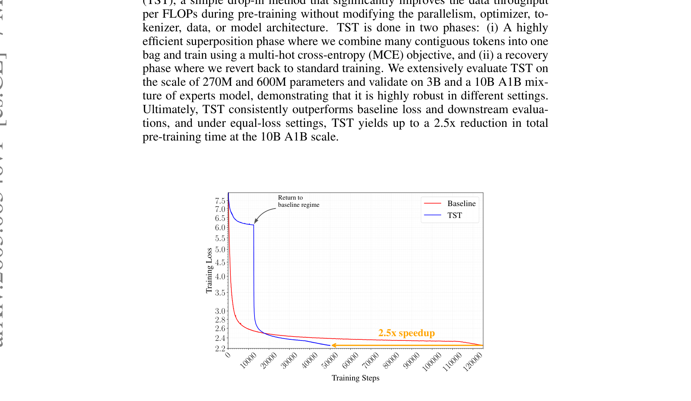
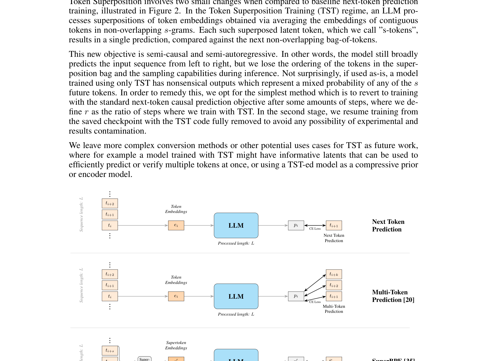
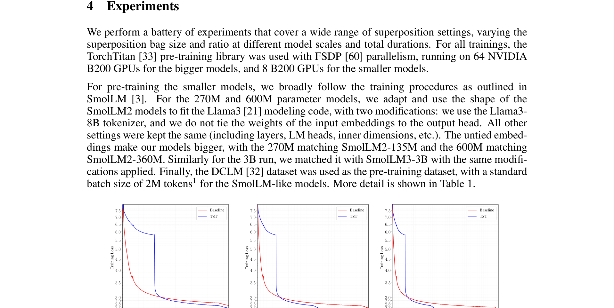
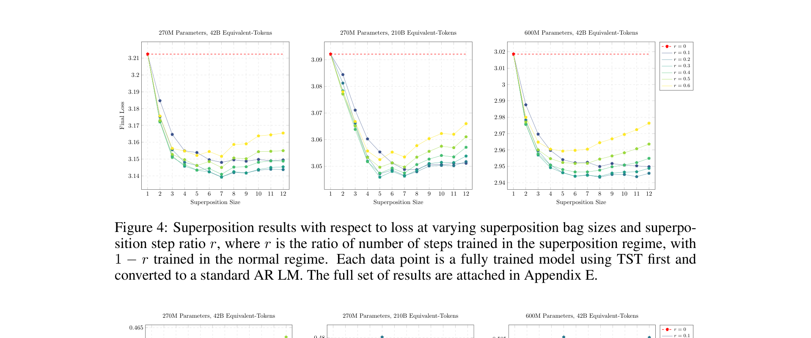
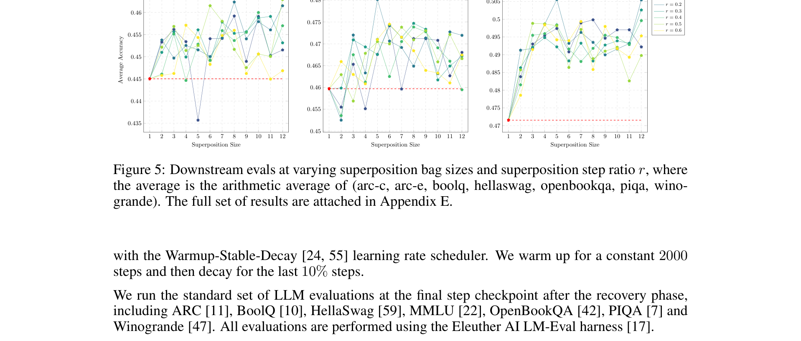
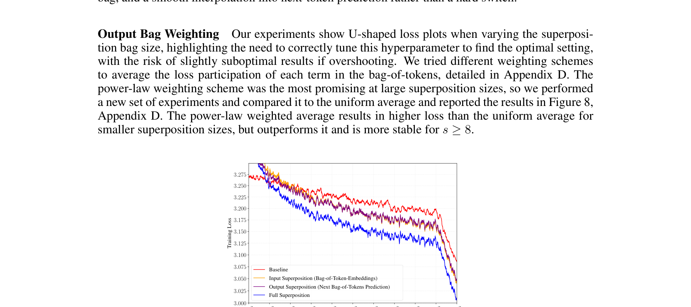

# Efficient Pre-Training with Token Superposition

**Authors:** Bowen Peng, Théo Gigant, Jeffrey Quesnelle (Nous Research)
**Date:** May 7, 2026
**Paper:** [arXiv:2605.06546](https://arxiv.org/abs/2605.06546)

---

## TL;DR

Token Superposition Training (TST) is a dead-simple trick for faster LLM pre-training: during a "superposition phase," average every s contiguous token embeddings into one "super-token," process these compressed inputs through the unchanged model, then predict the next *bag of s tokens* using a multi-hot cross-entropy loss. This lets the model see **s× more data tokens per FLOP**. After the superposition phase, switch back to standard next-token prediction for a "recovery phase." The model recovers quickly and ends up better than a baseline trained with the same total FLOPs. At the 10B A1B MoE scale, TST achieves the same loss in **2.5× fewer training steps**, with no changes to the model architecture, tokenizer, optimizer, or parallelism strategy.

---

## Key Figures

### Fig. 1: Headline Result — 2.5× Speedup on 10B MoE


The paper's main result. Blue: TST. Red: baseline. Both use equal FLOPs per step. TST starts with a high loss during the superposition phase (the model is working on compressed inputs), then rapidly drops when it switches to standard training ("return to baseline regime"). TST matches the baseline's final loss at the red line — requiring 2.5× fewer total steps. The baseline trains on 1.05T tokens; TST sees 2T tokens (because each step processes s× more data).

### Fig. 2: Method Comparison — TST vs NTP, MTP, SuperBPE


Four training paradigms side-by-side. **Next Token Prediction (NTP):** standard — one token in, one token out. **Multi-Token Prediction (MTP):** same input length, but k output heads predict k future tokens — adds parameters and computation but same tokens-per-FLOP. **SuperBPE:** merge tokens at the tokenizer level into supertokens, predict the next supertoken — fewer tokens to process but commits to the coarser vocabulary permanently. **Token Superposition (TST, bottom):** average s consecutive embeddings into one "s-token," predict the next bag of s tokens via multi-hot CE — processes s× more tokens per FLOP, then reverts to standard NTP. TST is the only method that increases training-time data throughput without modifying inference.

### Fig. 3: Equal-FLOPs and Equal-Loss Comparisons


Three views of the same 270M experiments with s=8, r=0.3. (a) **Equal-FLOPs:** TST (blue) achieves lower final loss than baseline (red) at matched compute. (b) **Equal-loss:** TST reaches the baseline's final loss in ~40% fewer steps. (c) **Equal-data:** when both see the same number of tokens, TST uses fewer FLOPs but still achieves lower loss (the superposition phase processes tokens cheaply).

### Fig. 4: Loss vs Superposition Bag Size


The key hyperparameter sweep. Three panels (270M at 42B tokens, 270M at 105B tokens, 600M at 42B tokens). Each curve is a different step ratio r (fraction of training spent in superposition). The x-axis is bag size s (how many tokens are averaged into one). **The landscape is U-shaped:** too-small s wastes the opportunity; too-large s compresses too aggressively. The sweet spot is around **s ∈ [4, 8]**. Larger r (more superposition) helps up to a point (~0.3-0.4).

### Fig. 5: Downstream Evaluation vs Bag Size


Same sweep but measuring downstream accuracy (average over ARC-C, ARC-E, BoolQ, HellaSwag, OpenBookQA, PIQA, WinoGrande). The pattern mirrors Fig. 4: **s ∈ [4, 8]** with **r ∈ [0.2, 0.4]** consistently beats the baseline (dashed line). The gains are robust — no configuration in this range underperforms the baseline.

### Fig. 6: Input vs Output Superposition Ablation


A key mechanistic finding. "Input-only" (bag the embeddings but predict one token), "Output-only" (standard input but predict the next bag of tokens), and "Full" (both). All three beat the baseline during the recovery phase, but **input-only and output-only each capture only part of the gain — both are needed for the full benefit**. This means TST's two changes (input compression + multi-hot output) work through orthogonal mechanisms: input changes the granularity/FLOPs-per-token, output changes the training signal/gradient.

---

## Key Novel Ideas

### 1. Input Superposition — Bag-of-Token Embeddings

The first half of TST: compress the input by averaging. Given a sequence of L tokens, split into non-overlapping bags of s consecutive tokens. For each bag, average their embeddings element-wise to produce a single "s-token" embedding. The model now processes a sequence of length L/s instead of L.

```python
# Reshape [B, L, V] -> [B, L/s, s, V]
# Average over the s dimension -> [B, L/s, V]
h = mean(tok_embeddings(tokens[..., 0:s]), dim=-2)
```

This is not new tokenization — the same tokenizer is used, and the bag boundaries are just every s positions. The averaging happens in embedding space, after the embedding layer. The model sees the same total number of data tokens per step (the data sequence length is increased by s×), but processes them through L/s positions, costing the same FLOPs as processing L standard tokens.

**Why averaging works:** token embeddings carry semantic information, and averaging contiguous embeddings produces a coarse "summary" that retains topic, style, and approximate content. It's lossy — you can't recover the exact ordering of tokens within a bag — but it preserves enough signal to train useful representations.

### 2. Output Superposition — Multi-Hot Cross-Entropy Loss

The second half: instead of predicting one next token, predict the *next bag of s tokens*. The standard cross-entropy loss targets a one-hot label; TST uses a **multi-hot** label where all s tokens in the target bag are equally weighted.

The multi-hot cross-entropy (MCE) loss is simply the average of standard CE losses over the s target tokens:

$$\mathcal{L}_{\text{MCE}}(\mathbf{z}, \mathbf{y}) = \frac{1}{|\mathbf{y}|} \sum_{y \in \mathbf{y}} \mathcal{L}_{\text{CE}}(\mathbf{z}, y)$$

where **z** is the logit vector and **y** is the bag of s target tokens. This reuses existing optimized CE kernels — you just loop over the s targets and average. No new parameters, no new output heads.

The label shift: each bag at positions [t, t+s-1] predicts the next bag at [t+s, t+2s-1], preserving a form of causality (each bag predicts *future* tokens, not tokens it already contains).

### 3. Two-Phase Training — Superposition Then Recovery

TST trains in two phases:

1. **Superposition phase** (fraction r of total steps): input and output superposition with bag size s. The model processes s× more data tokens per FLOP. Loss is high because the task is harder (predict bags from averaged inputs).

2. **Recovery phase** (fraction 1-r of total steps): revert completely to standard next-token prediction. The TST code is fully removed. The model rapidly recovers to standard behavior — the loss drops sharply and converges to a better final value than a baseline that trained with NTP the entire time.

The recovery is remarkably fast: within a few hundred steps of switching, the loss is already at or below the baseline. The interpretation: the superposition phase teaches useful representations (coarse structure, topic modeling, long-range dependencies) that transfer cleanly to the standard autoregressive objective.

**Critical detail:** the input embedding and LM head weights are **shared unchanged** between phases. If you re-initialize them at the phase boundary (Table 2 ablation), the gains vanish entirely (loss 2.938 vs 2.676) — confirming that representation alignment between phases is essential. This is why prior compressive pre-training methods that used adapters or separate alignment stages saw weaker results.

### 4. Orthogonal to MTP and Auxiliary Losses

TST is deliberately designed to be *orthogonal to* Multi-Token Prediction (MTP). MTP adds auxiliary output heads that predict k future tokens — but it doesn't increase tokens-per-FLOP. It adds parameters and primarily benefits inference (via speculative decoding). TST increases tokens-per-FLOP during training without adding parameters or modifying inference. The two approaches occupy different points in the design space and could be combined.

---

## Architecture Details

TST requires **no changes** to the model architecture, tokenizer, optimizer, or parallelism. The only modifications are:

| Component | Standard Training | TST Superposition Phase | TST Recovery Phase |
|---|---|---|---|
| Input | Token embeddings | Average of s consecutive embeddings | Token embeddings (standard) |
| Sequence length | L | L (but using s×L data tokens) | L (standard) |
| Output | Next-token CE loss | Multi-hot CE loss (bag of s) | Next-token CE loss (standard) |
| FLOPs per step | Baseline | Same as baseline | Same as baseline |
| Data tokens per step | L × B | s × L × B | L × B |
| Parameters | Unchanged | Unchanged | Unchanged |

---

## Training Pipeline

**Models tested:**
- 270M dense (SmolLM2-135M shape, untied embeddings)
- 600M dense (SmolLM2-360M shape, untied embeddings)
- 3B dense (SmolLM3-3B shape, untied embeddings)
- 10B A1B MoE (Qwen3-like, 1B active params)

**Training data:** DCLM dataset for dense models; 50/50 FineWeb-Edu + DCLM for MoE.

**Default TST settings:** s=8 (superposition bag size), r=0.3 (30% of steps in superposition).

**Optimizer:** AdamW, β=(0.9, 0.95). Warmup-Stable-Decay (WSD) schedule: 2000 steps warmup, constant, then decay for the last 10%.

**Infrastructure:** TorchTitan + FSDP on 64 NVIDIA B200 GPUs (large models), 8 B200 GPUs (small models).

---

## Key Results

### Table 1: Overview across scales (all equal-FLOPs comparisons)

| Model | Params | Total Steps | TST Steps | Bag Size | TST Tokens | Total Tokens | B200-Hours | Final Loss | HellaSwag | ARC-E | ARC-C | MMLU |
|---|---|---|---|---|---|---|---|---|---|---|---|
| Dense Baseline | 270M | 20000 | — | — | — | 42B | 34 | 3.212 | 36.3 | 46.7 | 24.9 | — |
| Dense TST | 270M | 20000 | 6000 | 6× | 75B | 105B | 34 | **3.142** | **38.6** | **47.6** | **26.4** | — |
| Dense Baseline | 270M | 30000 | — | — | — | 209B | 170 | 3.092 | 40.2 | 47.5 | 26.2 | — |
| Dense TST | 270M | 100000 | 100000 | 6× | 377B | 524B | 170 | **3.048** | **42.6** | **50.3** | **25.5** | — |
| Dense Baseline | 600M | 20000 | — | — | — | 42B | 61 | 3.019 | 43.5 | 51.7 | 25.5 | — |
| Dense TST | 600M | 20000 | 6000 | 6× | 75B | 105B | 61 | **2.943** | **48.2** | **52.5** | **26.9** | — |
| Dense Baseline | 3B | 20000 | — | — | — | 42B | 247 | 2.808 | 57.6 | 60.6 | 31.9 | 31.2 |
| Dense TST | 3B | 20000 | 6000 | 6× | 75B | 105B | 247 | **2.676** | **62.4** | **66.3** | **36.0** | **32.8** |
| MoE Baseline | 10B A1B | 125000 | — | — | — | 1.05T | 12311 | 2.552 | 70.1 | 73.8 | 46.3 | 37.4 |
| **MoE TST** | **10B A1B** | **49583** | **12483** | **16×** | **1.68T** | **2T** | **4768** | **2.236** | **71.2** | **74.2** | **47.3** | **39.0** |

At 10B A1B: TST achieves **2.5× fewer training steps** (and 2.6× fewer GPU-hours) to reach a similar loss, while also seeing 2× more data tokens. The final TST model is **better on all downstream benchmarks**.

### Table 2: Representation alignment is critical

| Model | Params | TST Steps | Total Steps | TST Tokens | Total Tokens | Final Loss |
|---|---|---|---|---|---|---|
| Dense Baseline | 3B | — | 20000 | — | 42B | 2.808 |
| Dense TST | 3B | 6000 | 20000 | 75B | 105B | **2.676** |
| Dense TST w/ Randomization | 3B | 6000 | 20000 | 75B | 105B | 2.938 |

Re-initializing the embedding and LM head at the phase boundary completely destroys the gains — confirming that shared representations between phases are essential.

---

## Key Takeaways

1. **TST is remarkably simple.** The entire method is three lines of code: (1) reshape and average embeddings, (2) use multi-hot CE loss, (3) after r fraction of steps, revert to standard training. No new parameters, no new modules, no changes to inference. The paper includes the full implementation in Appendix A.

2. **The superposition phase acts as a "pre-pre-training" on coarse structure.** Before learning exact token-level autoregression, the model first learns coarse statistical structure (topic, co-occurrence, long-range dependencies) from the compressed bag representations. This provides an inductive bias that accelerates subsequent standard training — similar to the coarse-to-fine curriculum seen in vision (patch scheduling) and in byte-level LMs (Bolmo, Minixhofer et al.).

3. **Input and output superposition are orthogonal mechanisms.** Input superposition changes the information granularity (FLOPs cost per token). Output superposition changes the training signal (bag-of-tokens prediction ≈ bag-of-words classification). Both independently beat the baseline; combining them gives the full gain. This is evidence that TST is not a single trick but a two-mechanism intervention.

4. **The sweet spot is s ∈ [4, 8] and r ∈ [0.2, 0.4].** The loss landscape is U-shaped in s: too small wastes the opportunity, too large compresses too aggressively. The step ratio r controls how much of training uses superposition. Within this range, TST is robust — no setting underperforms the baseline.

5. **Representation alignment across phases is the key enabler.** Randomly re-initializing embeddings/LM-head at the phase boundary eliminates all gains (Table 2). TST works because the same embedding layer processes both averaged s-tokens and individual tokens, forcing the model to learn representations that are useful at both granularities. Prior compressive methods that used adapters or separate alignment stages missed this.

6. **TST scales to 10B parameters.** The 10B A1B MoE experiment (Qwen3-like) achieves 2.5× fewer steps and better final metrics. This validates that the method works beyond the small-model regime where most efficiency tricks are tested.

7. **TST is orthogonal to MTP.** Multi-Token Prediction adds auxiliary heads and extra parameters to predict future tokens — it doesn't increase data throughput. TST increases data throughput without adding parameters or changing inference. They occupy non-overlapping positions in the design space, and combining them is a natural next step.

8. **The multi-hot CE loss beats alternatives.** The paper tried Hinge loss and Binary Cross-Entropy (BCE) for the bag-of-tokens prediction; both were significantly worse, even worse than no superposition. The multi-hot CE loss (average of standard CE over target bag members) achieves the best balance of soundness and simplicity.

9. **Output-only superposition is attractive if data is limited.** If the pre-training regime is data-constrained (not compute-constrained), output-only superposition — which changes only the loss, not the data throughput — is advantageous because it outperforms the baseline without consuming more data.

10. **The recovery phase is fast.** When switching from superposition to standard training, the loss drops to baseline levels within a few hundred steps. This suggests the representations learned during superposition are already close to what standard training needs — the recovery is mostly about fine-tuning the output distribution, not relearning representations.

---

## What's Open-Sourced

- **Code:** Full PyTorch implementation is provided in Appendix A (3 code listings: input folding, bag-of-token embedding, multi-hot CE loss). Each is ~20 lines of code.
- **Models/Checkpoints:** Not explicitly released.
- **Training framework:** Uses publicly available TorchTitan with FSDP.
- **Training data:** DCLM (publicly available), FineWeb-Edu (publicly available).
