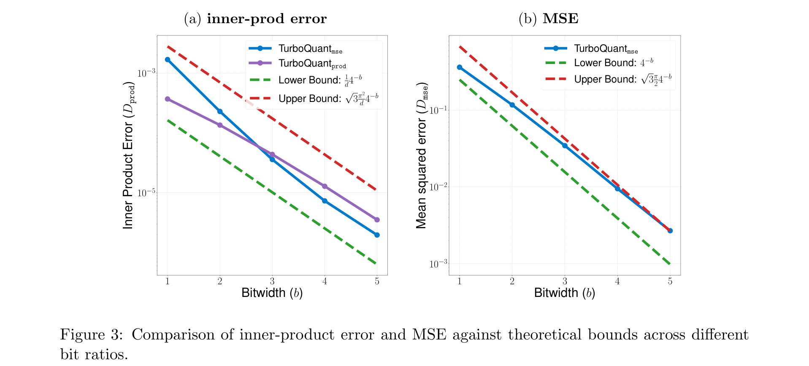
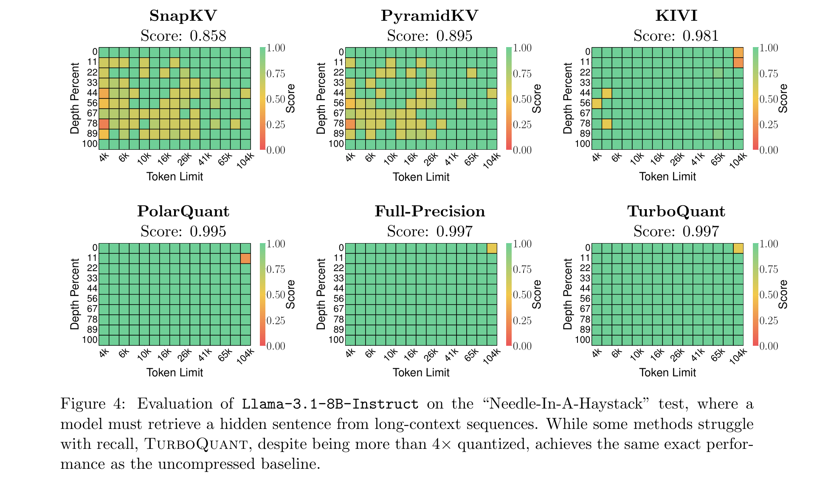
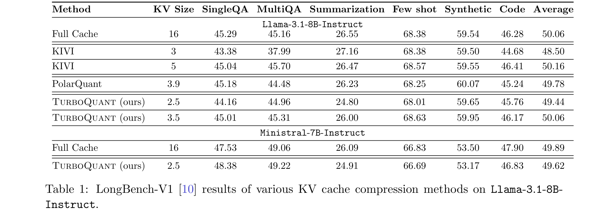
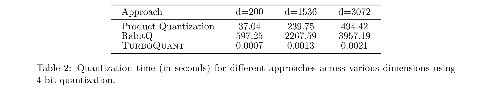
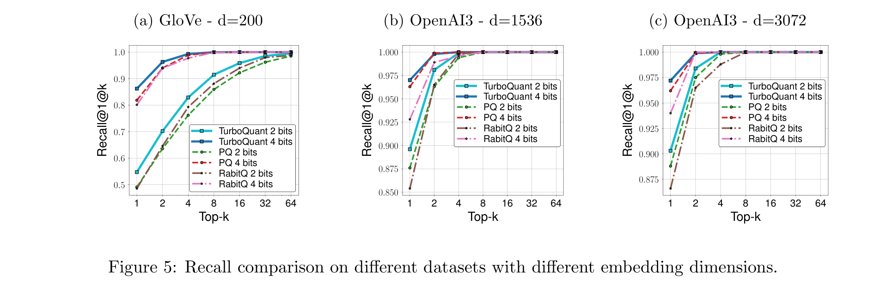
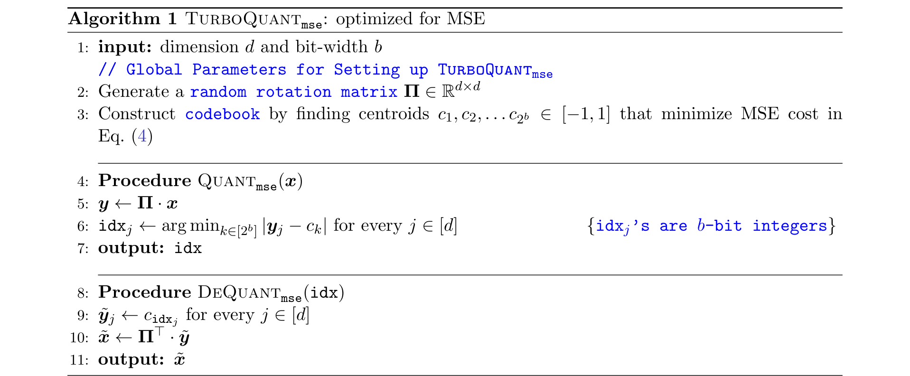

# TurboQuant: Online Vector Quantization with Near-optimal Distortion Rate

**Authors:** Amir Zandieh (Google Research), Majid Daliri (NYU), Majid Hadian (Google DeepMind), Vahab Mirrokni (Google Research)
**Date:** April 28, 2025
**Venue:** ICLR 2026
**Paper:** [PDF](https://arxiv.org/pdf/2504.19874)

---

## TL;DR

TurboQuant is a way to compress high-dimensional vectors (like the ones stored in a language model's KV cache or a vector database) down to just a few bits per number, while losing almost nothing in accuracy. It works by randomly rotating vectors, then applying an optimal per-coordinate quantizer. The math proves it gets within a factor of ~2.7 of the best any algorithm could ever do. In practice, it compresses KV caches by 4.5-6x with zero quality loss at 3.5 bits per channel, runs instantly (no training or indexing needed), and beats product quantization at nearest neighbor search.

---

## Key Figures

### Figure 3: Measured Error Matches Theoretical Bounds

This is the core validation plot. It shows both the inner product error (left) and MSE (right) measured on real data, plotted against the theoretical upper and lower bounds. The key takeaway: TurboQuant's actual performance (blue lines) tracks very close to the theoretical lower bound (green dashed) — the best any algorithm could possibly achieve. The gap between TurboQuant and the lower bound is only about 2.7x. Both errors shrink exponentially as you add more bits.

### Figure 4: Needle-In-A-Haystack Test

Each heatmap shows how well a model can find a hidden sentence buried in a long document, at different document lengths (x-axis) and positions (y-axis). SnapKV (score: 0.858) and PyramidKV (0.895) show visible failure patches. TurboQuant (0.997) matches the full-precision model (0.997) almost perfectly — even though it compresses the KV cache by 4x. This means you lose essentially nothing.

### Table 1: LongBench Results

On LongBench (a suite of long-context tasks), TurboQuant at 3.5 bits per channel scores 50.06 on Llama-3.1-8B-Instruct — exactly matching full cache (50.06) while using only 3.5 bits instead of 16 bits per value (a 4.5x compression). At 2.5 bits, it still scores 49.44, barely below full precision. Other methods like KIVI need 5 bits to reach 50.16, and PolarQuant at 3.9 bits gets only 49.78.

### Table 2: Indexing Speed

TurboQuant quantizes 100,000 vectors in 0.0007 to 0.0021 seconds — essentially instant. Product Quantization takes 37 to 494 seconds. RabitQ takes 597 to 3,957 seconds. This is because TurboQuant needs no training or data-dependent preprocessing at all. It just rotates and snaps to a precomputed codebook.

### Figure 5: Nearest Neighbor Search Recall

For nearest neighbor search across three different datasets (GloVe d=200, OpenAI3 d=1536, OpenAI3 d=3072), TurboQuant consistently outperforms Product Quantization (PQ) and RabitQ in recall@1@k at both 2-bit and 4-bit precision. The advantage is most visible on the lower-dimensional GloVe dataset, where PQ and RabitQ drop to 0.5-0.7 recall at low k values while TurboQuant stays above 0.8.

### Algorithm 1: The MSE-Optimal Quantizer

The core algorithm is remarkably simple. Setup: generate a random rotation matrix and precompute a codebook (a short list of "snap-to" values for each bit-width). To quantize a vector: multiply it by the rotation matrix, then for each coordinate, find the nearest codebook entry. To dequantize: look up the codebook entries, then multiply by the inverse rotation. That's it.

---

## Key Novel Ideas

### 1. Random Rotation Makes Any Vector Look the Same

The fundamental insight is this: if you multiply any vector on the unit sphere by a random rotation matrix, every coordinate of the result follows the same probability distribution — a Beta distribution that looks like a bell curve in high dimensions.

Here's why this matters. Normally, designing a good quantizer requires knowing what your data looks like. If your vectors have some big coordinates and some small ones, you'd want different quantization bins for each coordinate. But after random rotation, every coordinate has the same distribution, so you can use the same quantizer everywhere. You don't need to look at the data at all.

Formally, if $\mathbf{x} \in \mathbb{S}^{d-1}$ (a unit vector in $d$ dimensions) and $\boldsymbol{\Pi}$ is a random rotation matrix, then each coordinate $(\boldsymbol{\Pi} \cdot \mathbf{x})_j$ follows the distribution:

$$f_X(x) = \frac{\Gamma(d/2)}{\sqrt{\pi} \cdot \Gamma((d-1)/2)} (1 - x^2)^{(d-3)/2}$$

In high dimensions, this converges to $\mathcal{N}(0, 1/d)$ — a Gaussian with mean 0 and variance $1/d$. Even better, different coordinates become nearly independent. This means you can quantize each coordinate separately without losing anything, which makes the whole algorithm simple and fast.

### 2. Optimal Scalar Quantization via Continuous k-means

Once every coordinate follows the same known distribution $f_X$, the problem of finding the best quantizer for $b$ bits per coordinate becomes a textbook optimization: partition the interval $[-1, 1]$ into $2^b$ bins and pick a representative value (centroid) for each bin to minimize expected squared error. This is the Lloyd-Max quantizer, and it's equivalent to solving 1D k-means on a continuous distribution:

$$\mathcal{C}(f_X, b) := \min_{-1 \leq c_1 \leq \ldots \leq c_{2^b} \leq 1} \sum_{i=1}^{2^b} \int_{\frac{c_{i-1}+c_i}{2}}^{\frac{c_i+c_{i+1}}{2}} |x - c_i|^2 \cdot f_X(x) \, dx$$

where $c_i$ are the centroids (the values each bin "snaps to") and the bin boundaries are the midpoints between adjacent centroids.

This can be solved numerically once for each practical bit-width $b$ = 1, 2, 3, 4. The centroids are stored in a small lookup table. For example, at $b = 1$ (1 bit per coordinate), the optimal centroids are $\left\{\pm\sqrt{2/\pi}/\sqrt{d}\right\}$. The resulting MSE distortion is:

$$D_\text{mse} \leq \frac{\sqrt{3}\pi}{2} \cdot \frac{1}{4^b}$$

For $b$ = 1, 2, 3, 4 bits, the MSE is approximately 0.36, 0.117, 0.03, 0.009 respectively (for unit-norm vectors). The distortion shrinks by a factor of ~4 each time you add a bit — exponentially improving.

### 3. Two-Stage Fix for Inner Product Bias

Here's a subtle but important problem: the MSE-optimal quantizer above is great at reconstructing the vector itself, but it introduces a *bias* when you use the reconstructed vector to compute inner products. In other words, if you quantize $\mathbf{x}$ to $\tilde{\mathbf{x}}$ and then compute $\langle \mathbf{y}, \tilde{\mathbf{x}} \rangle$, the expected result is NOT $\langle \mathbf{y}, \mathbf{x} \rangle$ — it's off by a multiplicative factor of roughly $2/\pi$ at 1-bit width.

This matters a lot for attention in transformers (which relies on inner products between queries and keys) and for nearest neighbor search (which ranks by inner product similarity).

TurboQuant fixes this with a two-stage approach:

1. **Stage 1**: Apply the MSE quantizer using $b-1$ bits (one less than the target). This gives a good approximation $\tilde{\mathbf{x}}_\text{mse}$ with small residual $\mathbf{r} = \mathbf{x} - \tilde{\mathbf{x}}_\text{mse}$.

2. **Stage 2**: Apply a 1-bit Quantized Johnson-Lindenstrauss (QJL) transform to the residual. QJL works by multiplying the residual by a random Gaussian matrix $\mathbf{S}$ and taking only the sign (+ or −) of each entry:
$$Q_\text{qjl}(\mathbf{r}) := \text{sign}(\mathbf{S} \cdot \mathbf{r})$$

The QJL transform is provably unbiased for inner products: $\mathbb{E}[\langle \mathbf{y}, Q_\text{qjl}^{-1}(Q_\text{qjl}(\mathbf{r})) \rangle] = \langle \mathbf{y}, \mathbf{r} \rangle$. So the combined estimate $\langle \mathbf{y}, \tilde{\mathbf{x}}_\text{mse} \rangle + \langle \mathbf{y}, \tilde{\mathbf{x}}_\text{qjl} \rangle$ is unbiased for $\langle \mathbf{y}, \mathbf{x} \rangle$, and the total bit budget is still $b$ bits per coordinate.

The resulting inner product distortion is bounded by:

$$D_\text{prod} \leq \frac{\sqrt{3}\pi^2 \cdot \|\mathbf{y}\|_2^2}{d} \cdot \frac{1}{4^b}$$

### 4. Near-Optimal: Only 2.7x Away from the Information-Theoretic Limit

The authors prove a lower bound: no quantization algorithm, no matter how clever, can achieve MSE better than $1/4^b$ for the worst-case input vector. TurboQuant achieves $\frac{\sqrt{3}\pi}{2} \cdot \frac{1}{4^b} \approx 2.7 \cdot \frac{1}{4^b}$. So TurboQuant is within a constant factor of 2.7 of the best possible.

This lower bound proof uses Shannon's source coding theorem: it computes the entropy of a random point on the unit hypersphere, then applies the Shannon Lower Bound to get the minimum achievable distortion at any bit rate. The key result (Theorem 3):

$$D_\text{mse}(Q) \geq \frac{1}{4^b}$$

for any randomized quantizer $Q$ with bit-width $b$, for the hardest possible input. For smaller bit-widths, TurboQuant gets even closer to optimal — at $b=1$, the gap is only about 1.45x.

### 5. Zero Indexing Time: Fully Online and Data-Oblivious

Unlike product quantization (which runs k-means on your data and needs a "training" phase that takes minutes to hours), TurboQuant's codebook is precomputed from the known Beta distribution. It doesn't look at the data at all. You can quantize each vector the instant it arrives — there's no batch processing step.

This makes it ideal for:
- **KV cache quantization**: Keys and values arrive one at a time as tokens are generated. You can't wait to see the whole sequence before quantizing.
- **Streaming vector databases**: New vectors arrive continuously and need to be indexed immediately.

Quantization time: 0.0007-0.002 seconds for 100k vectors, vs. 37-3957 seconds for PQ/RabitQ.

---

## Key Results

### KV Cache Quantization — LongBench-V1 (Llama-3.1-8B-Instruct)

| Method | KV Bits | SingleQA | MultiQA | Summ. | Few-shot | Synthetic | Code | **Average** |
|--------|---------|----------|---------|-------|----------|-----------|------|------------|
| Full Cache | 16 | 45.29 | 45.16 | 26.55 | 68.38 | 59.54 | 46.28 | **50.06** |
| KIVI | 3 | 43.38 | 37.99 | 27.16 | 68.38 | 59.50 | 44.68 | 48.50 |
| KIVI | 5 | 45.04 | 45.70 | 26.47 | 68.57 | 59.55 | 46.41 | 50.16 |
| PolarQuant | 3.9 | 45.18 | 44.48 | 26.23 | 68.25 | 60.07 | 45.24 | 49.78 |
| **TurboQuant** | **2.5** | 44.16 | 44.96 | 24.80 | 68.01 | 59.65 | 45.76 | **49.44** |
| **TurboQuant** | **3.5** | 45.01 | 45.31 | 26.00 | 68.63 | 59.95 | 46.17 | **50.06** |

At 3.5 bits, TurboQuant exactly matches the full 16-bit cache. At 2.5 bits, it barely degrades (49.44 vs 50.06). KIVI needs 5 bits to match full precision.

### Needle-In-A-Haystack (4x compression, all methods at 25% KV budget)

| Method | Score |
|--------|-------|
| SnapKV | 0.858 |
| PyramidKV | 0.895 |
| KIVI | 0.981 |
| PolarQuant | 0.995 |
| Full-Precision | 0.997 |
| **TurboQuant** | **0.997** |

TurboQuant matches full precision exactly, even at 4x compression.

### Quantization Speed (100k vectors, seconds)

| Method | d=200 | d=1536 | d=3072 |
|--------|-------|--------|--------|
| Product Quantization | 37.04 | 239.75 | 494.42 |
| RabitQ | 597.25 | 2267.59 | 3957.19 |
| **TurboQuant** | **0.0007** | **0.0013** | **0.0021** |

TurboQuant is 50,000x to 850,000x faster than PQ, and 285,000x to 1,900,000x faster than RabitQ.

---

## Key Takeaways

1. **Random rotation is the key trick.** By rotating input vectors with a random matrix, you turn an intractable high-dimensional quantization problem into a trivially parallel set of identical 1D quantization problems. Each coordinate independently follows the same Beta distribution, so you can use the same precomputed codebook everywhere.

2. **MSE-optimal quantizers are biased for inner products.** This is a subtle but important finding. If you design a quantizer to minimize reconstruction error ($\|\mathbf{x} - \tilde{\mathbf{x}}\|_2^2$), the quantized vectors will systematically overestimate or underestimate inner products. The two-stage fix (MSE quantizer + 1-bit QJL on the residual) elegantly solves this.

3. **3.5 bits per channel is enough for lossless KV cache compression.** On both Needle-in-a-Haystack and LongBench, TurboQuant at 3.5 bits matches full 16-bit precision. This gives a 4.5x memory reduction for free.

4. **Zero indexing time is a game-changer for vector search.** Traditional product quantization needs minutes to hours for k-means training. TurboQuant's codebook is precomputed and data-independent, so quantization takes microseconds. This enables truly online vector indexing.

5. **The algorithm is within 2.7x of the information-theoretic optimum.** The paper proves a matching lower bound: no algorithm can do better than $1/4^b$ distortion, and TurboQuant achieves $\approx 2.7/4^b$. At low bit-widths, the gap is even smaller (1.45x at 1 bit).

6. **Outlier channels matter in practice.** For KV cache quantization, the paper splits channels into "outlier" (high-magnitude) and "regular" groups, quantizing outliers at higher precision. This is a standard technique that pairs well with TurboQuant — e.g., 32 outlier channels at 3 bits + 96 regular channels at 2 bits gives an effective 2.5-bit rate.

7. **The method is embarrassingly parallel and GPU-friendly.** The entire algorithm consists of a matrix multiply (rotation), per-element nearest-centroid lookup, and sign computation. All operations are fully vectorizable, unlike RabitQ's grid search or PQ's codebook lookup.

8. **Entropy coding could squeeze out another ~5% compression.** The paper notes that the distribution of codebook indices is non-uniform — some bins are more common than others. Applying entropy coding would reduce the effective bit-width by ~5% for free. They chose not to include it for simplicity.

---

## What's Open-Sourced

- **No code or models released** in the paper itself.
- The method is fully described with pseudocode (Algorithms 1 and 2) and precomputable codebooks, making it straightforward to implement.
- Related work QJL is available at the reference cited as [62] (Zandieh et al., 2024).
- PolarQuant (a companion paper from the same group) is at arxiv:2502.02617.
