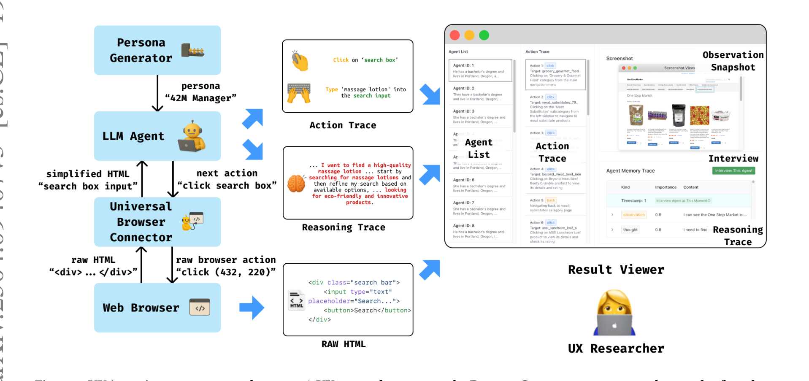
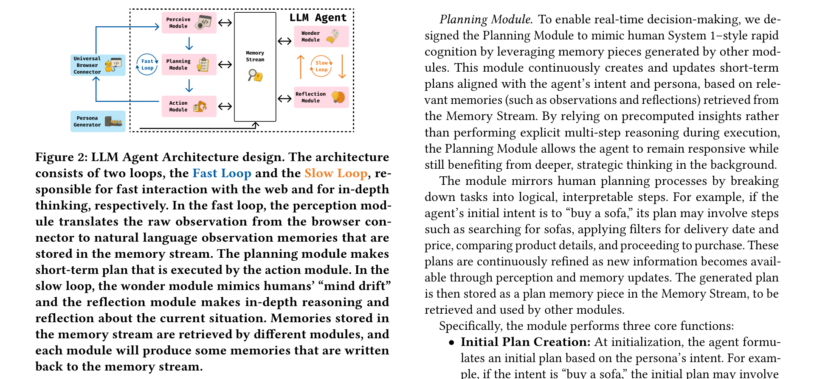
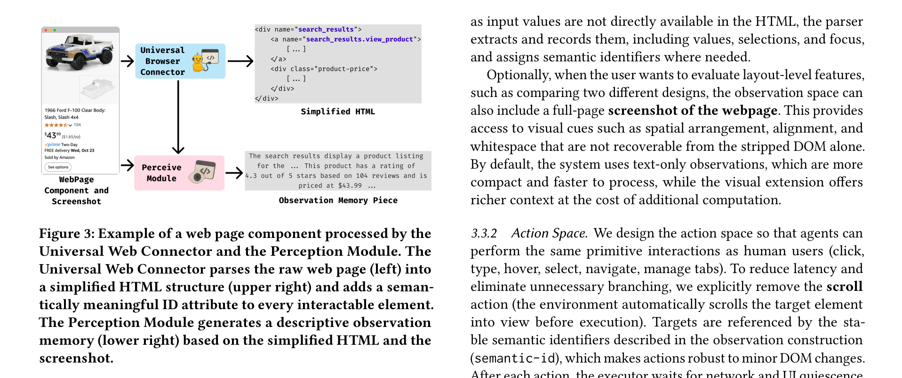
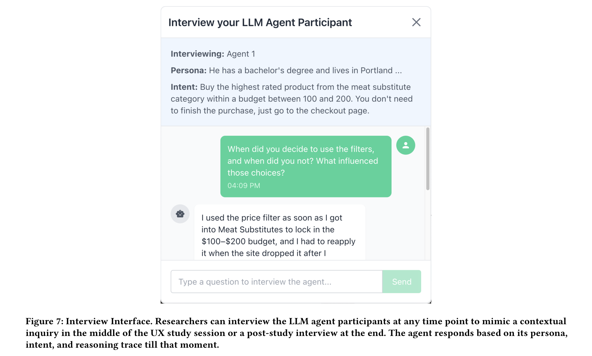
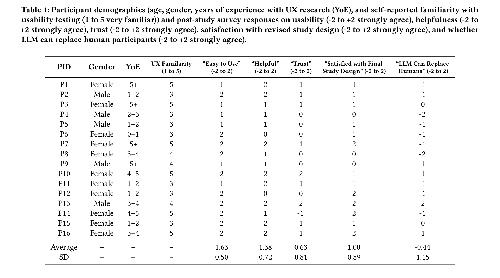
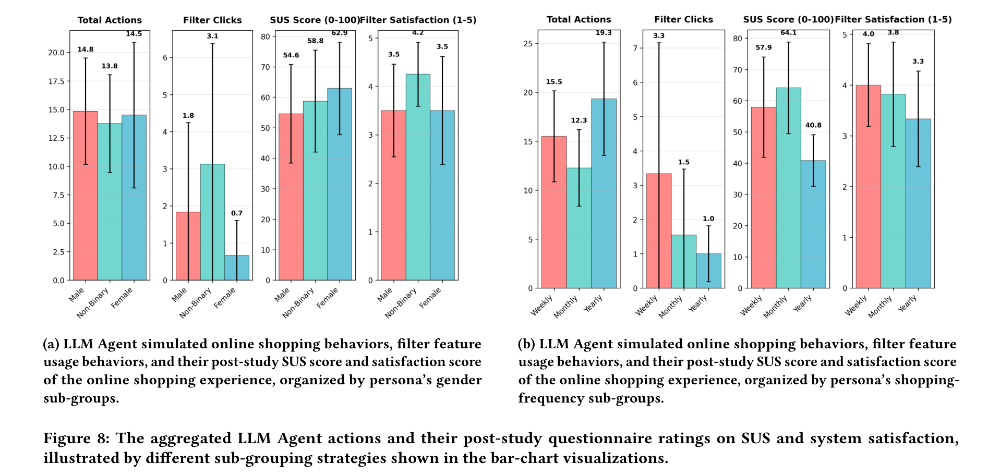

# UXAgent: A System for Simulating Usability Testing of Web Design with LLM Agents

**Authors:** Yuxuan Lu, Bingsheng Yao, Hansu Gu, Jing Huang, Zheshen (Jessie) Wang, Yang Li, Jiri Gesi, Qi He, Toby Jia-Jun Li, Dakuo Wang
**Affiliations:** Northeastern University, Amazon, University of Notre Dame
**Date:** September 19, 2025 (v3)
**Paper:** [PDF](https://arxiv.org/abs/2504.09407v3)

---

## TL;DR

UXAgent is an open-source system that generates LLM agents as simulated usability testing participants. Each agent gets a persona, interacts with real websites via a browser, and produces action traces, reasoning traces, post-study surveys, and can even be interviewed by a UX researcher. The key innovation is a dual-loop architecture (inspired by Dual Process Theory) that balances fast, reactive web interactions with slow, reflective reasoning. In a user study with 16 UX researchers, 14 of 16 proposed improvements to their study designs after reviewing UXAgent data, and all 16 were satisfied with their revised protocols -- though participants had mixed feelings about whether LLM agents could replace real humans.

---

## Key Figures

### Figure 1: System Overview

The complete UXAgent pipeline. Left side: the Persona Generator creates agents (e.g., "42M Manager") that are fed into the LLM Agent. The agent receives simplified HTML from the Universal Browser Connector, decides the next action ("click search box"), and the connector translates it to a browser command ("click (432, 220)"). Middle: the system logs both an Action Trace (what the agent did) and a Reasoning Trace (why -- including plans, reflections, and "wonders"). Right: the Result Viewer lets UX researchers browse agent lists, inspect action/reasoning traces, view observation snapshots, and conduct live interviews with agents.

### Figure 2: Dual-Loop LLM Agent Architecture

The core architectural innovation. The **Fast Loop** (left) handles real-time web interaction: the Perception Module converts HTML to natural language observations, the Planning Module creates short-term plans, and the Action Module executes browser actions. The **Slow Loop** (right) runs in parallel: the Wonder Module generates spontaneous, exploratory thoughts (like human mind-wandering), and the Reflection Module synthesizes memories for deeper reasoning. Both loops read from and write to a shared **Memory Stream**, enabling the slow loop's insights to influence fast-loop decisions without blocking interaction speed.

### Figure 3: Universal Web Connector and Perception Module

How UXAgent sees web pages. The Universal Web Connector takes raw HTML and produces: (1) a simplified HTML structure (removing invisible elements, collapsing empty containers, adding semantic IDs to interactive elements), and (2) an observation memory piece -- a natural language description of what a human would perceive on the page. The semantic IDs (e.g., `search_results.view_product`) ensure actions are robust to minor DOM changes.

### Figure 4: Interview Interface

A distinctive feature: researchers can interview LLM agents at any point during or after the simulated session. The agent responds based on its persona, intent, and reasoning trace *up to that moment* -- without knowledge of future events. This mimics contextual inquiry (a real-time interview method in UX research) and post-study interviews. In this example, the researcher asks "When did you decide to use the filters?" and the agent explains its filter usage based on its actual interaction history.

### Figure 5: Participant Demographics and Survey Results

The 16 UX researcher participants and their post-study survey ratings (-2 to +2 scale). Key averages: "Easy to Use" M=1.63 (high), "Helpful" M=1.38, "Trust" M=0.63 (moderate), "Satisfied with Final Study Design" M=1.00, and "LLM Can Replace Humans" M=-0.44 (slightly negative). The trust and replacement scores reveal the tension: researchers find the system helpful but don't believe it can replace real users.

### Figure 6: Agent Behaviors by Demographic Subgroups

Aggregated agent behaviors broken down by persona gender (left) and shopping frequency (right). (a) By gender: male agents took more total actions (14.8) than female (13.8) and non-binary (14.5); non-binary agents used filters most (3.1 clicks vs. 1.8 for male); SUS scores varied (58.8 non-binary vs. 54.6 female). (b) By shopping frequency: weekly shoppers were more efficient (12.3 actions) than monthly (15.5) or yearly (19.3); weekly shoppers had higher SUS scores (57.9) and filter satisfaction (4.0). These demographic differences enabled UX researchers to identify potential study design flaws (e.g., underrepresentation of specific groups).

---

## Key Novel Ideas

### 1. Dual-Loop Architecture Inspired by Dual Process Theory

The central technical contribution. Human cognition operates on two systems: System 1 (fast, intuitive, automatic) and System 2 (slow, deliberate, analytical). UXAgent mirrors this with two asynchronous loops:

**Fast Loop** (System 1):
- **Perception Module**: Reads the current web page top-to-bottom, converting simplified HTML into a natural language observation memory piece
- **Planning Module**: Creates/updates a short-term plan based on persona intent and retrieved memories -- operates on pre-computed insights rather than multi-step reasoning during execution
- **Action Module**: Translates the plan's next step into a concrete browser action (e.g., `type("massage lotion", search_input)`)

**Slow Loop** (System 2):
- **Wonder Module**: Generates spontaneous, unrelated thoughts based on persona and recent memories -- mimicking mind-wandering. These thoughts may not directly impact the immediate task but add realism to the simulation
- **Reflection Module**: Synthesizes recent observations, actions, plans, and reflections into high-level insights -- like a human pausing to reason about their experience

Both loops share a **Memory Stream** and run in parallel. The key insight: the slow loop's reflections and wonders are non-blocking -- they influence future fast-loop decisions but never delay the immediate interaction. This lets agents be both responsive and thoughtful.

**Why this matters:** Existing web agent architectures either use System 1 only (OpenAI Operator, Claude Computer-use -- fast but shallow) or System 2 only (ReAct, chain-of-thought -- deep but slow). For usability testing, you need both: agents must interact with real websites in real-time (System 1) while also generating the kind of reflective reasoning that produces useful qualitative data (System 2).

### 2. Universal Web Connector with Semantic DOM Parsing

Instead of passing raw HTML or screenshots to the LLM, UXAgent's connector produces a human-aligned representation:

**DOM Parser:**
- Strips invisible content (scripts, CSS-hidden elements, zero-size elements, off-screen elements)
- Collapses trivial nesting (chains of `
` wrappers with no content)
- Assigns stable, human-readable `semantic-id` attributes (e.g., `search_results.view_product`) based on visible text, placeholders, and tag names
- Marks elements as clickable based on tag type, ARIA roles, explicit onclick handlers, and computed cursor styles
- Monkey-patches `addEventListener` to detect hover-sensitive targets
- Distinguishes selectable text (cursor: "I") from clickable elements (cursor: "pointer")

**Action Space:**
- Element-level: click, hover, key press
- Form input: type text, clear input, select option
- Navigation: URL, back, forward, refresh
- Tab management: new tab, switch tab, close tab, terminate task
- No explicit scroll action -- the environment automatically scrolls targets into view

**Why this matters:** The Universal Web Connector requires no per-site configuration. Unlike Agent A/B (which has custom JavaScript parsers per website), UXAgent works on any website out of the box. The semantic IDs make actions robust to minor DOM changes.

### 3. Rich Multi-Modal Data Output for UX Research

UXAgent generates three types of data that map to established UX research methods:

1. **Action Trace**: Every browser action in sequence -- equivalent to screen recording / interaction log analysis in traditional usability testing
2. **Reasoning Trace**: All memory entries (observations, plans, rationales, reflections, wonders) -- equivalent to think-aloud protocols where participants verbalize their thoughts
3. **Post-Study Survey**: Agents answer configurable survey questions (including standard instruments like SUS) based on their reasoning trace -- equivalent to post-session questionnaires

Plus the **interactive interview** feature, where researchers can ask follow-up questions at any timepoint -- a capability that has no direct equivalent in traditional usability testing (contextual inquiry is limited to real-time, with human recall bias on past events).

### 4. Persona Generator with Demographic Distribution Control

UX researchers specify:
- An example persona (as a style template)
- A target demographic distribution (e.g., "10% low-income, 30% middle-income")
- Demographic fields (age, gender, shopping frequency, etc.)

The system samples demographic attributes from the distribution, then uses an LLM to generate full persona descriptions. To ensure diversity, each new persona generation includes previously generated personas as context, and a random previously generated persona is selected as the example for each new generation. This prevents repetitive outputs and encourages variation.

**Scale:** Generating 1,000 personas takes ~2 minutes. Running 20 simulations takes ~90 minutes; 1,000 simulations takes ~12 hours (limited by LLM API rate limits).

---

## Architecture Details

| Component | Details |
|---|---|
| **LLM Backend** | Not specified (architecture is model-agnostic) |
| **Agent Architecture** | Dual-loop: Fast Loop (Perception, Planning, Action) + Slow Loop (Wonder, Reflection) |
| **Memory Stream** | Shared storage for observations, plans, actions, reflections, wonders with timestamps |
| **Memory Retrieval** | Weighted scoring: importance × w_imp + relevance × w_rel + recency × w_rec, weighted by memory type |
| **Recency Formula** | recency = 1 / e^{k(t₀ - t)}, where k=1 (decay constant), t₀=current time, t=memory timestamp |
| **Browser Connector** | Universal DOM parser, no per-site config, semantic ID assignment |
| **Action Space** | 15+ action types across 4 categories (element interaction, form input, navigation, tab management) |
| **Observation Space** | Simplified HTML + clickable/hoverable/input/select element lists + optional screenshot |
| **Persona Generator** | Demographic distribution sampling + LLM-based persona description generation |
| **Result Viewer** | Web interface with agent list, action trace, reasoning trace, screenshot viewer, interview panel |
| **Evaluation Platform** | WebArena (Amazon-like shopping environment) |

---

## Training Pipeline

UXAgent requires **no training or fine-tuning**. It is a prompt-based system over off-the-shelf LLMs. The full prompt templates are provided in Appendix C for all modules (Persona Generation, Perception, Planning, Action, Wonder, Reflection).

The simulation flow per agent:
1. **Persona generation**: LLM generates a persona matching the target demographics
2. **Initialization**: Agent receives persona + task intent, Planning Module creates an initial plan
3. **Interaction loop**: Fast Loop and Slow Loop run in parallel
   - Fast Loop: Perceive page → Update plan → Execute action → Record to Memory Stream
   - Slow Loop: Generate wonders → Generate reflections → Write to Memory Stream
4. **Termination**: Agent completes task (purchase/navigate to checkout), explicitly stops, or hits loop/time limits
5. **Post-study survey**: Agent answers configured questions based on its reasoning trace
6. **Optional interview**: Researcher can interact with the agent at any point

---

## Key Results

### User Study with 16 UX Researchers

The evaluation focused on whether UXAgent helps UX researchers improve study designs -- not on whether agents perfectly replicate human behavior.

**Task:** Researchers reviewed simulated usability testing data (20 LLM agents shopping on WebArena) for a newly designed product filter feature, then proposed revisions to the study protocol.

| Metric | Mean (M) | SD | Scale |
|---|---|---|---|
| Easy to use | 1.63 | 0.50 | -2 to +2 |
| Helpful | 1.38 | 0.72 | -2 to +2 |
| Trust | 0.63 | 0.81 | -2 to +2 |
| Satisfied with revised study design | 1.00 | 0.89 | -2 to +2 |
| LLM can replace humans | **-0.44** | 1.15 | -2 to +2 |

### Researcher Behavior Patterns

Researchers followed a four-step paradigm:
1. **Building trust with data** -- first checking if LLM behavior looks reasonable
2. **Sense-making** -- interpreting relationships between variables (e.g., sorting by filter clicks, correlating with demographics)
3. **Proposing hypotheses and in-depth exploration** -- interviewing specific agents to verify hypotheses
4. **Drawing conclusions** -- revising study protocols

### Study Design Improvements

- **14 of 16** participants proposed improvements to their initial study design
- **6** suggested changes to participant tasks (e.g., adding filter-specific tasks)
- **3** recommended recruiting more diverse demographic groups
- **7** suggested new feature design ideas (e.g., rating-based sorting, price buckets)
- **2** proposed expanding interview protocols
- All 16 were satisfied with the revised study design

### Agent Behavioral Data

Per the simulation of 20 agents on WebArena (product filter feature evaluation):

| Metric | By Gender (M/F/NB) | By Shopping Freq (Weekly/Monthly/Yearly) |
|---|---|---|
| Total Actions | 14.8 / 13.8 / 14.5 | 12.3 / 15.5 / 19.3 |
| Filter Clicks | 1.8 / 4 / 3.1 | 1.5 / 5 / 3.3 |
| SUS Score (0-100) | 58.8 / 54.6 / 62.9 | 57.9 / 17.9 / 64.1 |
| Filter Satisfaction (1-5) | 3.5 / 3 / 4.2 | 4.0 / 2.3 / 3.8 |

Non-binary agents and weekly shoppers showed distinctive patterns, suggesting the demographic conditioning produces meaningfully different behaviors.

---

## Key Takeaways

1. **The dual-loop architecture is a genuinely novel agent design.** By running fast reactive interactions and slow reflective reasoning in parallel (not sequentially), UXAgent achieves something existing web agents don't: realistic-speed web interaction *and* rich qualitative reasoning data. The Memory Stream as the bridge between loops is elegant.

2. **The main value is improving study design, not replacing users.** Participants didn't use UXAgent as a substitute for human testing. They used it as a pre-pilot -- to surface study design flaws, generate feature improvement ideas, and refine protocols before recruiting real participants. 14/16 made meaningful improvements.

3. **The interview feature is distinctive.** No other system in this space (Agent A/B, SimAB) lets researchers conduct follow-up interviews with individual agents at arbitrary timepoints. This maps directly to contextual inquiry methodology and produces richer qualitative data than action traces alone.

4. **Trust is the critical bottleneck.** At M=0.63 on a -2 to +2 scale, trust is the lowest-rated metric. Researchers find the data helpful but aren't sure how much to trust it. Several specifically said knowing the LLM's training data and accuracy metrics would increase their trust. This suggests the system needs better calibration and transparency.

5. **"LLM can replace humans" received a negative score.** At M=-0.44, researchers explicitly disagreed that LLM agents could replace real participants. As P1 said: "I'm really afraid that researchers only rely on this and overtrust such data." This aligns with all three papers (UXAgent, Agent A/B, SimAB) positioning as complementary, not replacement.

6. **Demographic conditioning works but produces stereotypical patterns.** Non-binary agents used filters most (3.1 clicks vs. 1.8 for male), and weekly shoppers were most efficient. Whether these patterns reflect real-world differences or LLM stereotypes is an open question the paper acknowledges but doesn't resolve.

7. **The Universal Web Connector is a practical win.** Zero per-site configuration means any website can be tested immediately. The semantic ID system (generating stable identifiers from visible text and structure) is a good solution to the fragile-selector problem that plagues traditional browser automation.

8. **Scale is feasible but API-limited.** 20 simulations in 90 minutes, 1,000 in 12 hours. The bottleneck is LLM API rate limits, not compute. As API throughput improves, the system scales naturally.

9. **The Wonder Module is a creative touch.** Having agents generate spontaneous, unrelated thoughts (like "I wonder if there are better massage lotions on other sites") adds realism. Whether this actually improves usability testing data quality is unclear, but it makes the reasoning traces more human-like and thus more useful for qualitative analysis.

10. **UXAgent occupies a distinct niche from Agent A/B and SimAB.** UXAgent generates full usability study data (action logs, think-aloud traces, surveys, interviews) for study design iteration. Agent A/B runs between-subjects A/B tests for conversion metrics. SimAB does pairwise screenshot preference voting. They overlap in using LLM personas to evaluate web designs, but serve different research purposes.

---

## What's Open-Sourced

- **Code:** The paper states UXAgent is "an open-sourced system" -- the code is referenced as being available (the authors are from Amazon/Northeastern)
- **GitHub:** Referenced as UXAgent framework [62] in the Agent A/B paper (CHI EA '25), with DOI: 10.1145/3706599.3719729
- **Full prompt templates** are included in Appendix C (Persona Generation, Perception Module, Planning Module, Action Module)
- **Study protocol and survey instruments** are in Appendix B
- **Full action space** is documented in Appendix A
- The system works on **WebArena** (publicly available environment) but is designed for any website
