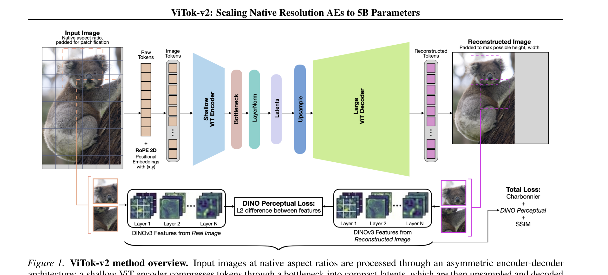
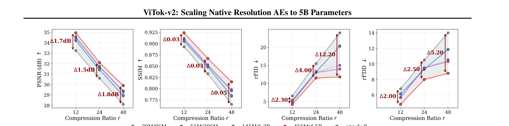
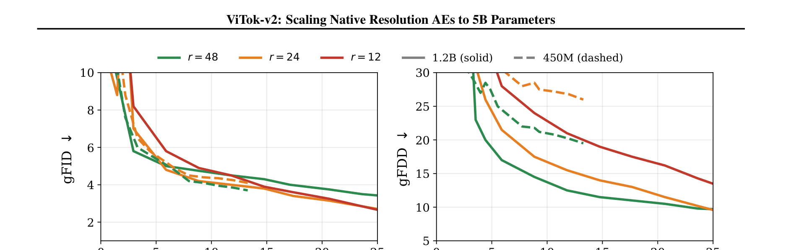
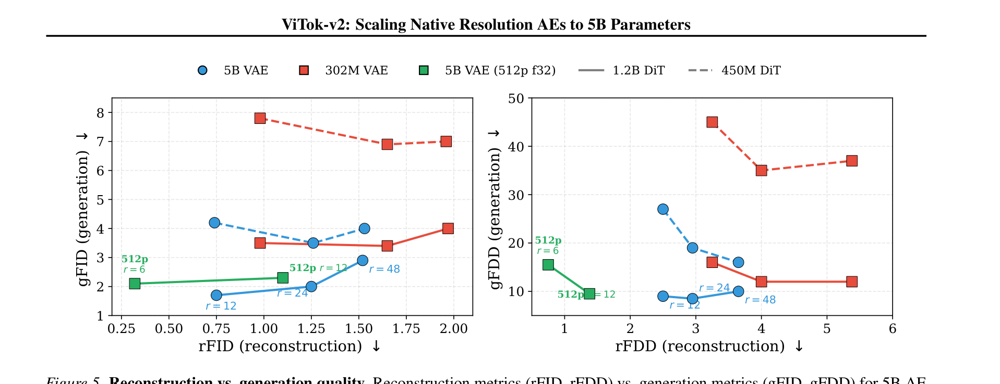
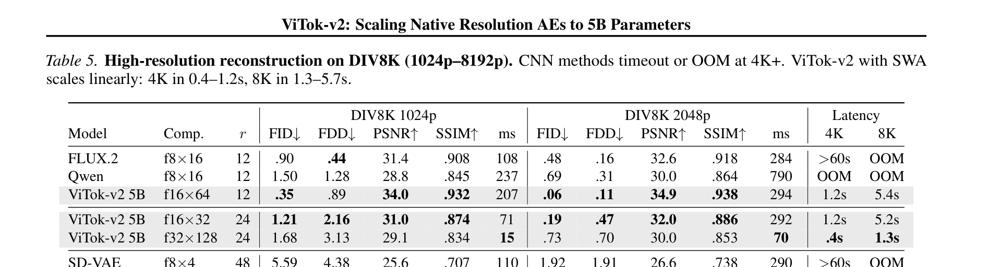

# ViTok-v2: Scaling Native Resolution Autoencoders to 5 Billion Parameters

**Authors:** Philippe Hansen-Estruch (UT Austin), Jiahui Chen (UT Austin), Vivek Ramanujan (UW), Orr Zohar (Stanford), Yan Ping (Spellbrush), Animesh Sinha (Meta), Markos Georgopoulos (Meta), Edgar Schoenfeld (Meta), Ji Hou (Meta), Felix Juefei-Xu (Meta), Sriram Vishwanath (Georgia Tech), Ali Thabet (Meta)
**Date:** May 6, 2026
**Paper:** [arXiv:2605.05331](https://arxiv.org/abs/2605.05331)

---

## TL;DR

ViTok-v2 is the largest continuous image autoencoder to date at **5 billion parameters** (4.5B decoder, 463M encoder). It solves three limitations of the original ViTok: (1) replaces absolute position embeddings with **NaFlex + 2D RoPE** for native resolution/aspect-ratio generalization, (2) replaces adversarial (GAN) and LPIPS losses with a novel **DINOv3 perceptual tile loss** that is stable at billion-parameter scale, and (3) scales the decoder to 4.5B parameters — **14× larger** than the original ViTok's 350M. Trained on ~2B images, ViTok-v2 matches or beats all baselines at 256p reconstruction, outperforms everything at 512p+, and is the **only tokenizer that can process 8K images** (where all CNN baselines run out of memory). In joint scaling experiments with flow models, larger AEs and larger generators independently improve generation quality.

---

## Key Figures

### Fig. 1: Architecture Overview

The asymmetric encoder-decoder pipeline. A shallow 4-layer ViT encoder compresses native-aspect-ratio images (padded to patch-aligned dimensions) into compact latents via a bottleneck + LayerNorm. A large deep ViT decoder (5-10× the encoder size) upsamples these latents to reconstruct the image. Training loss combines Charbonnier + SSIM + DINOv3 perceptual — no GAN or LPIPS needed. Key advances: RoPE 2D enables resolution generalization, NaFlex enables variable aspect ratios, and the DINOv3 tile loss enables stable billion-scale training.

### Fig. 2: Decoder Scaling Across Compression Ratios

Four metrics (PSNR, SSIM, rFID, rFDD) at three compression ratios (r=12, 24, 48). Every metric improves monotonically as decoders scale from B (88M) to T (4.5B). The improvement is **largest at high compression** (r=48): the B-to-T rFID gap grows from 2.3 at r=12 to 12.2 at r=48. This means decoder capacity is most critical when the bottleneck is tightest.

### Fig. 4: Joint AE–Flow Model Scaling

The generation-side story. DiT-style flow transformers (450M and 1.2B) trained for 300 epochs on ImageNet-22k at r∈{12, 24, 48}. (a) gFID: the 450M model does best at r=48 (most compressed = simplest latent space); the 1.2B model flips the ranking — r=12 and r=24 become competitive, because larger generators can exploit the richer latent representations from lower compression. (b) gFDD: larger models consistently win at all r. The 5B AE provides a consistent downward shift relative to 350M across all flow-training FLOPs.

### Fig. 5: Reconstruction Quality vs Generation Quality

The key insight of the paper in one figure. X-axis: reconstruction quality (rFID or rFDD). Y-axis: generation quality (gFID or gFDD). The 5B AE (red) achieves 1-2 gFID better generation quality than the 350M AE (blue) **even at comparable reconstruction quality**, confirming that decoder capacity benefits generation through mechanisms beyond reconstruction fidelity alone. The Pareto frontier shows both decoder scaling and loss ablation are needed to reach the best region.

### Table 5: High-Resolution Reconstruction (1024p-8192p)

The resolution-scaling payoff. At 2048p, ViTok-v2 5B at r=12 achieves rFID **0.11** — **87% better** than FLUX.2 (0.90) — with +2.3 dB PSNR. CNN-based methods (FLUX.2, Qwen, SD-VAE) **time out at 4K+ or run OOM**. ViTok-v2 processes 4K images in 1.2s and 8K in 5.2s using sliding window attention. At 8192p, **ViTok-v2 is the only method that succeeds** — all baselines OOM.

---

## Key Novel Ideas

### 1. DINOv3 Perceptual Tile Loss — Replacing LPIPS and GAN

This is the paper's most impactful engineering contribution. Previous ViT-AEs (including the original ViTok) used LPIPS (VGG-based perceptual loss) + adversarial training (GAN discriminator). Both cause problems at billion-parameter scale:

- **GANs cause training instabilities** that prevented scaling decoders past 350M in ViTok v1.
- **LPIPS uses VGG features** trained for classification, which are invariant to reconstruction-relevant details.

ViTok-v2 replaces both with a single **DINOv3 perceptual tile loss**:
1. Sample random 224×224 tiles from corresponding locations in the input and reconstructed images.
2. Pass each tile through a frozen DINOv3-S encoder.
3. Extract intermediate features from multiple transformer blocks, L2-normalize per token.
4. Compute MSE between the features.

Why DINOv3 works better than LPIPS: DINOv3 is trained via self-supervised learning with fixed-position embeddings, preserving fine-grained spatial information while capturing semantic structure. LPIPS's VGG features are classification-trained and throw away spatial detail. The tile-based approach allows it to work at any resolution (DINOv3 uses fixed-position embeddings, so tiles work naturally).

The result: DINOv3 loss with λ=1000 achieves rFID **0.30** — a **58% improvement over LPIPS** (rFID 0.72) with comparable SSIM. Adding LPIPS on top of DINOv3 provides no further benefit (rFID 0.38 vs 0.30), confirming that DINOv3 **subsumes** the perceptual signal LPIPS provides.

### 2. 14× Decoder Scaling — Asymmetric Architecture

ViTok-v2 scales decoders from 88M (B) through 302M (L), 1.1B (G), to **4.5B (T)**, while keeping the encoder at a fixed shallow 4 layers (~10% of total parameters). The key findings:

- **Encoder depth matters less than width.** Reducing encoder depth from 4 to 1 blocks barely changes SSIM (0.768 → 0.753). But a pure linear projection catastrophically fails (0.462 SSIM). So non-linearity is necessary but depth is not.
- **Decoder scaling consistently improves all metrics** across all compression ratios — and the improvement is largest at high compression (r=48), where the reconstruction task is hardest.
- **Scaling past 350M** (where ViTok v1 stopped due to GAN instabilities) **continues to yield gains.** The DINOv3 loss is what makes this possible — it's stable at 4.5B parameters without adversarial training.

### 3. NaFlex Training for Resolution Generalization

ViTok v1 used fixed 256×256 crops with absolute position embeddings, which broke at other resolutions and aspect ratios. ViTok-v2 adopts **NaFlex** (from SigLIP-2) with **2D RoPE**:

1. **90% of training** uses a 256-token budget (NaFlex packs native-aspect-ratio crops into 256 tokens at patch size 16).
2. **Final 10%** uses a 1024-token budget (~512p) for high-resolution generalization.

At inference, **sliding window attention (SWA)** with 2D block radius 8 replaces full attention, reducing complexity from O(L²) to O(L·r²) and enabling linear memory scaling.

The result: models trained with full attention and applied with SWA at inference show **no performance degradation**. The two-stage NaFlex schedule eliminates patch boundary artifacts that fixed-crop training produces (visible in Fig. 3 of the paper).

### 4. LayerNorm > KL for High-Channel Latent Regularization

A small but practical finding. For downstream generation with high-channel latents (64 channels), three regularization approaches achieve similar gFID (4.7-5.0) and rFID:
- **KL divergence** (β=0.01, proper VAE)
- **Tanh+noise** (σ=0.01, bounded with scaled Gaussian)
- **LayerNorm** (fully deterministic, no hyperparameters)

ViTok-v2 chooses LayerNorm because it's the simplest: no hyperparameter tuning, fully deterministic, and equivalent performance. This is consistent with concurrent work (DiTo) that also adopts LayerNorm.

### 5. Joint AE–Flow Scaling Study

ViTok-v2 conducts the first systematic study of **jointly scaling both autoencoder and generator capacity** at multiple compression ratios. Key findings:

- At r=12 (low compression), **larger generators benefit more** — the 1.2B flow model outperforms the 450M at matched FLOPs, exploiting the richer latent space.
- At r=48 (high compression), **smaller generators are competitive** — the latent space is simpler, so a 450M model suffices.
- The 5B AE provides a **consistent 1-2 gFID improvement** over the 350M AE at all flow-training budgets and all r values.
- **Decoder capacity benefits generation beyond reconstruction.** The 5B AE achieves better gFID than the 350M AE even at matched rFID, indicating the decoder improves the latent distribution quality itself.

---

## Architecture Details

| Component | Specification |
|---|---|
| **Encoder** | 4-layer ViT, width matched to decoder, ~10% of total params |
| **Decoder sizes** | B: 768w/12d/88M, L: 1024w/24d/302M, G: 1408w/40d/1.1B, T: 3072w/40d/4.5B |
| **Total model (5B)** | 463M encoder + 4.5B decoder |
| **Patch size** | 16 (or 32 for f32 variants) |
| **Latent channels** | 64 (default) |
| **Compression ratios** | r ∈ {12, 24, 48} → f16×64, f16×32, f16×16 (or f32 variants) |
| **Position encoding** | 2D RoPE |
| **Attention** | Full attention during training; sliding window (radius 8) at inference |
| **Normalization** | Pre-norm with RMSNorm, LayerScale on residuals |
| **MLP** | SwiGLU, expansion ≈2.67 |
| **Latent regularization** | LayerNorm (deterministic) |

---

## Training Pipeline

1. **Data:** ~2B images from DataComp, YFCC-100M, Shutterstock, ImageNet-22K, LAION.
2. **Two-stage NaFlex:**
   - Stage 1 (90%): 256-token budget → ~256p crops at native aspect ratio
   - Stage 2 (10%): 1024-token budget → ~512p crops for high-resolution generalization
3. **Optimizer:** AdamW (β=(0.9, 0.95)), weight decay 0.05, peak lr 5×10⁻⁴, cosine schedule, gradient clip 1.0
4. **Training infrastructure:** FSDP in bfloat16, float8 GEMMs, torch.compile, 128 H200 GPUs, ~90% MFU
5. **Losses:** L = L_char + 0.1·L_SSIM + λ_p·L_DINO (no GAN, no LPIPS)
   - λ_p = 500 (default, balanced reconstruction-perception)
   - λ_p = 1000 (high-DINO variant, optimizes rFID at cost of PSNR)
6. **Training steps:** ~300K steps total
7. **No adversarial training** at any scale

---

## Key Results

### Reconstruction at 256p (ImageNet-1K 50K val)

| Model | Comp. | r | rFID↓ | rFDD↓ | PSNR↑ | SSIM↑ |
|---|---|---|---|---|---|---|
| FLUX.2 | f8×16 | 12 | **.15** | — | 31.1 | .887 |
| VA-VAE | f16×64 | 12 | .14 | — | 30.7 | .870 |
| Qwen | f8×16 | 12 | 1.32 | 7.36 | 30.3 | .860 |
| **ViTok-v2 5B** | f16×64 | 12 | .74 | 2.49 | **34.2** | **.924** |
| **ViTok-v2 5B‡** (high-DINO) | f16×64 | 12 | **.30** | **1.12** | 33.6 | .914 |
| SDXL-VAE† | f8×8 | 24 | .68 | — | 26.0 | .834 |
| AToken† | f16×32 | 24 | **.26** | — | 28.8 | .814 |
| **ViTok-v2 5B** | f16×32 | 24 | 1.26 | **2.94** | **31.2** | **.867** |
| SD-VAE | f8×4 | 48 | .73 | 6.14 | 25.7 | .702 |
| VA-VAE | f16×16 | 48 | .61 | — | 25.3 | .690 |
| RAE | f16×16 | 48 | .61 | — | 18.8 | .496 |
| **ViTok-v2 5B** | f16×16 | 48 | 6.66 | **3.66** | **28.5** | **.793** |

ViTok-v2 5B achieves **best PSNR and SSIM at every compression ratio**. At r=12 with high-DINO weights: rFID 0.30, approaching FLUX.2 (0.15) which uses adversarial training.

### High-Resolution Reconstruction (DIV8K)

| Resolution | ViTok-v2 5B (r=12) | FLUX.2 | Other baselines |
|---|---|---|---|
| 1024p rFID | **0.35** | 0.90 | — |
| 2048p rFID | **0.11** | 0.48 | CNN: OOM |
| 4K latency | **1.2s** | 284s | CNN: timeout/OOM |
| 8K latency | **5.2s** | OOM | **All OOM** |

At 8192p, **ViTok-v2 is the only method that succeeds.** All CNN baselines OOM. The 50×+ speed advantage at 4K comes from SWA's linear memory scaling.

### Generation Quality (ImageNet-22K, flow model)

| AE | AE Size | Flow Size | r=12 gFID | r=24 gFID | r=48 gFID |
|---|---|---|---|---|---|
| 350M | 302M | 1.2B | 2.0 | 3.3 | 3.9 |
| **5B** | 4.5B | 1.2B | **1.7** | **2.9** | **2.9** |

5B AE consistently produces 1-2 gFID better generation quality across all compression ratios.

---

## Key Takeaways

1. **Decoder capacity matters far more than encoder capacity.** A 1-block encoder suffices (Finding 1). Scaling decoders from 88M to 4.5B improves all metrics monotonically (Finding 2). This 14× capacity asymmetry is the defining architectural choice.

2. **Decoder scaling benefits increase with compression ratio.** At r=48, the B-to-T rFID gap is 12.2; at r=12 it's only 2.3. The intuition: higher compression creates a harder inversion problem, and more decoder capacity helps invert it.

3. **DINOv3 perceptual loss replaces both LPIPS and GAN.** A single frozen DINOv3-S encoder provides better perceptual supervision than VGG-based LPIPS, while eliminating the adversarial training instabilities that limited ViTok v1 to 350M. This is the key enabler for billion-scale training.

4. **NaFlex + 2D RoPE + SWA enables unlimited resolution.** The two-stage NaFlex schedule (256-token then 1024-token) plus sliding window attention at inference lets ViTok-v2 process images from 256p to 8192p with no architectural changes. CNN-based tokenizers can't match this — they hit memory limits at 4K+.

5. **Training with full attention, inferring with SWA, works.** This is non-obvious: you'd expect a train-inference mismatch. But attention heads primarily use local information, so SWA preserves quality while reducing complexity from O(L²) to O(L·r²).

6. **Larger generators need lower compression.** At r=12, the 1.2B flow model outperforms 450M; at r=48, the ranking flips. Larger generators can exploit the richer latent structure available at lower compression. This means the optimal r depends on generator scale — a design parameter that should be co-optimized.

7. **Decoder capacity benefits generation *beyond* reconstruction.** The 5B AE produces better gFID than the 350M AE even when their rFID values are matched. This suggests the larger decoder also produces a better-structured latent distribution, not just higher-fidelity reconstructions.

8. **High-channel latents don't need careful regularization.** KL, tanh+noise, and LayerNorm all produce similar gFID and rFID for 64-channel latents. LayerNorm is simplest (no hyperparameters) and is the recommended default.

9. **The f32 configuration offers a practical quality-speed tradeoff.** f32×128 processes 4K images in 0.4s (3× faster than f16×64) at the cost of ~2 dB PSNR. This is attractive for latency-sensitive pipelines. f16 remains better when reconstruction fidelity is paramount.

10. **ViTok-v2 is the first visual tokenizer to handle 8K images.** At 8192p, every CNN baseline (FLUX.2, SD-VAE, DC-AE) runs out of memory. ViTok-v2's transformer architecture with SWA scales linearly in memory, opening new applications for high-resolution generation and editing.

---

## What's Open-Sourced

- **Code/Weights:** Not explicitly mentioned in the paper. No GitHub link provided.
- **Training data:** Uses publicly available datasets (DataComp, YFCC-100M, ImageNet-22K, LAION, Shutterstock).
- **Frozen components:** DINOv3-S encoder (publicly available from Meta).
- **Flow model:** DiT-style flow transformers trained on ImageNet-22k following the DiT recipe.
