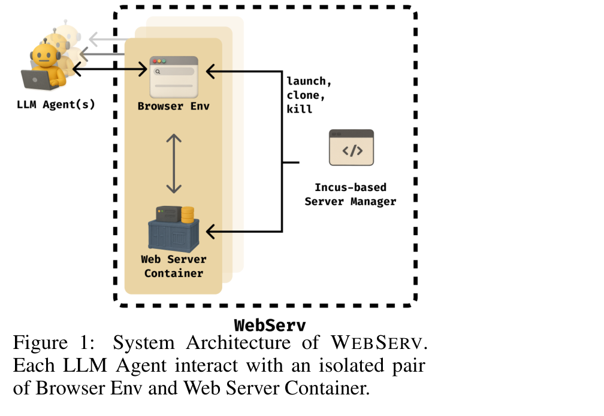
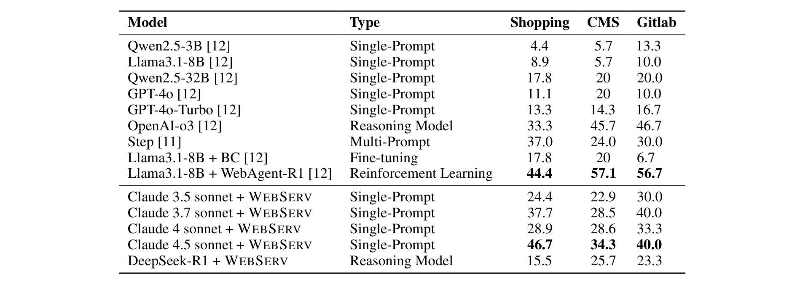

# WEBSERV: A Browser-Server Environment for Efficient Training of Reinforcement Learning-based Web Agents at Scale

**Authors:** Yuxuan Lu (Northeastern University), Jing Huang, Hui Liu, Jiri Gesi, Yan Han, Tianqi Zheng (Amazon), Shihan Fu (Northeastern University), Dakuo Wang (Northeastern University)
**Date:** October 17, 2025
**Venue:** NeurIPS 2025 Workshop: Multi-Turn Interactions in Large Language Models
**Paper:** [PDF](https://arxiv.org/abs/2510.16252v1)

---

## TL;DR

WebServ is a full-stack browser-server environment designed for scalable reinforcement learning (RL) training of web agents. It solves three problems with existing setups: (1) noisy/bloated HTML observations that overwhelm LLMs, (2) brittle action execution that doesn't wait for pages to actually finish loading, and (3) Docker containers that are too slow and heavy for massive parallel RL rollouts. Using an automatic DOM parser, network-aware execution, and Incus-based containers with ZFS copy-on-write, WebServ achieves state-of-the-art single-prompt performance on WebArena while cutting launch latency by ~5x and storage by ~240x versus Docker.

---

## Key Figures

### Figure 1: System Architecture

Each LLM agent gets its own isolated pair of Browser Env and Web Server Container. The Incus-based Server Manager handles launching, cloning, and killing containers. This isolation is critical for RL training — without it, multiple agents sharing a server can corrupt each other's state (e.g., one agent adds an item to a shared shopping cart that another agent then sees).

### Table 1: Benchmark Results on WebArena-Lite

WebServ paired with Claude 4.5 achieves 46.7% on Shopping, 34.3% on CMS, and 40.0% on Gitlab — the best single-prompt results reported. Notably, this is competitive with multi-prompt and RL-trained agents, despite only using a single prompt with no fine-tuning. The clean, semantically enriched observations that WebServ provides are doing a lot of the heavy lifting.

### Table 2: System Efficiency — WebServ vs Docker

WebServ (Incus) launches containers in 1.78s vs Docker's 8.96s (~5x faster) and uses only 28 MiB of storage per container vs Docker's 6.78 GiB (~240x reduction). Memory is comparable (1.74 GiB vs 1.63 GiB). The storage savings come from ZFS block-level copy-on-write — Docker copies entire file layers on each launch, while Incus only duplicates the blocks that actually change.

---

## Key Novel Ideas

### 1. Automatic DOM Parser for Clean Observations

The core problem: existing web-agent environments either pass raw HTML (thousands of tokens of noise) or use hand-crafted, site-specific parsers that don't generalize. WebServ takes a middle path — a fully automatic parser that works on any website.

The parser does four things:

**Filtering:** It strips everything humans can't see — `<script>`, `<style>`, `<meta>`, hidden elements (`display:none`, `visibility:hidden`, zero-opacity), off-screen nodes, and media tags (`<video>`, `<audio>`, `<canvas>`). Only a whitelist of useful HTML attributes (id, name, value, placeholder, role, tabindex, aria-*, data-*) is kept.

**Flattening and pruning:** Nested chains of meaningless `
` wrappers are collapsed. Empty elements are removed, except for interactive controls (`<input>`, `<select>`, `<button>`, etc.) that may legitimately be empty.

**Interactivity detection:** This is particularly clever. The parser figures out which elements are clickable by checking: native controls (`<button>`, `<input>`), anchors with href, elements with onclick handlers, ARIA roles (button, link), and — importantly — computed cursor styles. Elements with `pointer-events:none` are marked non-interactive. They even monkey-patch `addEventListener` to detect hover targets, annotating them with `data-maybe-hoverable=true`.

**Semantic identifiers:** Every interactive element gets a stable, human-readable ID derived from its visible text, placeholder, or tag name. These are scoped hierarchically by parent names, so IDs like `"search-bar"` or `"cart > checkout-button"` are meaningful to both humans and LLMs. This is the key that makes the action space work — agents reference targets by these semantic IDs, not by fragile XPath or CSS selectors.

### 2. Network-Aware Action Execution

Prior environments either use a fixed sleep after each action (wasteful and still unreliable) or wait for a full page reload (breaks on modern single-page apps that update incrementally). WebServ hooks into the browser's JavaScript runtime and intercepts both `XMLHttpRequest` and `fetch` APIs, maintaining a global counter of active network requests.

After each action, the environment waits until:
- There are no outstanding network requests, AND
- A configurable idle period (e.g., 500ms) has passed with no new requests

This means the agent always sees the fully-rendered page — search results, shopping carts, dropdowns populated via AJAX — before choosing its next action. If the page fails to settle within a timeout window, the environment returns an explicit error state rather than silently giving the agent a half-loaded page.

### 3. Incus-Based Container Management with ZFS Copy-on-Write

This is the scalability breakthrough. Docker was designed for long-lived services, not for the rapid create/reset/destroy cycle that RL training demands. Launching a single WebArena shopping container in Docker takes ~9 seconds and writes ~6.78 GiB to disk.

WebServ replaces Docker with Incus (a modern Linux container runtime built on LXC) backed by ZFS. The key insight is about filesystem operations:

- **Docker:** Uses overlay filesystems where each new container copies entire modified file layers to a fresh upper layer. For the WebArena shopping site (a multi-gigabyte database), this means writing GiBs of data on every reset.
- **Incus + ZFS:** Uses block-level copy-on-write. Creating a new container is essentially creating a ZFS snapshot — it's a metadata operation, not a data-copy operation. Only the ~28 MiB of container-specific metadata needs to be written. The actual data blocks are shared read-only across all containers.

This makes the bottleneck shift from disk I/O to lightweight metadata transactions, enabling sub-second startup even under heavy parallel load. Since post-launch access is mostly reads (which benefit from kernel and ZFS buffer pool caching), the system scales to 200+ concurrent containers on a single host.

Incus also supports snapshotting running containers and cloning from snapshots, which opens up RL-specific operations like branching from a decision point to explore multiple actions in parallel.

---

## Architecture Details

| Component | Design Choice |
|---|---|
| Observation format | Stripped, annotated HTML JSON with clickable/hoverable/input element lists |
| Action space | 14 actions across 4 categories (element interaction, form input, navigation, tab management) |
| Element targeting | Stable semantic IDs (e.g., `"search-bar"`, `"cart > checkout-button"`) |
| Network sync | Intercept XMLHttpRequest + fetch; wait for idle period with 0 active requests |
| Idle timeout | Configurable (default 500ms) |
| Container runtime | Incus (LXC-based) with ZFS |
| Container format | OCI-compatible (can import Docker images directly) |
| Scroll handling | Automatic — target elements are scrolled into view before action execution |

### Action Space Categories

- **A. Element-level interactions:** Click, hover, key press
- **B. Form and text input:** Type text, clear input, select option
- **C. Navigation and page control:** Navigate to URL, back, forward, refresh
- **D. Tab management and task control:** New tab, switch tab, close tab, terminate task

The scroll action was deliberately removed — the environment auto-scrolls to the target element before executing any action. This eliminates a source of unnecessary branching in the agent's decision space.

---

## Key Results

### WebArena-Lite Benchmark (Single-Prompt Setting)

| Model | Type | Shopping | CMS | Gitlab |
|---|---|---|---|---|
| Qwen2.5-3B | Single-Prompt | 4.4 | 5.7 | 13.3 |
| Llama3.1-8B | Single-Prompt | 8.9 | 5.7 | 10.0 |
| Qwen2.5-32B | Single-Prompt | 17.8 | 20 | 20.0 |
| GPT-4o | Single-Prompt | 11.1 | 20 | 10.0 |
| GPT-4o-Turbo | Single-Prompt | 13.3 | 14.3 | 16.7 |
| OpenAI-o3 | Reasoning | 33.3 | 45.7 | 46.7 |
| SteP | Multi-Prompt | 37.0 | 24.0 | 30.0 |
| Llama3.1-8B + BC | Fine-tuning | 17.8 | 20 | 6.7 |
| Llama3.1-8B + WebAgent-R1 | RL | 44.4 | 57.1 | 56.7 |
| **Claude 3.5 sonnet + WebServ** | Single-Prompt | 24.4 | 22.9 | 30.0 |
| **Claude 3.7 sonnet + WebServ** | Single-Prompt | 37.7 | 28.5 | 40.0 |
| **Claude 4 sonnet + WebServ** | Single-Prompt | 28.9 | 28.6 | 33.3 |
| **Claude 4.5 sonnet + WebServ** | Single-Prompt | **46.7** | **34.3** | **40.0** |
| DeepSeek-R1 + WebServ | Reasoning | 15.5 | 25.7 | 23.3 |

Claude 4.5 + WebServ sets state-of-the-art for single-prompt agents across all three tasks. It even beats the multi-prompt SteP system and comes close to the RL-trained WebAgent-R1 on Shopping (46.7 vs 44.4), though WebAgent-R1 still leads on CMS and Gitlab with the benefit of end-to-end RL training.

### System Efficiency

| Metric | WebServ (Incus) | Naive Docker | Improvement |
|---|---|---|---|
| Launch speed | 1.781s | 8.963s | ~5x faster |
| Storage per container | 28.01 MiB | 6.78 GiB | ~240x less |
| Memory per container | 1.74 GiB | 1.63 GiB | Comparable |
| Max concurrent containers (single host) | 200+ | Limited by disk I/O | - |

Benchmarked on AWS EC2 r6id.metal (128 vCPUs, 1024 GiB RAM).

---

## Training Pipeline

WebServ itself is not a training algorithm — it's an environment for training and evaluation. The paper focuses on the environment design rather than a specific RL training pipeline. However, the system is designed to plug into RL training in several ways:

1. **Parallel rollouts:** 200+ concurrent containers means you can run hundreds of RL episodes simultaneously on a single host.
2. **Fast resets:** Sub-second container startup means the environment reset cost is negligible compared to the LLM inference cost.
3. **Snapshotting for branching:** Incus can snapshot a running container and clone from it, enabling exploration strategies like trying multiple actions from the same state.
4. **Deterministic retries:** Fast restore to a named snapshot enables fair comparisons across policies and avoids cold-start effects.
5. **OCI compatibility:** Existing Docker-based environments (like WebArena) work without modification.

---

## Key Takeaways

1. **Clean observations matter more than model size.** Claude 3.7 sonnet with WebServ's cleaned observations (37.7% Shopping) outperforms GPT-4o with standard WebArena observations (11.1% Shopping) despite being a similar-tier model. The environment does much of the heavy lifting.

2. **Semantic IDs are better than XPath/CSS selectors for web agents.** Giving elements human-readable names like `"search-bar"` instead of fragile paths like `//div[3]/input[1]` makes the action space more interpretable and robust to minor DOM changes.

3. **Network quiescence > fixed waits for modern SPAs.** Intercepting actual network requests and waiting for idle is strictly better than sleeping for N seconds. It's both faster (no unnecessary waiting) and more reliable (dynamic content is guaranteed to be loaded).

4. **ZFS copy-on-write is a game-changer for container-heavy RL.** The 240x storage reduction isn't just about disk space — it means container creation becomes a metadata operation instead of a multi-GiB file copy, which is what enables the 200+ concurrent container scaling.

5. **Auto-scrolling is an underrated simplification.** Removing the scroll action from the agent's action space and having the environment auto-scroll to targets eliminates unnecessary branching. The agent never needs to decide "should I scroll to find the button?" — it just clicks the button.

6. **Hover detection via monkey-patching is creative.** The `addEventListener` monkey-patch to detect hover-sensitive elements and annotate them with `data-maybe-hoverable=true` is a neat trick for exposing information that's normally only available through visual inspection.

7. **Single-prompt performance is approaching multi-prompt/RL levels.** Claude 4.5 + WebServ (single-prompt, no fine-tuning) beats the RL-trained WebAgent-R1 on Shopping (46.7 vs 44.4). This suggests the environment design is at least as important as the training method for current web agent performance.

8. **Incus + ZFS brings Linux container orchestration patterns that Docker lacks.** Block-level CoW, snapshot/clone of running containers, and lightweight virtualized namespaces are purpose-built for the rapid lifecycle management RL demands. Docker was designed for long-lived services, not this use case.

9. **Visual cues (cursor styles) help agents avoid clicking non-interactive elements.** Exposing computed cursor styles in the observation is a simple change that significantly reduces wasted actions on non-clickable elements — mimicking how humans use visual feedback.

10. **The paper provides useful human-centered inspection tools.** The trajectory replayer and real-time action preview aren't just debugging aids — they enable human-in-the-loop correction signals that can feed back into RL training.

---

## Limitations

- **Text-only observations.** WebServ operates on a stripped DOM representation. Agents cannot perceive spatial layout, color, images, or other visual modalities. Tasks requiring visual reasoning are unsupported.
- **No layout information.** Grid layouts are flattened into lists. The agent doesn't know how many items appear per row or where elements are positioned relative to each other.
- **Evaluated only on WebArena.** While the system is site-agnostic by design, benchmarks are limited to three WebArena tasks (Shopping, CMS, Gitlab).
- **No RL training results.** The paper evaluates prompting-based agents. While the infrastructure supports RL, no RL training experiments are reported.

---

## What's Open-Sourced

The paper does not explicitly mention releasing code, models, or datasets. The system is described in sufficient detail to reimplement, and it uses open infrastructure components (Incus, ZFS, standard browser automation).
